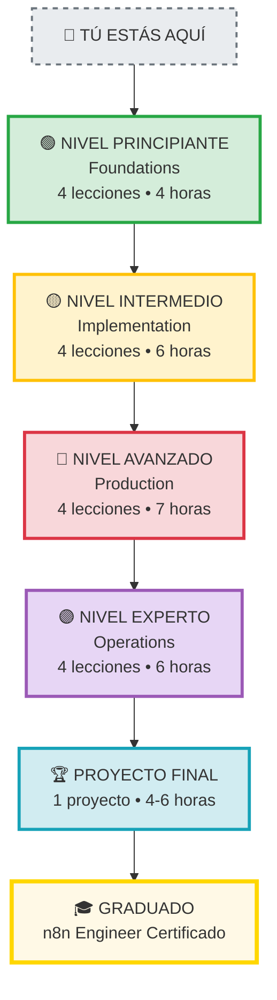

# 🎉 ¡Bienvenido a Zero to Hero: n8n Engineer!

Este es tu punto de partida para convertirte en experto en implementación de n8n.

---

## 🗺️ Roadmap de Aprendizaje



**Tiempo total estimado:** 27-30 horas

---

## 🎯 ¿Qué vas a lograr?

Al completar este curso:

    ✅ Implementarás n8n en local y producción
    ✅ Configurarás PostgreSQL + Redis
    ✅ Entenderás Docker y Docker Compose
    ✅ Configurarás HTTPS con SSL
    ✅ Implementarás CI/CD automático
    ✅ Monitorearás y escalarás n8n
    ✅ Manejarás backups y disaster recovery
    ✅ Troubleshootearás problemas como un pro

---

## 🚀 Cómo Empezar

### Paso 1: Lee el README Principal

```bash
# Abre este archivo primero
open README.md

# O en terminal
cat README.md
```

### Paso 2: Revisa el Índice de Lecciones

```bash
cd lessons
cat INDEX.md
```

### Paso 3: Comienza con la Lección 1

```bash
cd 01-foundations
cat README.md
```

### Comando Rápido (Todo en uno):

```bash
# Ver todo el contenido disponible
cd lessons && ls -la
```

---

## 📚 Archivos Importantes

| Archivo | Para qué sirve |
|---------|----------------|
| `README.md` | 📖 Introducción completa al curso |
| `START_HERE.md` | 📍 Este archivo - Tu punto de partida |
| `lessons/INDEX.md` | 📚 Índice completo de lecciones |
| `lessons/01-foundations/` | 🎓 Tu primera lección |
| `resources/cheatsheets/` | 📄 Referencias rápidas |
| `projects/final-project/` | 🏆 Proyecto final |

---

## 🛠️ Requisitos Previos

### Software que necesitas:

```bash
# Verificar que tienes todo instalado
docker --version         # Docker Desktop
git --version           # Git
code --version          # VS Code (o tu editor)
```

Si algo falta:
- **Docker**: https://docs.docker.com/get-docker/
- **Git**: https://git-scm.com/downloads
- **VS Code**: https://code.visualstudio.com/

### Conocimientos:

- ✅ Uso básico de terminal/línea de comandos
- ✅ Conceptos de redes (IP, puertos, DNS)
- ⚠️ NO se requiere experiencia previa con Docker
- ⚠️ NO se requiere experiencia previa con n8n

---

## 📖 Estructura del Curso

```
ZTH-n8n-Engineer/
├── README.md               ← Intro completa
├── START_HERE.md          ← Este archivo
│
├── lessons/               ← 16 lecciones
│   ├── INDEX.md          ← Navegación
│   ├── 01-foundations/
│   │   ├── README.md     ← Teoría
│   │   ├── practica/     ← Ejercicios
│   │   └── recursos/     ← Material extra
│   ├── 02-docker-basics/
│   └── ...
│
├── resources/            ← Material de apoyo
│   ├── cheatsheets/     ← Referencias rápidas
│   ├── diagrams/        ← Diagramas visuales
│   ├── scripts/         ← Scripts útiles
│   └── templates/       ← Plantillas
│
├── projects/            ← Proyectos prácticos
│   ├── final-project/  ← Proyecto final
│   └── mini-projects/  ← Proyectos pequeños
│
└── solutions/          ← Soluciones (ocultas)
    └── (completa ejercicios primero)
```

---

## 🎓 Metodología de Enseñanza

Cada lección incluye:

1. **🎯 Objetivos** - Lo que aprenderás
2. **📖 Teoría** - Conceptos explicados con analogías
3. **🧪 Práctica Guiada** - Ejercicios paso a paso
4. **💪 Ejercicios** - Practica solo
5. **✅ Checklist** - Verifica que entendiste
6. **🔗 Recursos** - Para profundizar

---

## 🗓️ Planes de Estudio

### Plan Intensivo (3 días)

```
Día 1: Foundations
├── Lección 1: Fundamentos (30 min)
├── Lección 2: Docker (1h)
├── Lección 3: Docker Compose (1h)
└── Lección 4: Variables (30 min)
Total: 3 horas

Día 2: Implementation
├── Lección 5: Arquitectura (1h)
├── Lección 6: PostgreSQL (1h)
├── Lección 7: Redis (1h)
└── Lección 8: Setup Local (2h)
Total: 5 horas

Día 3: Production
├── Lección 9: Preparación (1h)
├── Lección 10: Deploy (2h)
├── Lección 11: HTTPS (1.5h)
└── Lección 12: CI/CD (2h)
Total: 6.5 horas
```

### Plan Pausado (2 semanas, 1-2h/día)

```
Semana 1: Foundations + Implementation
- Lunes: Lección 1-2
- Martes: Lección 3-4
- Miércoles: Lección 5-6
- Jueves: Lección 7
- Viernes: Lección 8

Semana 2: Production + Operations
- Lunes: Lección 9-10
- Martes: Lección 11-12
- Miércoles: Lección 13-14
- Jueves: Lección 15-16
- Viernes: Proyecto Final
```

### Plan Profundo (1 mes, práctica extensa)

```
Semana 1: Foundations
- Teoría + Práctica + Proyectos extra

Semana 2: Implementation
- Teoría + Práctica + Mini-proyecto

Semana 3: Production
- Teoría + Deploy real en VPS

Semana 4: Operations + Proyecto
- Optimización + Proyecto Final completo
```

---

## 💡 Consejos de Estudio

### ✅ DO (Haz)

- Lee en orden, cada lección se construye sobre la anterior
- Haz TODOS los ejercicios prácticos
- Toma notas en tus propias palabras
- Experimenta y rompe cosas (en local)
- Pregunta cuando no entiendas algo

### ❌ DON'T (No hagas)

- Saltar lecciones
- Solo leer sin practicar
- Copiar y pegar sin entender
- Asumir que entendiste sin hacer ejercicios
- Tener miedo de equivocarte

---

## 🎯 Tu Primer Paso

**Ahora mismo, haz esto:**

```bash
# 1. Ve a la primera lección
cd lessons/01-foundations

# 2. Abre el README
cat README.md

# O en tu editor:
code README.md

# 3. ¡Empieza a aprender!
```

---

## 🏆 Compromiso Personal

Antes de empezar, completa esto:

```
Mi nombre: _________________________________

Fecha de inicio: ___________________________

¿Por qué quiero aprender esto?
_______________________________________________
_______________________________________________

Mi objetivo es completar en:
⬜ 3 días (intensivo)
⬜ 2 semanas (pausado)
⬜ 1 mes (profundo)
⬜ A mi ritmo

Mi motivación (1-10): _____

Voy a dedicar _____ horas por día/semana.

Meta personal al terminar:
_______________________________________________
_______________________________________________
```

---

## 📞 Soporte y Comunidad

¿Tienes dudas? ¿Encontraste errores?

- 🐛 **Issues**: Para reportar errores o bugs
- 💬 **Discussions**: Para preguntas generales
- ⭐ **Star**: Si te gusta el contenido

---

## 🎉 ¡Listo para Empezar!

```bash
# Tu comando para empezar:
cd lessons/01-foundations && cat README.md
```

**¡Nos vemos en la Lección 1!** 🚀

---

**Última actualización:** Noviembre 2024  
**Versión del curso:** 1.0.0  
**Creado con ❤️ para la comunidad n8n**

