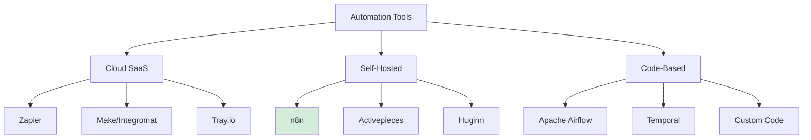
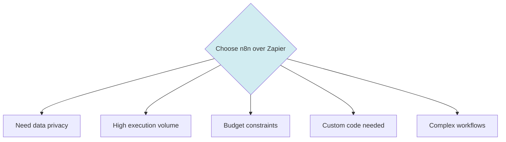
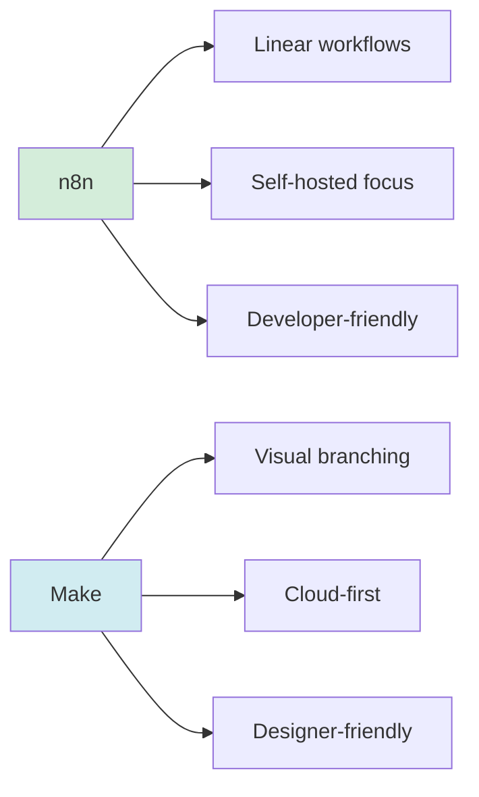
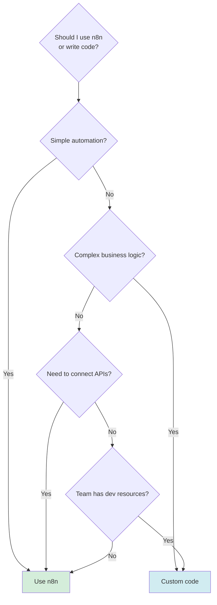
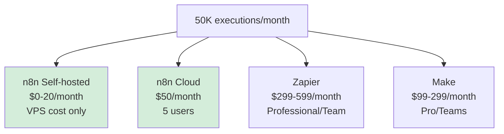

# Tool Comparison: n8n vs Alternatives

Understanding how n8n compares to other automation tools helps you make informed decisions.

---

## Overview

---

## Detailed Comparison

| Feature | n8n | Zapier | Make | Activepieces | Custom Code |
|---------|-----|--------|------|--------------|-------------|
| **Cost** | Free (self-hosted) / $20/user (cloud) | $20-599/month | $9-299/month | Free (self-hosted) | Developer time |
| **Execution Limits** | Unlimited | 100-50,000/month | 1,000-10,000/month | Unlimited | Unlimited |
| **Data Privacy** | Total control | Data on their servers | Data on their servers | Total control | Total control |
| **Setup Difficulty** | Medium | Easy | Easy | Medium | Hard |
| **Integrations** | 400+ | 7,000+ | 1,900+ | 100+ | Unlimited |
| **Custom Code** | Yes (JavaScript) | Limited | Limited | Yes (TypeScript) | Everything |
| **Visual Editor** | ✅ Yes | ✅ Yes | ✅ Yes | ✅ Yes | ❌ No |
| **Open Source** | ✅ Yes | ❌ No | ❌ No | ✅ Yes | N/A |
| **Horizontal Scaling** | ✅ Yes | ✅ Yes | ✅ Yes | ⚠️ Limited | ✅ Yes |
| **Learning Curve** | Medium | Low | Low | Medium | High |
| **Best For** | Privacy, complex workflows, budget-conscious | Quick setup, many integrations | Visual complexity | Simple self-hosted | Full control, complex logic |

---

## n8n vs Zapier

### When to Choose n8n

✅ **n8n is better when:**
- You process sensitive data (healthcare, finance, personal info)
- You run 10,000+ executions per month ($$ on Zapier)
- You need custom JavaScript logic
- You want self-hosted infrastructure
- Budget is limited but technical skills exist
- You need full control over your automation platform

### When to Choose Zapier

✅ **Zapier is better when:**
- You need 7,000+ pre-built integrations
- You want zero setup (working in 5 minutes)
- Non-technical users need to build workflows
- You don't have IT resources to manage infrastructure
- Premium support is critical
- You need integrations for niche/obscure tools

---

## n8n vs Make (Integromat)

### Key Differences

**n8n advantages:**
- Free self-hosted option
- Unlimited executions (self-hosted)
- More flexible with custom code
- Open-source (can modify)

**Make advantages:**
- More visual workflow builder
- Better at complex branching scenarios
- More pre-built scenarios/templates
- Integrated data store

---

## n8n vs Activepieces

### Both are Open-Source Alternatives

| Aspect | n8n | Activepieces |
|--------|-----|--------------|
| **Maturity** | Established (2019) | Newer (2022) |
| **Community** | Large, active | Growing |
| **Integrations** | 400+ | 100+ |
| **Architecture** | Battle-tested | Simpler |
| **Learning Resources** | Extensive | Limited |
| **TypeScript Support** | Node.js required | Native TypeScript |

**Choose n8n:** More mature, larger community, more integrations, proven in production

**Choose Activepieces:** Prefer TypeScript, want simpler architecture, smaller projects

---

## n8n vs Custom Code

### When to Code vs Use n8n

### Use n8n when:
- ✅ Connecting 2+ services via APIs
- ✅ Non-developers need to maintain it
- ✅ Workflow changes frequently
- ✅ Need visual workflow documentation
- ✅ 80% of logic is service integration

### Write custom code when:
- ✅ Complex algorithms or data processing
- ✅ Performance is absolutely critical
- ✅ Need very specific error handling
- ✅ Integration requirements are unique
- ✅ Already have development team

### Best of both worlds:
Use n8n for orchestration and API integration, but call custom code via HTTP Request nodes or Function nodes when needed.

---

## Cost Comparison (Real Numbers)

### Scenario: 50,000 executions/month

**Annual savings with self-hosted n8n:**
- vs Zapier Professional: ~$3,348/year
- vs Make Pro: ~$948/year

**Break-even point:**
Self-hosted n8n pays for itself in month 1 if you:
- Have basic DevOps skills
- Can spend 4-6 hours on initial setup
- Running 10,000+ executions/month

---

## Integration Coverage

### Do they have what you need?

**Before choosing, check:**

1. List your critical integrations
2. Verify each platform supports them
3. Check if n8n's 400+ nodes cover your needs

**n8n has excellent coverage for:**
- ✅ Google Workspace (Gmail, Sheets, Drive, Calendar)
- ✅ Microsoft 365 (Outlook, Excel, OneDrive)
- ✅ Developer tools (GitHub, GitLab, Jira)
- ✅ Communication (Slack, Discord, Telegram, WhatsApp)
- ✅ CRM (Salesforce, HubSpot, Pipedrive)
- ✅ Databases (PostgreSQL, MySQL, MongoDB)
- ✅ E-commerce (Shopify, WooCommerce, Stripe)

**Missing integrations?**
- Use HTTP Request node (works with any REST API)
- Build custom node (it's open source!)
- Request from community

---

## Decision Matrix

Use this to decide:

| Your Situation | Recommended Tool |
|----------------|------------------|
| Startup, budget-conscious, have tech skills | ✅ n8n self-hosted |
| Need 1,000+ niche integrations | Zapier |
| Very complex visual workflows | Make |
| Healthcare/Finance (data privacy critical) | ✅ n8n self-hosted |
| Non-technical team, want fast | Zapier |
| Want open-source, newer to market | Activepieces |
| ML/Data pipelines | Apache Airflow |
| Need 24/7 enterprise support | Zapier Enterprise / Make Enterprise |
| Control freaks who love to code | ✅ n8n + custom code |

---

## Key Takeaways

✅ n8n excels at: privacy, cost, customization, self-hosted  
✅ Zapier excels at: ease of use, integrations, support  
✅ Make excels at: visual complexity, branching scenarios  
✅ Custom code excels at: performance, unique logic  
✅ Choose based on your specific needs, not popularity  

---

## Further Reading

- [n8n vs Zapier (Official Comparison)](https://n8n.io/compare/zapier/)
- [n8n vs Make](https://n8n.io/compare/make/)
- [n8n Integration List](https://n8n.io/integrations)

---

**Back to:** [Lesson 1 Overview](../README.md)

