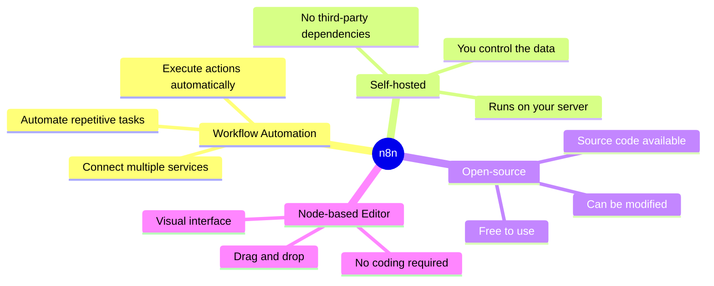
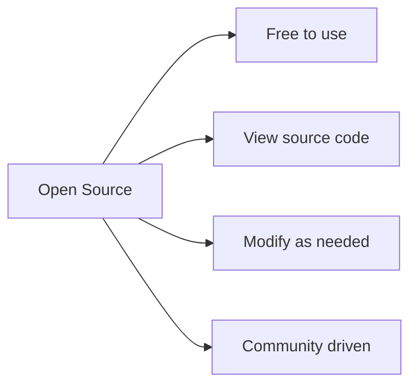
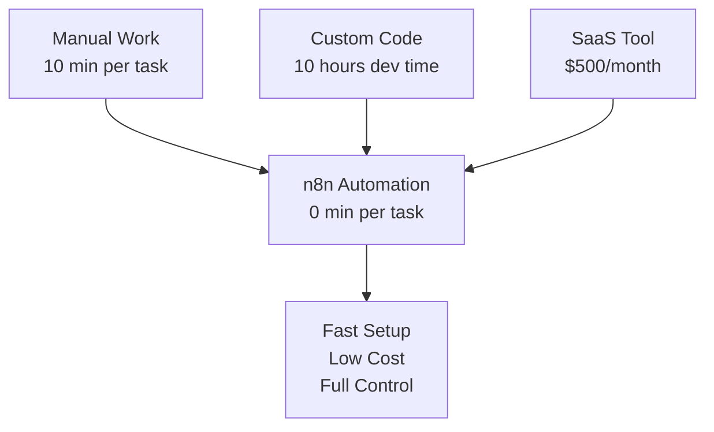

# What is n8n?

**Reading Time:** 5 minutes

---

## Simple Definition

> n8n is a tool for automating tasks between different applications and services, without needing to code (much).

Think of it as a digital assistant that connects your apps and makes them work together automatically.

---

## Technical Definition

> n8n is a self-hosted, open-source workflow automation platform with a node-based visual editor.

Let's break this down:



---

## Breaking Down the Definition

### "Workflow Automation"
**= Making things happen automatically by following rules**

Instead of manually copying data from email to spreadsheet to CRM, n8n does it automatically when triggered.

### "Self-hosted"
**= You install it on your own server (no dependency on third parties)**

Unlike Zapier or Make, n8n runs on YOUR infrastructure. This means:
- Your data never leaves your servers
- No monthly fees per execution
- Full control over updates and customization

### "Open-source"
**= The code is open, free, and you can modify it**



### "Node-based Visual Editor"
**= You don't write code, you connect blocks visually**

Think of it like building with LEGO blocks:
- Each block (node) does ONE specific thing
- You connect blocks to create a workflow
- Data flows from block to block
- No programming required (but you CAN code if needed)

---

## Why Does n8n Exist?

### The Problem
Modern businesses use dozens of tools:
- Email (Gmail, Outlook)
- CRM (Salesforce, HubSpot)
- Chat (Slack, Teams)
- Storage (Google Drive, Dropbox)
- And many more...

**These tools don't talk to each other automatically.**

### The Manual Solution (Before n8n)
```
Option 1: Do everything manually
→ Slow, error-prone, boring

Option 2: Hire developers to build integrations
→ Expensive, time-consuming

Option 3: Use SaaS tools like Zapier
→ Expensive at scale, data privacy concerns
```

### The n8n Solution


---

## n8n in One Sentence

**n8n is like having a robot assistant that connects all your apps and automates boring repetitive tasks, running on your own server so you keep control of your data.**

---

## Key Takeaways

✅ n8n automates workflows between different services  
✅ It's self-hosted (runs on YOUR server)  
✅ It's open-source (free and customizable)  
✅ Uses a visual editor (blocks/nodes)  
✅ Solves the "apps don't talk to each other" problem  

---

## Check Your Understanding

Before moving on, make sure you can answer:

1. What does n8n do in simple terms?
2. What does "self-hosted" mean?
3. Why is open-source important?
4. What is the main problem n8n solves?

---

**Next:** [Real-World Use Cases →](02-use-cases.md)

