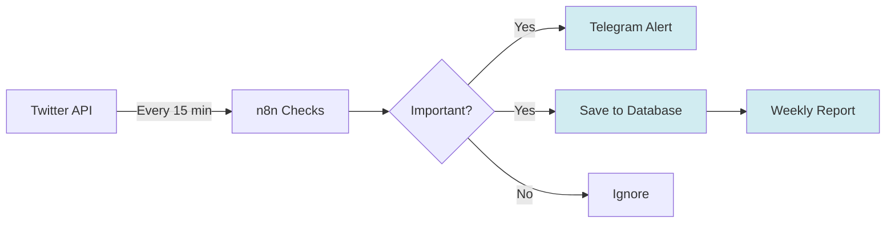
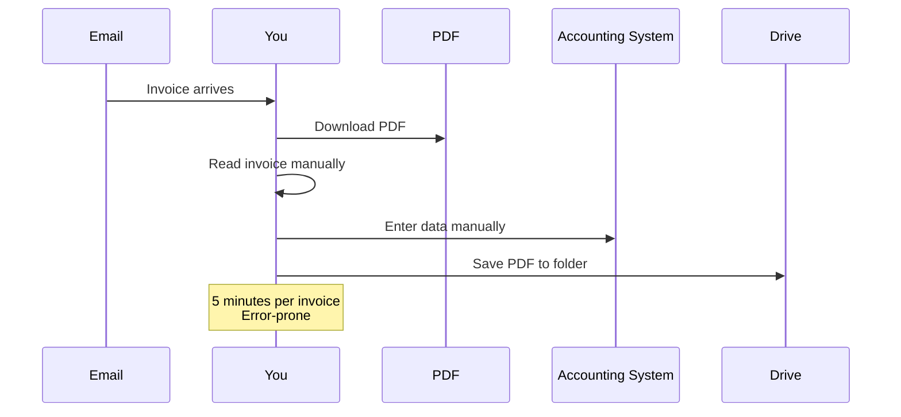
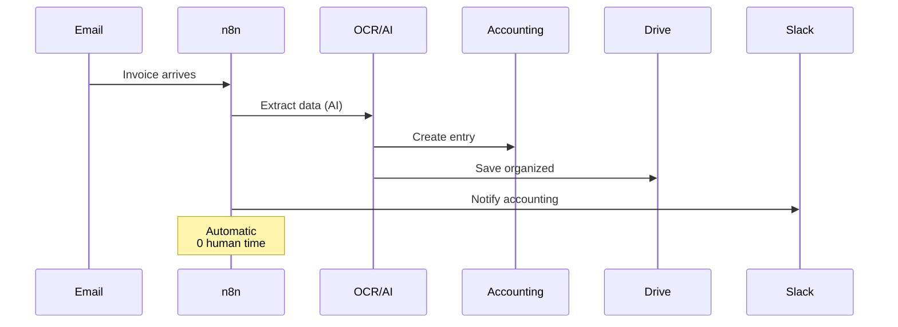
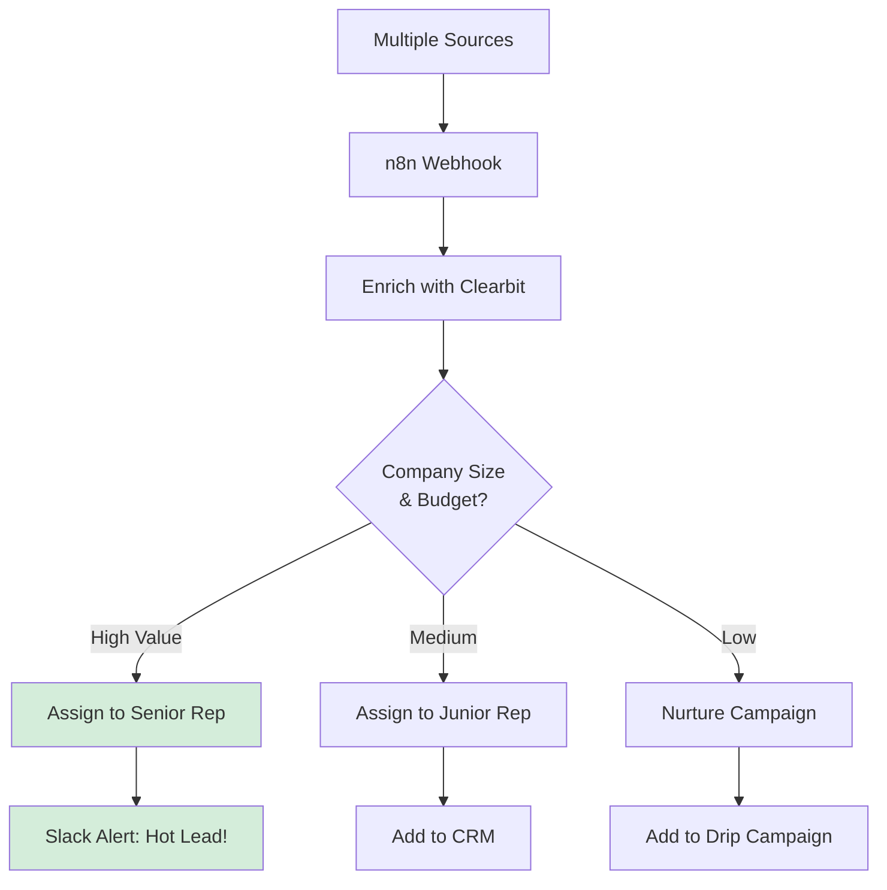
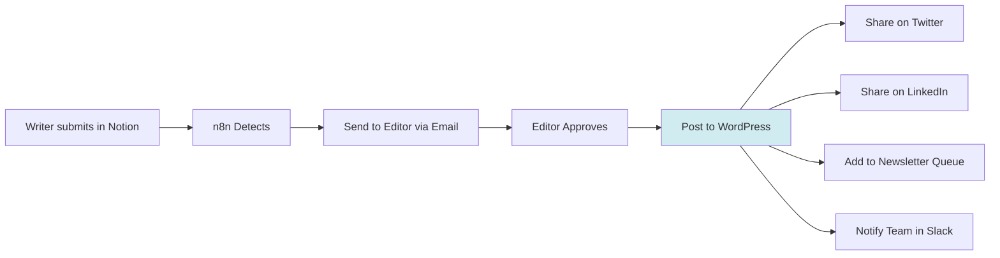
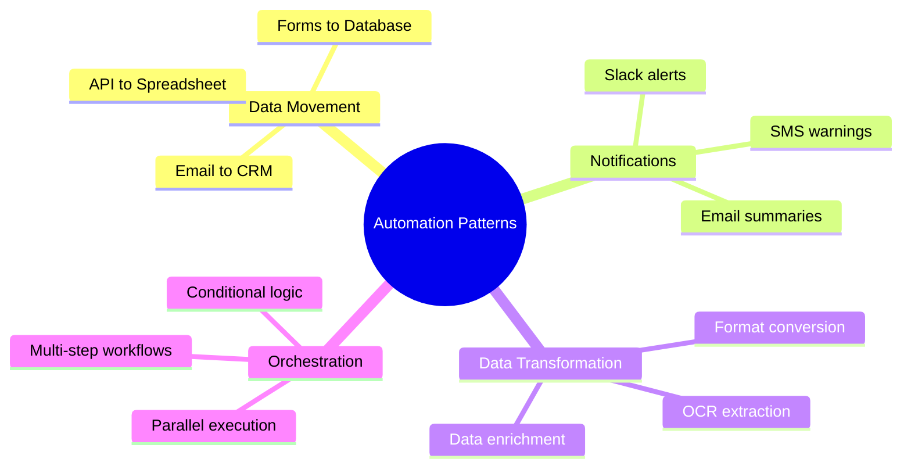

# Real-World Use Cases

**Reading Time:** 5 minutes

---

## Why Use Cases Matter

Understanding WHEN and WHY to use n8n is crucial. Let's explore real scenarios where n8n shines.

---

## Use Case 1: Sales Automation

### The Manual Way (Without n8n)

```mermaid
graph TD
    A[Customer fills form] --> B[You receive email]
    B --> C[Open email, read data]
    C --> D[Copy to Google Sheets]
    D --> E[Open CRM, create customer]
    E --> F[Compose welcome email]
    F --> G[Open Slack, notify team]
    
    H[⏰ Time: 10 minutes<br/>❌ Error-prone<br/>😫 Boring] --> A
```



**Problems:**
- Takes 10 minutes per customer
- Prone to copy-paste errors
- Team member might forget a step
- Doesn't scale (100 customers = 16+ hours)

### The n8n Way (Automated)

```mermaid
graph TD
    A[Customer fills form] --> B[n8n Webhook Trigger]
    B --> C[Save to Google Sheets]
    B --> D[Create customer in CRM]
    B --> E[Send welcome email]
    B --> F[Notify team in Slack]
    
    G[⏰ Time: 0 minutes<br/>✅ Perfect every time<br/>😊 Team focuses on sales] --> A
```



**Benefits:**
- Instant (happens in seconds)
- Never forgets a step
- Works 24/7
- Scales infinitely
- **ROI:** 100 customers/month = 16 hours saved = ~$800-2,000 value

---

## Use Case 2: Social Media Monitoring

### Without n8n

You need to:
1. Check Twitter every hour for brand mentions
2. Copy important tweets manually
3. Respond to each one
4. Update tracking spreadsheet
5. Generate weekly reports manually

**Time investment:** 2-3 hours per day

### With n8n



**Workflow:**
1. n8n checks Twitter API every 15 minutes
2. Filters mentions with keywords (urgent, complaint, opportunity)
3. Sends instant Telegram notification
4. Saves to database with sentiment analysis
5. Generates automatic weekly report

**Time saved:** 10+ hours per week

---

## Use Case 3: Invoice Processing

### The Traditional Process



### The n8n Process



**n8n Workflow:**
1. Monitors email for invoices
2. Extracts PDF attachment
3. Uses OCR/AI to extract: amount, vendor, date, items
4. Creates entry in accounting system
5. Saves PDF to Google Drive (organized by date/vendor)
6. Notifies accounting team

**Benefits:**
- 20 invoices/month × 5 min = 100 min saved
- Zero data entry errors
- Instant processing
- Automatic organization

---

## Use Case 4: Lead Qualification

### Scenario
You get leads from multiple sources: website, LinkedIn, email, ads.

### Without n8n
- Manually check each source
- Qualify leads by researching company
- Assign to sales rep
- Update CRM

### With n8n



**Result:**
- Instant lead routing
- Automatic enrichment
- Sales team only sees qualified leads
- **Conversion rate increase:** 20-30%

---

## Use Case 5: Content Publishing Pipeline

### Workflow



**Automation:**
- Writer marks article "Ready" in Notion
- n8n sends to editor automatically
- On approval, publishes everywhere
- Cross-posts to social media
- Updates internal tracking

---

## Common Patterns

All these use cases share common patterns:



---

## When to Automate with n8n

✅ **Good fit:**
- Repetitive tasks (same steps every time)
- Multi-system workflows (connects 2+ tools)
- Time-consuming manual work (5+ min per execution)
- High volume tasks (daily/weekly)
- Error-prone processes (copy-paste heavy)

❌ **Not a good fit:**
- One-time tasks
- Highly variable processes
- Requires human judgment/creativity
- Already has native integration

---

## ROI Calculation

Simple formula:

```
Time Saved per Month = Tasks/month × Minutes/task
Cost Saved = (Time Saved / 60) × Hourly Rate
n8n Cost = ~$0 (self-hosted) or $20/user (cloud)

ROI = Cost Saved - n8n Cost
```

**Example:**
- 100 tasks/month × 5 minutes = 500 minutes (8.3 hours)
- 8.3 hours × $50/hour = $415 saved
- n8n cost = $0 (self-hosted)
- **ROI = $415/month** for ONE workflow

---

## Key Takeaways

✅ n8n excels at repetitive, multi-system tasks  
✅ Real ROI from time savings and error reduction  
✅ Works best for high-volume workflows  
✅ Can automate almost any app-to-app workflow  
✅ Most valuable for businesses with multiple tools  

---

## Check Your Understanding

1. Name 3 types of tasks that are good candidates for n8n automation
2. Why is invoice processing a good use case?
3. What's the ROI formula for automation?

---

**Next:** [How n8n Works →](03-how-it-works.md)

