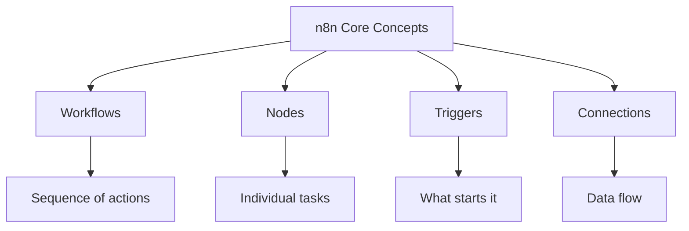
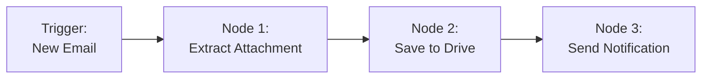
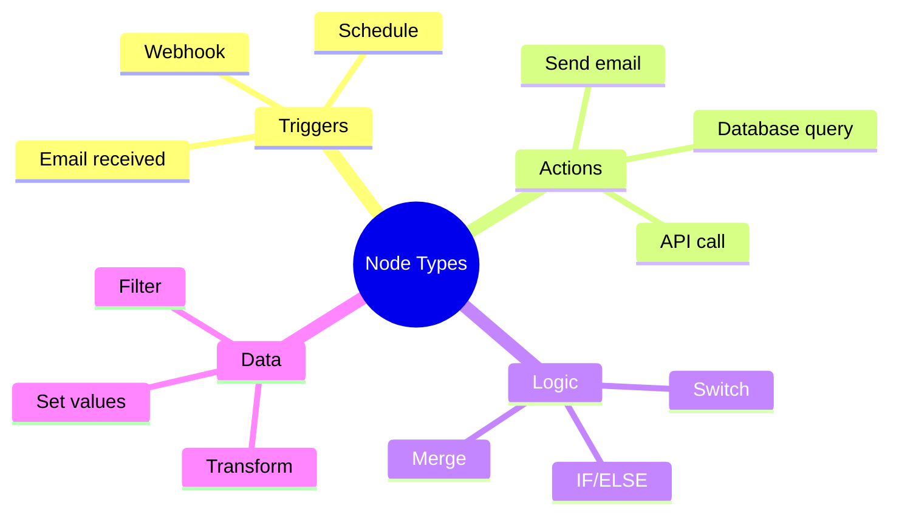
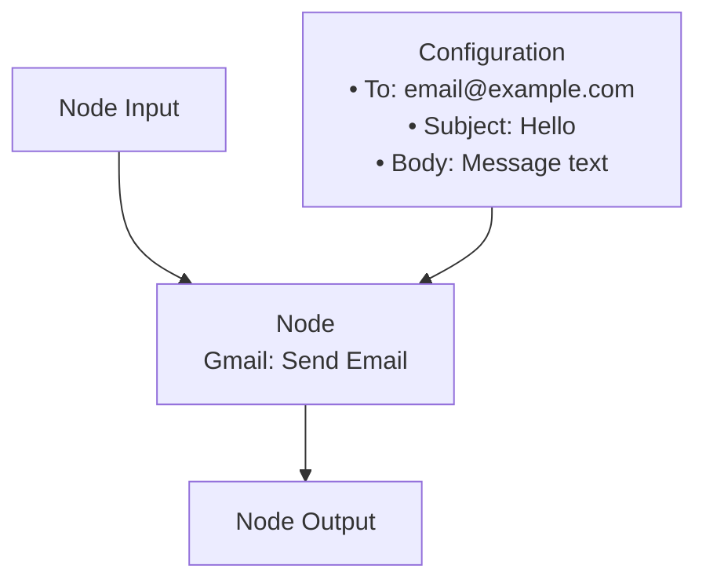
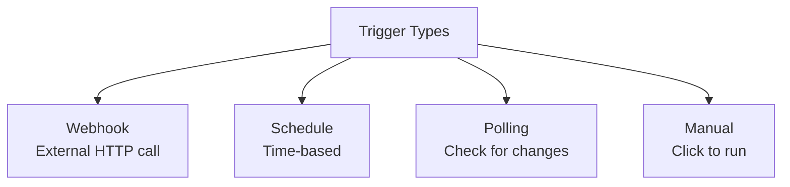
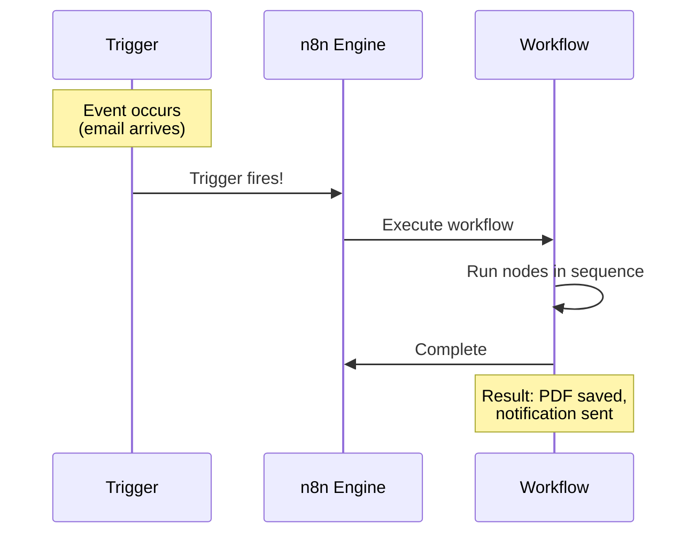
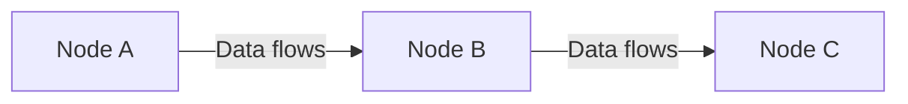
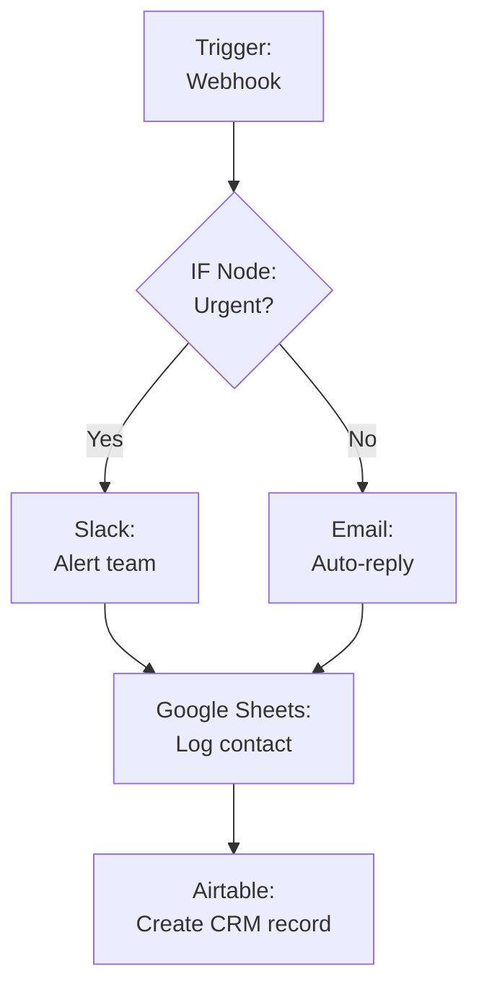
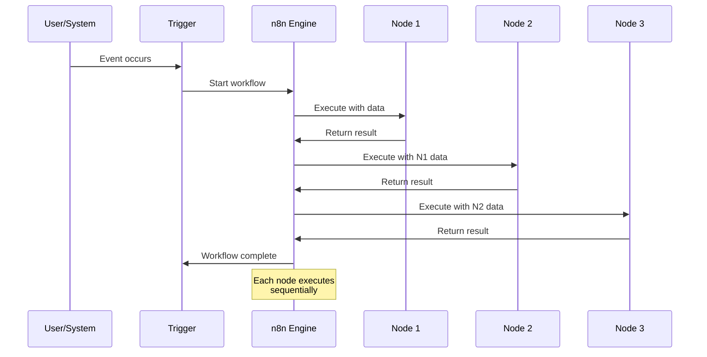

# How n8n Works

**Reading Time:** 5 minutes

---

## Core Concepts

Before diving into workflows, let's understand the building blocks:



---

## 1. Workflows

### What is a Workflow?

> A **workflow** is a sequence of automated actions that execute in order to accomplish a task.

Think of it like a recipe:
- Recipe = Workflow
- Ingredients = Input data
- Steps = Nodes
- Final dish = Output/Result

### Workflow Example



**This workflow:**
1. Waits for new email (Trigger)
2. Extracts PDF attachment (Node 1)
3. Saves to Google Drive (Node 2)
4. Sends Slack notification (Node 3)

---

## 2. Nodes

### What is a Node?

> A **node** is a single action or task in your workflow. Each node does ONE thing.



### Node Anatomy



Every node has:
- **Input:** Data coming from previous node
- **Configuration:** Settings for this specific node
- **Output:** Data produced, sent to next node

### Common Node Examples

| Node Type | What it Does | Example |
|-----------|--------------|---------|
| **HTTP Request** | Makes API calls | Fetch weather data |
| **Gmail** | Email operations | Send/read emails |
| **Google Sheets** | Spreadsheet ops | Add row, read data |
| **Slack** | Chat operations | Send message, create channel |
| **IF** | Conditional logic | If amount > 1000, alert |
| **Code** | Custom JavaScript | Complex transformations |
| **Database** | SQL operations | Query PostgreSQL |

---

## 3. Triggers

### What is a Trigger?

> A **trigger** is what STARTS a workflow. Nothing happens until the trigger fires.



### Trigger Examples

#### 1. Webhook Trigger
```
External service → POST to n8n URL → Workflow starts
Example: Form submission on website
```

#### 2. Schedule Trigger
```
Every day at 9 AM → Workflow starts
Example: Generate daily report
```

#### 3. Polling Trigger
```
Check Gmail every 5 min for new emails → If found, workflow starts
Example: Monitor inbox for invoices
```

#### 4. Manual Trigger
```
You click "Execute Workflow" → Workflow starts
Example: Testing or one-time tasks
```

### Trigger Visualization



---

## 4. Connections

### What are Connections?

> **Connections** link nodes together and define how data flows through your workflow.



### Data Flow

Data flows through connections like water through pipes:

```mermaid
graph LR
    A[Input:<br/>Email received] -->|email data| B[Extract:<br/>Get attachment]
    B -->|file data| C[Save:<br/>To Drive]
    C -->|file URL| D[Notify:<br/>Send to Slack]
    
    E[Data: {<br/>  from: sender@email.com<br/>  subject: Invoice<br/>}] -.-> A
    
    F[Data: {<br/>  filename: invoice.pdf<br/>  content: binary<br/>}] -.-> B
    
    G[Data: {<br/>  driveURL: https://...<br/>  fileId: 123<br/>}] -.-> C
```

---

## 5. Putting It All Together

### Complete Workflow Example

Let's build a "Contact Form" workflow:



**Step-by-step:**

1. **Trigger (Webhook):** Form submission hits n8n URL
2. **IF Node:** Checks if "urgent" field is true
   - If YES → Alert team on Slack immediately
   - If NO → Send auto-reply email
3. **Google Sheets:** Both paths log contact to spreadsheet
4. **Airtable:** Create record in CRM

### Data Transformation

As data flows through nodes, it can be transformed:

```mermaid
graph LR
    A[Raw Form Data] --> B[Extract Fields]
    B --> C[Validate Email]
    C --> D[Format Phone]
    D --> E[Enrich with API]
    E --> F[Clean Data Ready]
    
    G[{<br/>  name: john doe<br/>  email: JOHN@email.com<br/>  phone: 5551234567<br/>}] -.-> A
    
    H[{<br/>  name: John Doe<br/>  email: john@email.com<br/>  phone: +1-555-123-4567<br/>  company: Acme Inc<br/>  title: CEO<br/>}] -.-> F
```

---

## 6. Execution Flow

### How n8n Processes Workflows



### Execution Modes

**1. Sequential (Default)**
```
Node 1 → Node 2 → Node 3 → Done
```

**2. Parallel (Multiple branches)**
```
         → Node 2a →
Node 1 →            → Merge → Node 4
         → Node 2b →
```

**3. Conditional**
```
         → Node 2 (if true)
Node 1 →
         → Node 3 (if false)
```

---

## Key Takeaways

✅ **Workflow** = Complete automation sequence  
✅ **Node** = Individual action/task  
✅ **Trigger** = What starts the workflow  
✅ **Connections** = How data flows  
✅ Data transforms as it moves through nodes  
✅ Workflows can branch (conditional logic)  

---

## Check Your Understanding

1. What's the difference between a trigger and a node?
2. Can a workflow have multiple triggers?
3. What happens to data as it flows through nodes?
4. Name 3 types of triggers

---

**Next:** [n8n Architecture →](04-architecture.md)

