# n8n Architecture

**Reading Time:** 5 minutes

---

## Overview

Understanding n8n's architecture is crucial for implementing it properly. Let's break down the components and how they work together.

---

## High-Level Architecture

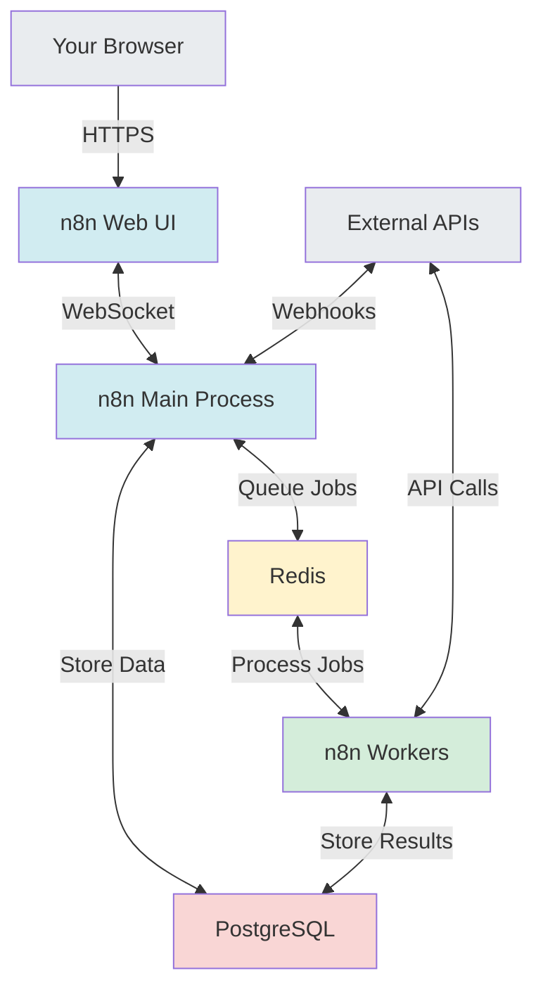

---

## Core Components

n8n consists of 4 main components:

### 1. n8n Web (Frontend UI)

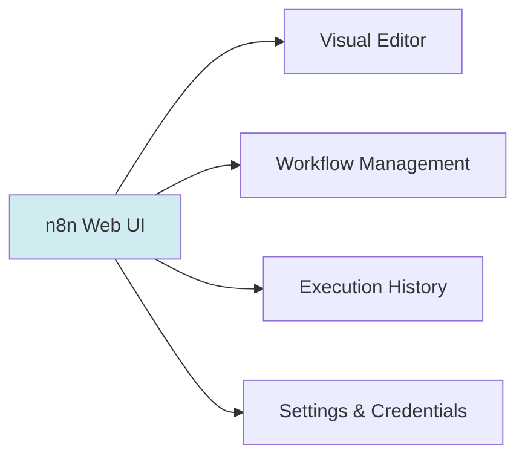

**What it does:**
- Provides the visual workflow editor
- Shows workflow execution history
- Manages credentials and settings
- Serves the web interface

**Technology:**
- Vue.js frontend
- Runs in your browser
- Communicates via WebSocket and REST API

**Port:** Usually `5678`

---

### 2. n8n Main Process (Backend)

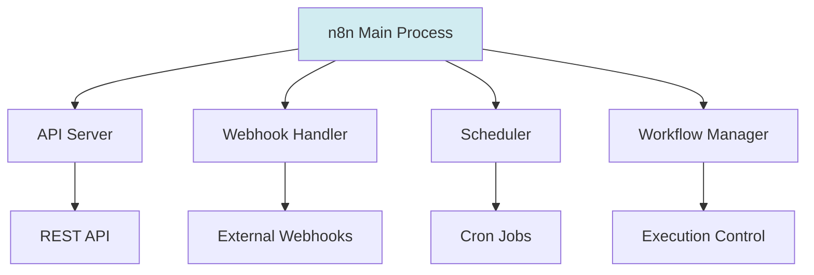

**What it does:**
- Handles API requests from UI
- Receives webhook triggers
- Manages scheduled workflows
- Coordinates workflow executions
- Acts as the "brain" of n8n

**Key Responsibilities:**
- User authentication
- Webhook routing
- Schedule management
- Job queuing (when using Redis)

---

### 3. PostgreSQL (Database)

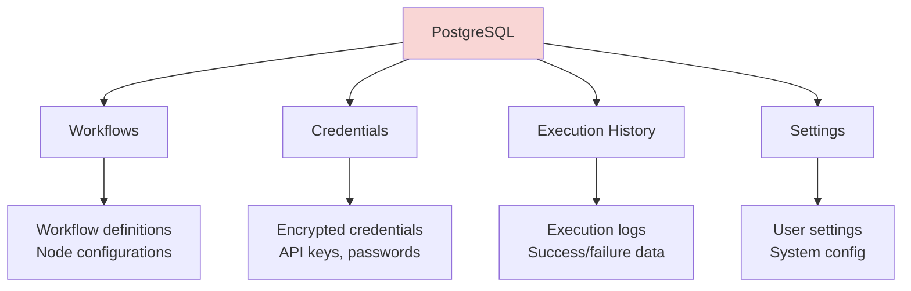

**What it stores:**
- Workflow definitions (your workflows)
- Credentials (encrypted)
- Execution history
- System settings
- User data

**Why PostgreSQL?**
- ✅ Reliable and battle-tested
- ✅ ACID compliance (data integrity)
- ✅ Great performance for n8n's needs
- ✅ Excellent backup/restore tools

**Alternatives:**
- SQLite (for development only)
- MySQL (supported but PostgreSQL preferred)

---

### 4. Redis (Queue System)

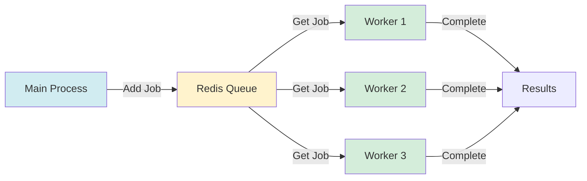

**What it does:**
- Manages job queue (workflows to execute)
- Enables horizontal scaling (multiple workers)
- Coordinates distributed execution
- Provides pub/sub for real-time updates

**Why Redis?**
- ⚡ Extremely fast (in-memory)
- 🔄 Perfect for queues
- 📊 Built-in pub/sub
- 🚀 Enables scaling

**When is Redis needed?**
- ✅ Production environments
- ✅ High-volume workflows
- ✅ Multiple workers
- ❌ NOT needed for simple dev setup

---

## 5. n8n Workers (Execution Engine)

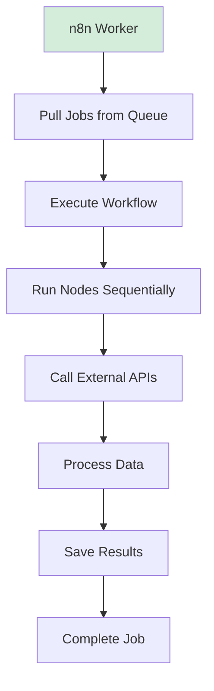

**What they do:**
- Pull jobs from Redis queue
- Execute workflows
- Call external APIs
- Process data transformations
- Save execution results

**Scaling:**
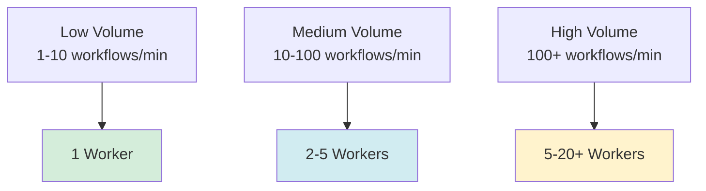

---

## Architecture Modes

### Mode 1: Single Process (Development)

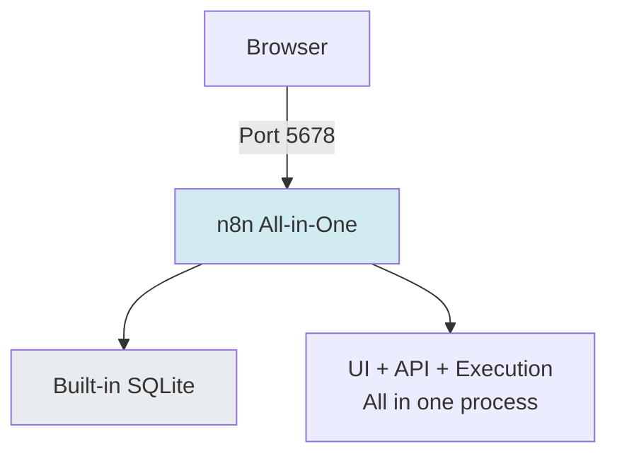

**Characteristics:**
- ✅ Simple setup (one command)
- ✅ Perfect for development/testing
- ✅ No Redis needed
- ✅ Can use SQLite
- ❌ No horizontal scaling
- ❌ Limited performance

**When to use:** Local development, testing, low-volume personal use

---

### Mode 2: Main + Workers (Production)

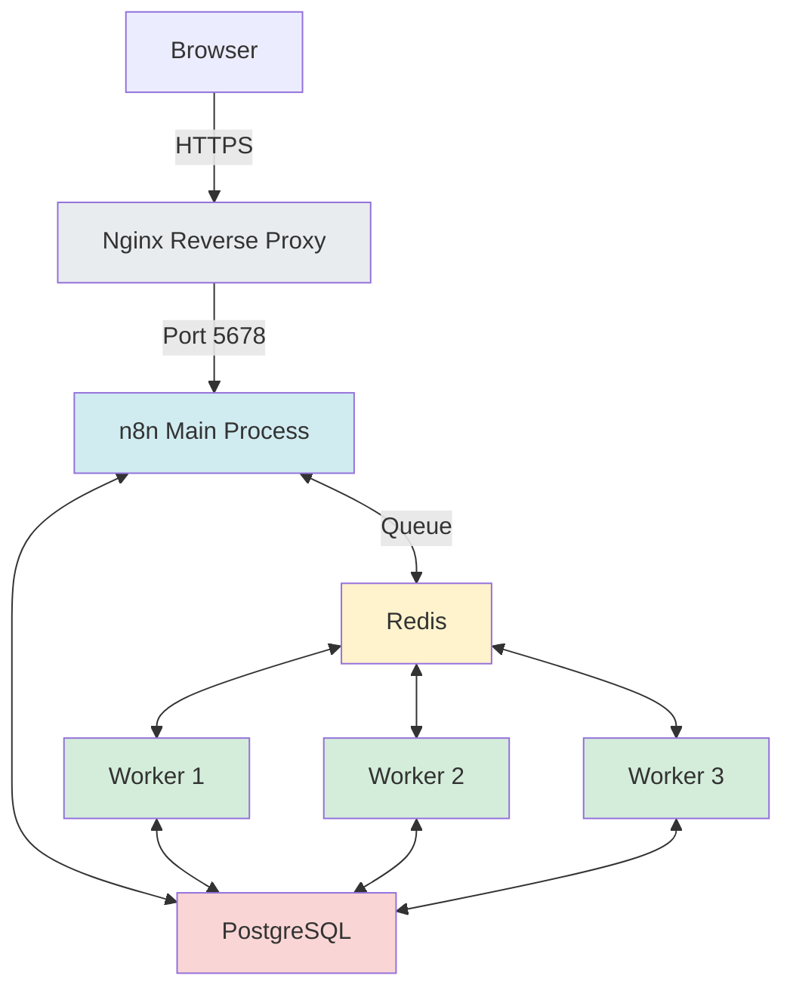

**Characteristics:**
- ✅ Horizontal scaling
- ✅ High performance
- ✅ Production-ready
- ✅ HTTPS with Nginx
- ✅ Multiple workers
- ⚠️ More complex setup

**When to use:** Production deployments, high-volume, business-critical

---

## Data Flow Example

Let's trace a complete workflow execution:

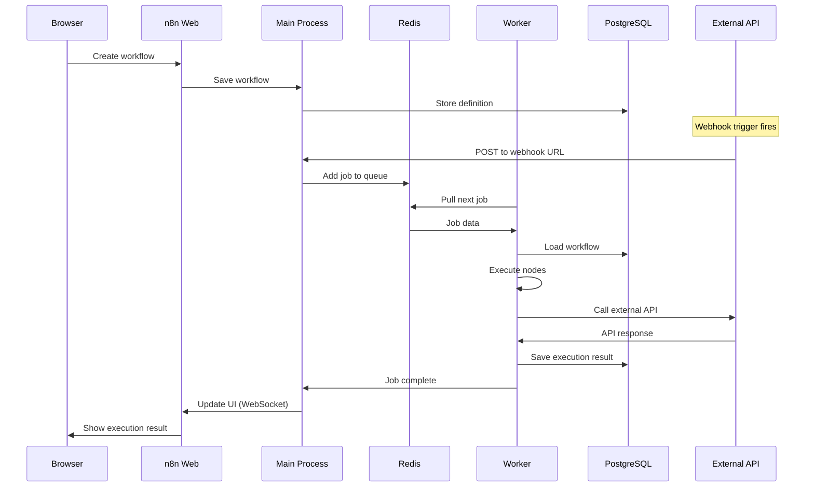

---

## Component Communication

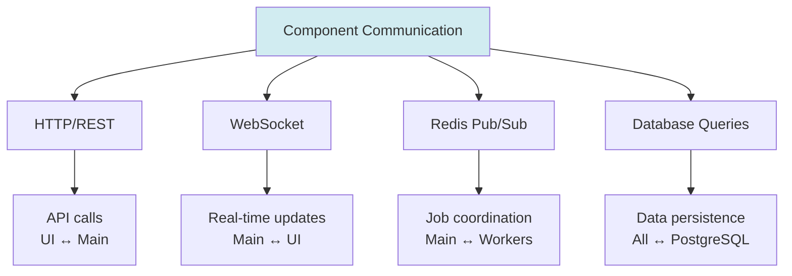

---

## Deployment Patterns

### Pattern 1: Single Server (Small Scale)

```
┌─────────────────────────────┐
│      VPS (4GB RAM)          │
│                             │
│  ┌─────────────────────┐   │
│  │  Docker Compose     │   │
│  │  ├─ n8n             │   │
│  │  ├─ PostgreSQL      │   │
│  │  ├─ Redis           │   │
│  │  └─ Nginx           │   │
│  └─────────────────────┘   │
└─────────────────────────────┘
```

### Pattern 2: Scaled (Medium Scale)

```
┌──────────────┐  ┌──────────────┐  ┌──────────────┐
│  n8n Main    │  │  n8n Worker  │  │  n8n Worker  │
│  (2GB RAM)   │  │  (2GB RAM)   │  │  (2GB RAM)   │
└──────┬───────┘  └──────┬───────┘  └──────┬───────┘
       │                 │                 │
       └────────┬────────┴────────┬────────┘
                │                 │
       ┌────────▼─────┐  ┌───────▼────────┐
       │ PostgreSQL   │  │     Redis      │
       │  (4GB RAM)   │  │   (2GB RAM)    │
       └──────────────┘  └────────────────┘
```

---

## Key Takeaways

✅ **4 core components:** Web, Main, PostgreSQL, Redis  
✅ **Two modes:** Single (dev) vs Queue (production)  
✅ **PostgreSQL:** Stores workflows and credentials  
✅ **Redis:** Enables scaling with multiple workers  
✅ **Workers:** Execute the actual workflows  
✅ **Main Process:** Coordinates everything  

---

## Check Your Understanding

1. What are the 4 main components of n8n?
2. What does PostgreSQL store?
3. Why do we need Redis in production?
4. What's the difference between Main Process and Workers?
5. When would you use single process vs queue mode?

---

**Next:** [Using vs Implementing →](05-using-vs-implementing.md)

