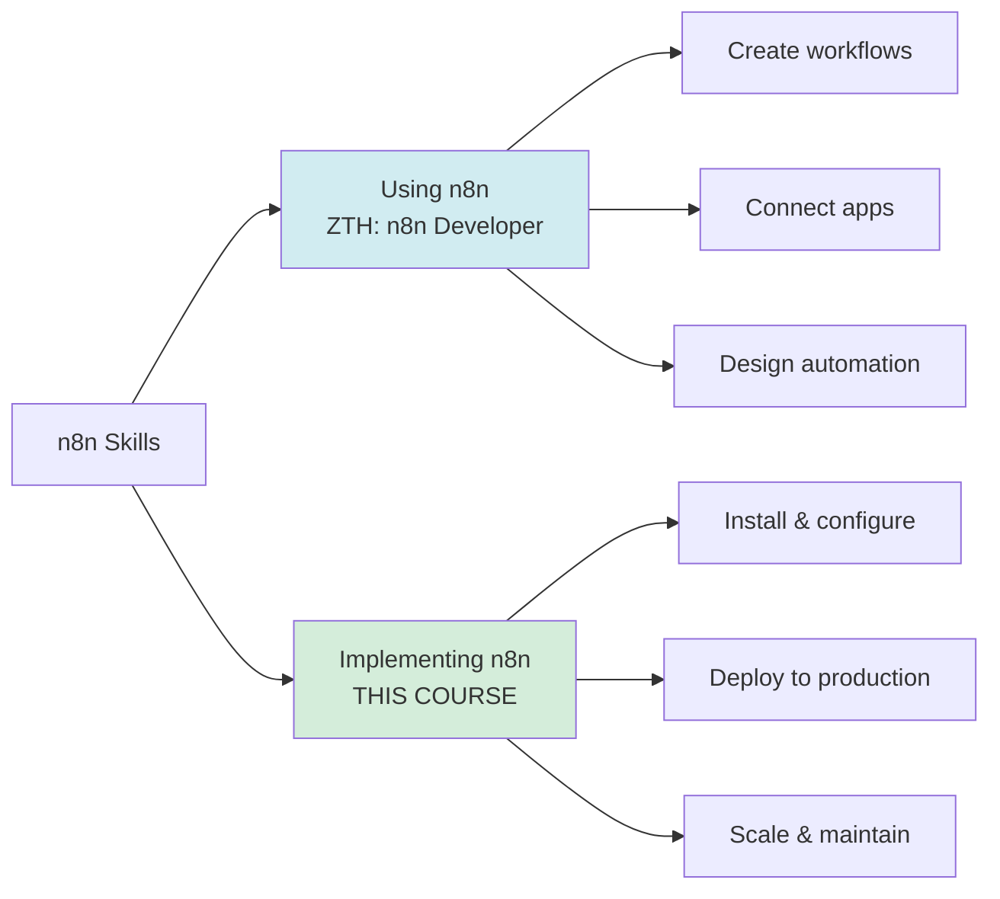
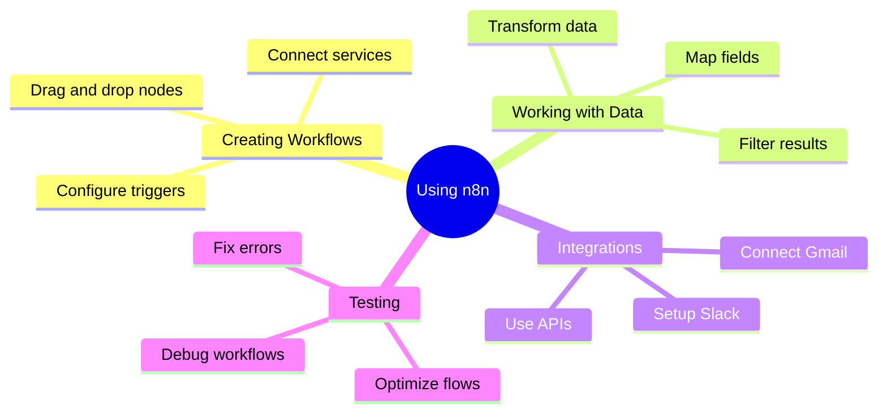
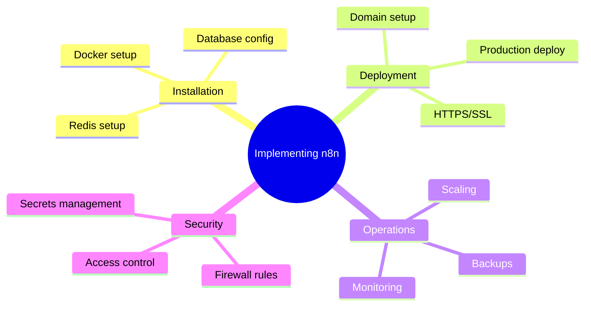
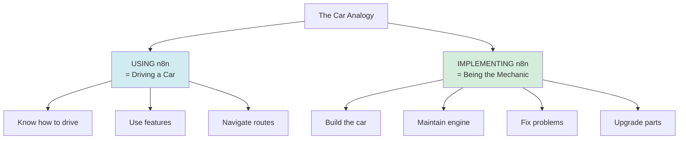
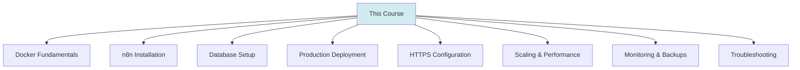
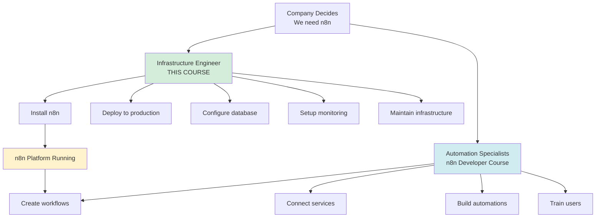
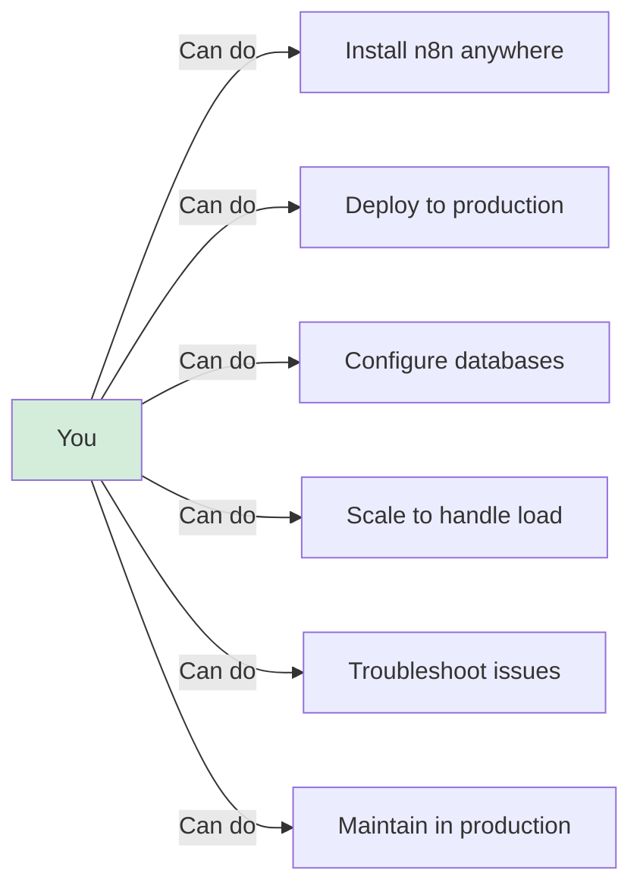

# Using vs Implementing n8n

**Reading Time:** 3 minutes

---

## The Critical Distinction

This course teaches you how to **IMPLEMENT** n8n, not how to **USE** it. Understanding this difference is crucial.



---

## Using n8n (n8n Developer)

### Role: Workflow Creator / Automation Specialist



### What You Do

**Daily Tasks:**
- Create workflows in the visual editor
- Connect services (Gmail, Slack, CRM, etc.)
- Configure triggers and actions
- Transform and map data
- Test and debug workflows
- Optimize workflow performance

### Skills Needed

✅ Basic logic and problem-solving  
✅ Understanding of APIs  
✅ Knowledge of tools you're connecting  
✅ Data mapping concepts  
❌ NO Docker knowledge needed  
❌ NO server management needed  
❌ NO database administration needed  

### Tools You Use

- n8n Web UI (the visual editor)
- The apps you're connecting
- Testing tools (Postman, etc.)

---

## Implementing n8n (Infrastructure Engineer)

### Role: DevOps / Infrastructure Engineer



### What You Do

**Daily Tasks:**
- Install and configure n8n
- Set up PostgreSQL database
- Configure Redis and workers
- Deploy to production servers
- Configure HTTPS and SSL certificates
- Set up backups and monitoring
- Scale workers based on load
- Troubleshoot infrastructure issues
- Manage updates and security

### Skills Needed

✅ Docker and containerization  
✅ Linux/Server administration  
✅ Networking (ports, DNS, SSL)  
✅ Database management  
✅ Security best practices  
✅ CI/CD concepts  
❌ NO need to be n8n workflow expert  
❌ NO need to know every integration  

### Tools You Use

- Docker / Docker Compose
- Terminal / Command line
- VPS / Cloud servers
- Nginx / Reverse proxy
- Git / Version control
- Monitoring tools

---

## The Car Analogy



**Using n8n = Driving a car**
- You know how to drive
- You use the features (AC, radio)
- You navigate where to go
- Someone else built and maintains it

**Implementing n8n = Being the mechanic**
- You build/assemble the car
- You maintain the engine
- You fix mechanical problems
- You upgrade and optimize parts
- The driver doesn't need to know mechanics

---

## What This Course Covers

### ✅ YOU WILL LEARN:



- How to install n8n with Docker
- PostgreSQL configuration for n8n
- Redis and Queue Mode setup
- Deploying to production (VPS)
- Configuring HTTPS with Let's Encrypt
- CI/CD automation
- Monitoring and logging
- Backup strategies
- Scaling workers
- Infrastructure troubleshooting

### ❌ YOU WON'T LEARN:

- How to create workflows (that's for "ZTH: n8n Developer")
- Specific integrations (Gmail, Slack, etc.)
- Workflow design patterns
- n8n JavaScript expressions
- Advanced workflow optimization

---

## Career Paths

### Path 1: n8n Developer (User)

```
Junior Automation Specialist
↓
Automation Engineer
↓
Senior Workflow Architect
↓
Head of Automation
```

**Focus:** Building workflows, connecting services, automating processes

### Path 2: n8n Engineer (Implementer)

```
Junior DevOps Engineer
↓
Infrastructure Engineer
↓
Senior n8n Platform Engineer
↓
Head of Infrastructure
```

**Focus:** Installing, deploying, scaling, maintaining infrastructure

### Path 3: Full Stack (Both)

```
Know how to USE n8n + Know how to IMPLEMENT n8n
= Complete n8n Specialist
```

**This is the most valuable combination!**

---

## Real-World Scenario

### Company needs n8n



**You need BOTH roles:**
1. **Engineer** (this course) sets up the platform
2. **Developers** (different course) build automations

---

## Which One Are You?

### You're an **Implementer** if:
- ✅ You work in DevOps / Infrastructure
- ✅ You manage servers and deployments
- ✅ You're comfortable with Docker
- ✅ You need to set up n8n for your team/company
- ✅ You're responsible for uptime and performance

### You're a **User** if:
- ✅ You create automation workflows
- ✅ You connect different apps/services
- ✅ You focus on business logic
- ✅ Someone else manages the infrastructure
- ✅ You use the n8n UI daily

### You're **Both** if:
- ✅ You're a solo founder / freelancer
- ✅ You wear multiple hats
- ✅ Small team where you do everything
- ✅ You want complete control

---

## After This Course

Once you complete this course, you'll be able to:



**You'll be certified as:** n8n Infrastructure Engineer

**Next step to learn:** "ZTH: n8n Developer" (how to USE n8n)

---

## Key Takeaways

✅ **Using** = Creating workflows in the UI  
✅ **Implementing** = Installing and maintaining infrastructure  
✅ This course = **Implementation** (DevOps/Infrastructure)  
✅ Both skills are valuable (ideally learn both!)  
✅ Different career paths for each specialty  

---

## Check Your Understanding

1. What's the main difference between using and implementing n8n?
2. Which role focuses on Docker and servers?
3. Which role focuses on creating workflows?
4. Can one person do both? When would they need to?
5. What will YOU be able to do after this course?

---

## 🎯 You've Completed the Theory!

Congratulations! You now understand:
- ✅ What n8n is
- ✅ Real-world use cases
- ✅ How n8n works internally
- ✅ n8n's architecture
- ✅ The difference between using and implementing

**Next:** Time for hands-on practice!

**👉 [Go to Practice Exercises →](../practice/)**

