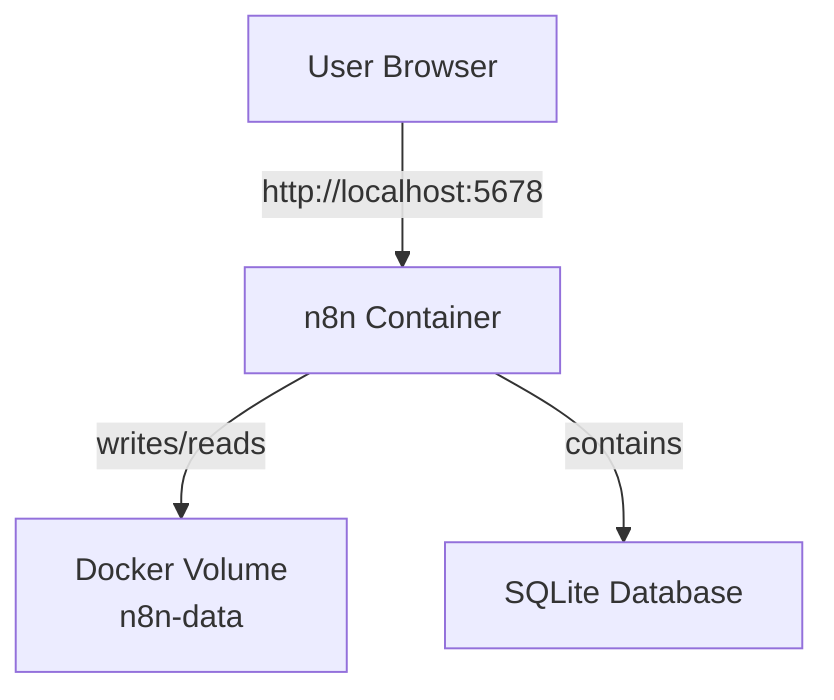

# Example 1: Basic n8n with Docker

**Complexity:** ⭐ Beginner  
**Use Case:** Development, testing, personal automation projects

---

## 📋 What's Included

- Single n8n container
- SQLite database (default)
- Volume for data persistence
- Basic security with authentication

---

## 📁 Files

```
01-basic-n8n/
├── Dockerfile          # Custom n8n image (optional)
├── docker-run.sh       # Shell script to run n8n
├── .env.example        # Environment variables template
└── README.md          # This file
```

---

## 🚀 Quick Start

### Option 1: Using Docker Run Command (Simplest)

```bash
# Run n8n with volume
docker run -d \
  --name n8n \
  --restart unless-stopped \
  -p 5678:5678 \
  -e N8N_BASIC_AUTH_ACTIVE=true \
  -e N8N_BASIC_AUTH_USER=admin \
  -e N8N_BASIC_AUTH_PASSWORD=change_this_password \
  -e GENERIC_TIMEZONE=America/New_York \
  -v n8n-data:/home/node/.n8n \
  n8n/n8n:latest

# Access n8n at http://localhost:5678
# Login: admin / change_this_password
```

### Option 2: Using Shell Script

```bash
# Make script executable
chmod +x docker-run.sh

# Run script
./docker-run.sh

# Access n8n at http://localhost:5678
```

---

## 🔧 Configuration

### Environment Variables

Create `.env` file from template:

```bash
cp .env.example .env
```

Edit `.env`:

```bash
# Basic Authentication
N8N_BASIC_AUTH_ACTIVE=true
N8N_BASIC_AUTH_USER=admin
N8N_BASIC_AUTH_PASSWORD=your_secure_password_here

# Timezone
GENERIC_TIMEZONE=America/New_York

# Host Configuration
N8N_HOST=localhost
N8N_PORT=5678
N8N_PROTOCOL=http

# Webhook URL
WEBHOOK_URL=http://localhost:5678/
```

### Port Mapping

Default: `5678:5678` (host:container)

To use different port:
```bash
docker run -d \
  --name n8n \
  -p 8080:5678 \  # Access at http://localhost:8080
  -v n8n-data:/home/node/.n8n \
  n8n/n8n:latest
```

---

## 📊 Architecture



---

## 🔍 Management Commands

```bash
# View logs
docker logs n8n
docker logs -f n8n  # Follow logs

# Stop n8n
docker stop n8n

# Start n8n
docker start n8n

# Restart n8n
docker restart n8n

# Remove container (keeps data)
docker stop n8n
docker rm n8n

# Access container shell
docker exec -it n8n sh

# Check n8n version
docker exec n8n n8n --version
```

---

## 💾 Data Management

### Backup

```bash
# Backup volume to tar file
docker run --rm \
  -v n8n-data:/data \
  -v $(pwd):/backup \
  alpine \
  tar czf /backup/n8n-backup-$(date +%Y%m%d).tar.gz -C /data .
```

### Restore

```bash
# Restore from backup
docker run --rm \
  -v n8n-data:/data \
  -v $(pwd):/backup \
  alpine \
  tar xzf /backup/n8n-backup-20241117.tar.gz -C /data
```

### Export/Import Workflows

Workflows are stored in the SQLite database inside the volume. You can also:

1. **Manual Export (via UI):**
   - Open n8n web interface
   - Navigate to Workflows
   - Select workflow → Download

2. **Programmatic Export:**
   ```bash
   # Access container
   docker exec -it n8n sh
   
   # Use n8n CLI
   n8n export:workflow --all --output=/home/node/workflows-backup.json
   
   # Exit and copy out
   exit
   docker cp n8n:/home/node/workflows-backup.json .
   ```

---

## 🔒 Security Considerations

### Basic Setup (Current)
```
✅ Basic authentication enabled
✅ Running as non-root user (node)
✅ Data isolated in volume
❌ No HTTPS (use reverse proxy)
❌ No firewall rules
❌ Default credentials (change them!)
```

### Recommended Security Improvements

**1. Change Default Credentials:**
```bash
-e N8N_BASIC_AUTH_USER=your_unique_username
-e N8N_BASIC_AUTH_PASSWORD=your_very_strong_password
```

**2. Use HTTPS (with reverse proxy like nginx):**
```bash
-e N8N_PROTOCOL=https
-e N8N_HOST=n8n.yourdomain.com
```

**3. Limit Access (firewall):**
```bash
# Only allow localhost
iptables -A INPUT -p tcp --dport 5678 -s 127.0.0.1 -j ACCEPT
iptables -A INPUT -p tcp --dport 5678 -j DROP
```

---

## 🐛 Troubleshooting

### Container Won't Start

```bash
# Check logs
docker logs n8n

# Common issues:
# - Port already in use
# - Volume permission issues
# - Corrupted database

# Solution: Use different port
docker run -d --name n8n -p 8080:5678 -v n8n-data:/home/node/.n8n n8n/n8n
```

### Can't Access Web Interface

```bash
# Verify container is running
docker ps | grep n8n

# Check port mapping
docker port n8n

# Test from container
docker exec n8n wget -O- http://localhost:5678
```

### Performance Issues

SQLite is fine for:
- ✅ Personal use
- ✅ < 100 workflows
- ✅ Light execution load

Consider PostgreSQL if:
- ❌ Heavy concurrent usage
- ❌ Many workflows (100+)
- ❌ High execution frequency

**Solution:** See [Example 2: n8n with PostgreSQL](../02-n8n-postgres/)

---

## 📈 Upgrading n8n

```bash
# Stop current container
docker stop n8n
docker rm n8n

# Pull new version
docker pull n8n/n8n:latest

# Run with same volume (data preserved)
docker run -d \
  --name n8n \
  --restart unless-stopped \
  -p 5678:5678 \
  -v n8n-data:/home/node/.n8n \
  n8n/n8n:latest

# Check logs
docker logs -f n8n
```

**Version-specific upgrade:**
```bash
docker pull n8n/n8n:1.19.0
docker run -d --name n8n -p 5678:5678 -v n8n-data:/home/node/.n8n n8n/n8n:1.19.0
```

---

## ✅ When to Use This Setup

**✅ Good for:**
- Learning Docker and n8n
- Personal automation projects
- Development and testing
- Small-scale deployments (1-10 users)
- Prototyping workflows

**❌ Not recommended for:**
- High-traffic production
- Mission-critical automations
- Multi-user production environments
- Workflows requiring queue mode
- Environments needing high availability

---

## 🎯 Next Steps

Once you're comfortable with this basic setup:

1. **Add more complexity:** [Example 2 - PostgreSQL](../02-n8n-postgres/)
2. **Scale up:** [Example 3 - Queue Mode](../03-n8n-queue-mode/)
3. **Customize:** [Example 4 - Custom Nodes](../04-n8n-custom-nodes/)

---

**Questions?** Open an issue or refer to [n8n documentation](https://docs.n8n.io/)

