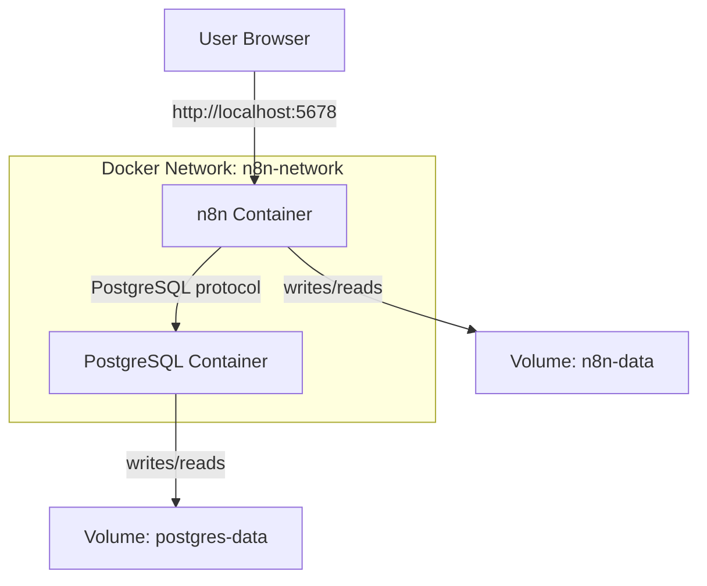

# Example 2: n8n with PostgreSQL

**Complexity:** ⭐⭐ Intermediate  
**Use Case:** Production deployments requiring better database performance and reliability

---

## 📋 What's Included

- n8n container
- PostgreSQL container
- Docker network for inter-container communication
- Volumes for both n8n and PostgreSQL data
- Environment variables for configuration

---

## 🏗️ Architecture



---

## 🚀 Quick Start

### Step 1: Create Network

```bash
docker network create n8n-network
```

### Step 2: Start PostgreSQL

```bash
docker run -d \
  --name n8n-postgres \
  --network n8n-network \
  --restart unless-stopped \
  -e POSTGRES_USER=n8n \
  -e POSTGRES_PASSWORD=n8n_secure_password \
  -e POSTGRES_DB=n8n \
  -v postgres-data:/var/lib/postgresql/data \
  postgres:15-alpine
```

### Step 3: Wait for PostgreSQL to Initialize

```bash
# Wait 10 seconds for PostgreSQL to be ready
sleep 10

# Or check logs
docker logs n8n-postgres
# Look for: "database system is ready to accept connections"
```

### Step 4: Start n8n

```bash
docker run -d \
  --name n8n \
  --network n8n-network \
  --restart unless-stopped \
  -p 5678:5678 \
  -e DB_TYPE=postgresdb \
  -e DB_POSTGRESDB_HOST=n8n-postgres \
  -e DB_POSTGRESDB_PORT=5432 \
  -e DB_POSTGRESDB_DATABASE=n8n \
  -e DB_POSTGRESDB_USER=n8n \
  -e DB_POSTGRESDB_PASSWORD=n8n_secure_password \
  -e N8N_BASIC_AUTH_ACTIVE=true \
  -e N8N_BASIC_AUTH_USER=admin \
  -e N8N_BASIC_AUTH_PASSWORD=admin_secure_password \
  -e GENERIC_TIMEZONE=America/New_York \
  -v n8n-data:/home/node/.n8n \
  n8nio/n8n:latest
```

### Step 5: Access n8n

Open browser: `http://localhost:5678`

---

## 📁 Files

```
02-n8n-postgres/
├── docker-run.sh       # Shell script to start both containers
├── .env.example        # Environment variables template
├── Dockerfile.n8n      # Custom n8n image (optional)
└── README.md          # This file
```

---

## 🔧 Using the Shell Script

```bash
# Make executable
chmod +x docker-run.sh

# Run
./docker-run.sh

# The script will:
# 1. Create network
# 2. Start PostgreSQL
# 3. Wait for initialization
# 4. Start n8n
# 5. Display access information
```

---

## 🔧 Configuration

### Environment Variables

Create `.env` file:

```bash
# PostgreSQL Configuration
POSTGRES_USER=n8n
POSTGRES_PASSWORD=your_secure_db_password
POSTGRES_DB=n8n

# n8n Database Connection
DB_TYPE=postgresdb
DB_POSTGRESDB_HOST=n8n-postgres
DB_POSTGRESDB_PORT=5432
DB_POSTGRESDB_DATABASE=n8n
DB_POSTGRESDB_USER=n8n
DB_POSTGRESDB_PASSWORD=your_secure_db_password

# n8n Authentication
N8N_BASIC_AUTH_ACTIVE=true
N8N_BASIC_AUTH_USER=admin
N8N_BASIC_AUTH_PASSWORD=your_secure_admin_password

# General Settings
GENERIC_TIMEZONE=America/New_York
N8N_HOST=localhost
N8N_PORT=5678
N8N_PROTOCOL=http
WEBHOOK_URL=http://localhost:5678/
```

---

## 🔍 Management Commands

### n8n Commands

```bash
# View n8n logs
docker logs n8n
docker logs -f n8n

# Restart n8n
docker restart n8n

# Access n8n shell
docker exec -it n8n sh
```

### PostgreSQL Commands

```bash
# View PostgreSQL logs
docker logs n8n-postgres

# Access PostgreSQL CLI
docker exec -it n8n-postgres psql -U n8n -d n8n

# Once in psql:
\dt              # List tables
\d+ workflows    # Describe workflows table
SELECT * FROM workflows;  # View workflows
\q               # Quit
```

### Network Commands

```bash
# List networks
docker network ls

# Inspect network
docker network inspect n8n-network

# View connected containers
docker network inspect n8n-network | grep Name
```

---

## 💾 Database Management

### Backup PostgreSQL

**Method 1: pg_dump (Recommended)**

```bash
# Backup to SQL file
docker exec n8n-postgres pg_dump -U n8n n8n > n8n-backup-$(date +%Y%m%d).sql

# Or inside container
docker exec -it n8n-postgres pg_dump -U n8n n8n > backup.sql
```

**Method 2: Volume Backup**

```bash
docker run --rm \
  -v postgres-data:/data \
  -v $(pwd):/backup \
  alpine \
  tar czf /backup/postgres-backup-$(date +%Y%m%d).tar.gz -C /data .
```

### Restore PostgreSQL

**From SQL dump:**

```bash
# Stop n8n first
docker stop n8n

# Restore database
docker exec -i n8n-postgres psql -U n8n -d n8n < n8n-backup-20241117.sql

# Start n8n
docker start n8n
```

**From volume backup:**

```bash
# Stop containers
docker stop n8n n8n-postgres
docker rm n8n-postgres

# Remove old volume
docker volume rm postgres-data

# Create new volume
docker volume create postgres-data

# Restore
docker run --rm \
  -v postgres-data:/data \
  -v $(pwd):/backup \
  alpine \
  tar xzf /backup/postgres-backup-20241117.tar.gz -C /data

# Start containers again
./docker-run.sh
```

---

## 🔍 Troubleshooting

### n8n Can't Connect to PostgreSQL

```bash
# Check if PostgreSQL is running
docker ps | grep postgres

# Check PostgreSQL logs
docker logs n8n-postgres

# Verify network connectivity
docker exec n8n ping n8n-postgres

# Test PostgreSQL connection
docker exec n8n-postgres psql -U n8n -d n8n -c "SELECT 1;"
```

### PostgreSQL Won't Start

```bash
# Check logs
docker logs n8n-postgres

# Common issues:
# - Port conflict (5432)
# - Volume corruption
# - Insufficient permissions

# Solution: Fresh start
docker stop n8n-postgres
docker rm n8n-postgres
docker volume rm postgres-data
docker volume create postgres-data
# Run PostgreSQL again
```

### Database Connection Timeout

```bash
# Increase startup wait time
# PostgreSQL needs time to initialize

# Check if ready
docker exec n8n-postgres pg_isready -U n8n
```

---

## 📊 Performance Tuning

### PostgreSQL Configuration

For better performance, create custom PostgreSQL config:

**Create `postgres.conf`:**

```conf
# Memory Configuration
shared_buffers = 256MB
effective_cache_size = 1GB
maintenance_work_mem = 64MB
work_mem = 16MB

# Checkpoint Configuration
checkpoint_completion_target = 0.9
wal_buffers = 16MB

# Query Planning
random_page_cost = 1.1
effective_io_concurrency = 200

# Logging
log_destination = 'stderr'
logging_collector = on
log_min_duration_statement = 1000
```

**Run with custom config:**

```bash
docker run -d \
  --name n8n-postgres \
  --network n8n-network \
  -e POSTGRES_USER=n8n \
  -e POSTGRES_PASSWORD=n8n_secure_password \
  -e POSTGRES_DB=n8n \
  -v postgres-data:/var/lib/postgresql/data \
  -v $(pwd)/postgres.conf:/etc/postgresql/postgresql.conf \
  postgres:15-alpine \
  -c 'config_file=/etc/postgresql/postgresql.conf'
```

---

## 🔒 Security Best Practices

1. **Use Strong Passwords:**
   ```bash
   # Generate secure password
   openssl rand -base64 32
   ```

2. **Don't Expose PostgreSQL Port:**
   ```bash
   # ❌ Bad: Exposing database
   docker run -p 5432:5432 postgres
   
   # ✅ Good: Only accessible within Docker network
   docker run --network n8n-network postgres
   ```

3. **Use Environment Files:**
   ```bash
   # Never commit .env with real passwords
   echo ".env" >> .gitignore
   ```

4. **Regular Backups:**
   ```bash
   # Automate backups with cron
   0 2 * * * docker exec n8n-postgres pg_dump -U n8n n8n > /backups/n8n-$(date +\%Y\%m\%d).sql
   ```

---

## ✅ When to Use This Setup

**✅ Good for:**
- Production deployments
- Multiple users
- > 100 workflows
- High execution frequency
- Need for data reliability
- Backup and restore requirements

**❌ Consider alternatives if:**
- Very high traffic → Use Queue Mode ([Example 3](../03-n8n-queue-mode/))
- Simple testing → Use SQLite ([Example 1](../01-basic-n8n/))

---

## 🎯 Next Steps

1. **Add Redis for Queue Mode:** [Example 3](../03-n8n-queue-mode/)
2. **Use Docker Compose:** [Lesson 3](../../03-docker-compose/)
3. **Add HTTPS:** [Lesson 11](../../11-nginx-https/)

---

**Questions?** Refer to [n8n documentation](https://docs.n8n.io/) or [PostgreSQL docs](https://www.postgresql.org/docs/)

