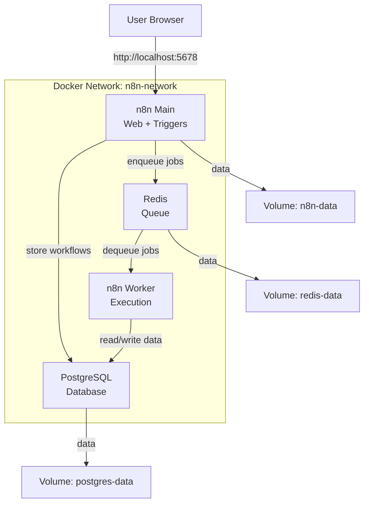
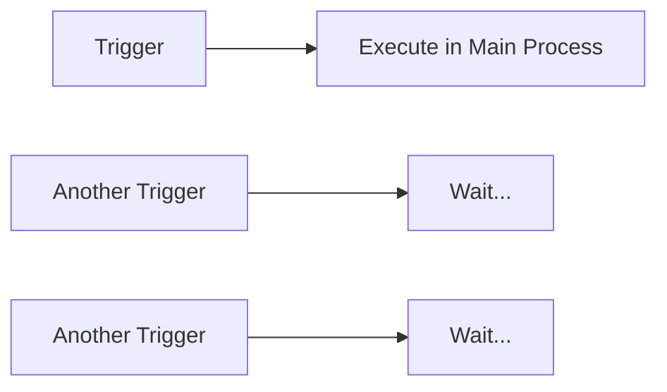
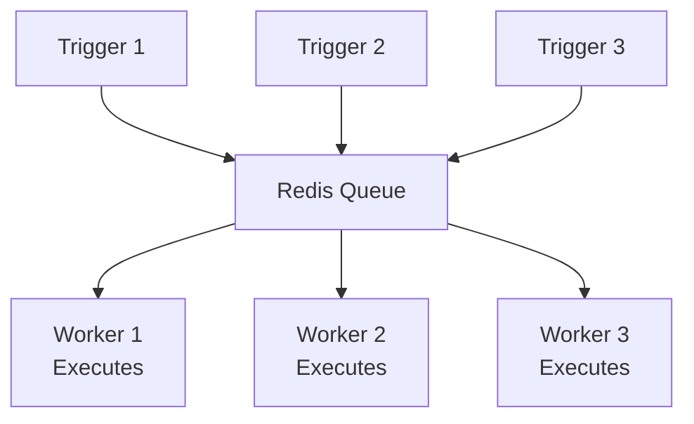
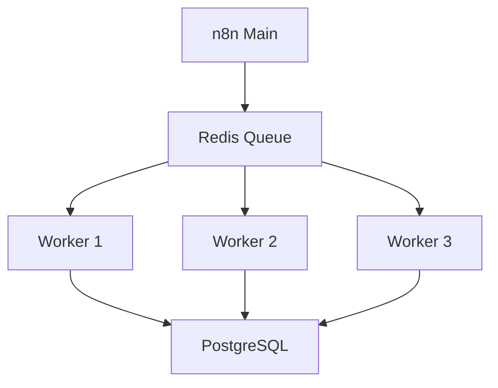

# Example 3: n8n with Queue Mode (Redis)

**Complexity:** ⭐⭐⭐ Advanced  
**Use Case:** High-performance production deployments with heavy workload

---

## 📋 What's Included

- n8n main container (web interface)
- n8n worker container (executes workflows)
- PostgreSQL container (database)
- Redis container (job queue)
- Docker network for communication
- Volumes for all data persistence

---

## 🏗️ Architecture



---

## 💡 Why Queue Mode?

### Without Queue Mode (Default)



**Problems:**
- Sequential execution (one at a time)
- Long-running workflows block others
- Limited scalability
- Main process handles everything

### With Queue Mode



**Benefits:**
- ✅ Parallel execution
- ✅ Scalable workers
- ✅ Better resource utilization
- ✅ Fault tolerance
- ✅ Dedicated main process

---

## 🚀 Quick Start

This example requires all components to start in order. Use the provided script:

```bash
chmod +x docker-run.sh
./docker-run.sh
```

The script will:
1. Create Docker network
2. Start PostgreSQL
3. Start Redis
4. Start n8n Main (web interface)
5. Start n8n Worker (execution)

---

## 📁 Files

```
03-n8n-queue-mode/
├── docker-run.sh           # Automated setup script
├── docker-compose.yml      # Alternative: Compose setup
├── .env.example           # Environment variables
└── README.md             # This file
```

---

## 🔧 Manual Setup

### Step 1: Create Network

```bash
docker network create n8n-network
```

### Step 2: Start PostgreSQL

```bash
docker run -d \
  --name n8n-postgres \
  --network n8n-network \
  --restart unless-stopped \
  -e POSTGRES_USER=n8n \
  -e POSTGRES_PASSWORD=secure_db_password \
  -e POSTGRES_DB=n8n \
  -v postgres-data:/var/lib/postgresql/data \
  postgres:15-alpine
```

### Step 3: Start Redis

```bash
docker run -d \
  --name n8n-redis \
  --network n8n-network \
  --restart unless-stopped \
  -v redis-data:/data \
  redis:7-alpine
```

### Step 4: Wait for Services

```bash
sleep 10
```

### Step 5: Start n8n Main (Web Interface)

```bash
docker run -d \
  --name n8n-main \
  --network n8n-network \
  --restart unless-stopped \
  -p 5678:5678 \
  -e DB_TYPE=postgresdb \
  -e DB_POSTGRESDB_HOST=n8n-postgres \
  -e DB_POSTGRESDB_PORT=5432 \
  -e DB_POSTGRESDB_DATABASE=n8n \
  -e DB_POSTGRESDB_USER=n8n \
  -e DB_POSTGRESDB_PASSWORD=secure_db_password \
  -e EXECUTIONS_MODE=queue \
  -e QUEUE_BULL_REDIS_HOST=n8n-redis \
  -e QUEUE_BULL_REDIS_PORT=6379 \
  -e N8N_BASIC_AUTH_ACTIVE=true \
  -e N8N_BASIC_AUTH_USER=admin \
  -e N8N_BASIC_AUTH_PASSWORD=secure_admin_password \
  -v n8n-data:/home/node/.n8n \
  n8n/n8n:latest \
  n8n start
```

### Step 6: Start n8n Worker (Execution)

```bash
docker run -d \
  --name n8n-worker \
  --network n8n-network \
  --restart unless-stopped \
  -e DB_TYPE=postgresdb \
  -e DB_POSTGRESDB_HOST=n8n-postgres \
  -e DB_POSTGRESDB_PORT=5432 \
  -e DB_POSTGRESDB_DATABASE=n8n \
  -e DB_POSTGRESDB_USER=n8n \
  -e DB_POSTGRESDB_PASSWORD=secure_db_password \
  -e EXECUTIONS_MODE=queue \
  -e QUEUE_BULL_REDIS_HOST=n8n-redis \
  -e QUEUE_BULL_REDIS_PORT=6379 \
  -v n8n-data:/home/node/.n8n \
  n8n/n8n:latest \
  n8n worker
```

**Note the different commands:**
- Main: `n8n start`
- Worker: `n8n worker`

---

## 🔍 Verifying Setup

### Check All Containers

```bash
docker ps --filter network=n8n-network
```

Should show:
- n8n-main (port 5678)
- n8n-worker
- n8n-postgres
- n8n-redis

### Check Logs

```bash
# Main process
docker logs n8n-main

# Worker process
docker logs n8n-worker

# PostgreSQL
docker logs n8n-postgres

# Redis
docker logs n8n-redis
```

### Access n8n

Open browser: `http://localhost:5678`

---

## ⚖️ Scaling Workers

You can run multiple workers for parallel execution:

```bash
# Start additional workers
docker run -d \
  --name n8n-worker-2 \
  --network n8n-network \
  --restart unless-stopped \
  -e DB_TYPE=postgresdb \
  -e DB_POSTGRESDB_HOST=n8n-postgres \
  -e DB_POSTGRESDB_DATABASE=n8n \
  -e DB_POSTGRESDB_USER=n8n \
  -e DB_POSTGRESDB_PASSWORD=secure_db_password \
  -e EXECUTIONS_MODE=queue \
  -e QUEUE_BULL_REDIS_HOST=n8n-redis \
  -v n8n-data:/home/node/.n8n \
  n8n/n8n:latest \
  n8n worker

docker run -d \
  --name n8n-worker-3 \
  --network n8n-network \
  --restart unless-stopped \
  -e DB_TYPE=postgresdb \
  -e DB_POSTGRESDB_HOST=n8n-postgres \
  -e DB_POSTGRESDB_DATABASE=n8n \
  -e DB_POSTGRESDB_USER=n8n \
  -e DB_POSTGRESDB_PASSWORD=secure_db_password \
  -e EXECUTIONS_MODE=queue \
  -e QUEUE_BULL_REDIS_HOST=n8n-redis \
  -v n8n-data:/home/node/.n8n \
  n8n/n8n:latest \
  n8n worker
```

**Now you have:**
- 1 Main process
- 3 Workers (parallel execution)



---

## 💾 Monitoring Redis Queue

### Check Queue Status

```bash
# Access Redis CLI
docker exec -it n8n-redis redis-cli

# Inside Redis:
KEYS *                    # List all keys
LLEN bull:n8n:wait       # Check waiting jobs
LLEN bull:n8n:active     # Check active jobs
LLEN bull:n8n:completed  # Check completed jobs
LLEN bull:n8n:failed     # Check failed jobs

# Exit
exit
```

### Monitor Queue in Real-Time

```bash
docker exec -it n8n-redis redis-cli MONITOR
```

---

## 🔧 Performance Tuning

### Redis Configuration

For production, tune Redis:

```bash
docker run -d \
  --name n8n-redis \
  --network n8n-network \
  -v redis-data:/data \
  redis:7-alpine \
  redis-server \
  --maxmemory 2gb \
  --maxmemory-policy allkeys-lru \
  --save 60 1000 \
  --appendonly yes
```

### Worker Concurrency

Control how many jobs a worker can handle simultaneously:

```bash
docker run -d \
  --name n8n-worker \
  --network n8n-network \
  -e EXECUTIONS_MODE=queue \
  -e QUEUE_BULL_REDIS_HOST=n8n-redis \
  -e QUEUE_WORKER_TIMEOUT=30 \
  n8n/n8n:latest \
  n8n worker --concurrency=10
```

---

## 🐛 Troubleshooting

### Workers Not Picking Up Jobs

```bash
# Check worker logs
docker logs n8n-worker

# Verify Redis connection
docker exec n8n-worker ping n8n-redis

# Check Redis for jobs
docker exec n8n-redis redis-cli LLEN bull:n8n:wait
```

### Jobs Stuck in Queue

```bash
# Access Redis
docker exec -it n8n-redis redis-cli

# Clear stuck jobs (careful!)
DEL bull:n8n:wait
DEL bull:n8n:active
```

### Main Process Issues

```bash
# Check if main is running
docker ps | grep n8n-main

# Check logs
docker logs n8n-main

# Restart main
docker restart n8n-main
```

---

## ✅ When to Use Queue Mode

**✅ Use Queue Mode if:**
- High execution volume (100+ per hour)
- Long-running workflows
- Need parallel execution
- Multiple concurrent users
- Production deployments
- Workflows that can't be interrupted

**❌ Don't use Queue Mode if:**
- Simple personal use
- Few workflows
- Low execution frequency
- Learning/testing environment
- Resource constraints

---

## 📊 Resource Requirements

### Minimum

- **CPU:** 4 cores
- **RAM:** 4 GB
- **Disk:** 20 GB

### Recommended

- **CPU:** 8+ cores
- **RAM:** 8+ GB
- **Disk:** 50+ GB SSD

### Per Component

| Component | CPU | RAM | Notes |
|-----------|-----|-----|-------|
| Main | 1-2 cores | 1 GB | Handles web UI + triggers |
| Worker (each) | 1-2 cores | 1-2 GB | Executes workflows |
| PostgreSQL | 1-2 cores | 2 GB | Database |
| Redis | 0.5 core | 512 MB | Queue |

---

## 🎯 Next Steps

1. **Production Setup:** Add nginx reverse proxy
2. **HTTPS:** Configure SSL certificates
3. **Monitoring:** Add logging and metrics
4. **Backups:** Automate database backups

---

**Related Lessons:**
- [Lesson 3: Docker Compose](../../03-docker-compose/)
- [Lesson 7: Redis & Queue Mode](../../07-redis-queue/)
- [Lesson 15: Scaling](../../15-escalado/)

