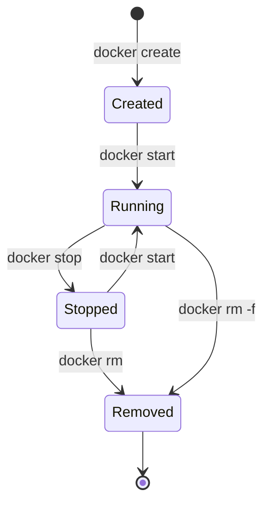

# Practice 1: Run n8n with Docker

**Estimated Time:** 8 minutes  
**Difficulty:** Easy ⭐  
**Prerequisites:** Docker installed

---

## 🎯 Objective

Learn to pull and run the n8n Docker image, and understand the basic Docker commands for managing n8n containers.

---

## 📋 Prerequisites

Ensure you have Docker installed:

```bash
docker --version
```

> If Docker is not installed, visit [docs.docker.com/get-docker](https://docs.docker.com/get-docker/)

---

## 📋 Instructions

### Step 1: Pull the n8n Docker Image

First, download the official n8n image from Docker Hub:

```bash
docker pull n8nio/n8n:latest
```

**Expected output:**
```
latest: Pulling from n8nio/n8n
abc123def456: Pull complete
...
Status: Downloaded newer image for n8nio/n8n:latest
```

**Verify the image:**
```bash
docker images | grep n8n
```

---

### Step 2: Run n8n Container (Basic)

Start n8n in a container:

```bash
docker run -d \
  --name n8n \
  -p 5678:5678 \
  n8nio/n8n
```

**Command breakdown:**
- `-d` → Run in detached mode (background)
- `--name n8n` → Name the container "n8n"
- `-p 5678:5678` → Map port 5678 (host:container)
- `n8nio/n8n` → Image to use

**Verify the container is running:**
```bash
docker ps
```

Expected output:
```
CONTAINER ID   IMAGE      COMMAND   CREATED         STATUS         PORTS                    NAMES
abc123def456   n8nio/n8n    "n8n"     5 seconds ago   Up 4 seconds   0.0.0.0:5678->5678/tcp   n8n
```

---

### Step 3: Access n8n Interface

1. Open your browser
2. Navigate to: `http://localhost:5678`
3. You should see the n8n setup screen

**Create your owner account:**
- Email: your-email@example.com
- First Name: Your Name
- Last Name: Your Last Name
- Password: (secure password)

---

### Step 4: View Container Logs

Check what's happening inside the container:

```bash
docker logs n8n
```

**Look for:**
```
Editor is now accessible via:
http://localhost:5678/
```

**Follow logs in real-time:**
```bash
docker logs -f n8n
```

(Press `CTRL+C` to stop following)

---

### Step 5: Inspect Container Details

Get detailed information about the container:

```bash
docker inspect n8n
```

**Key information to observe:**
- Network settings
- Port mappings
- Volume mounts
- Environment variables
- Container state

**Get specific info (IP address):**
```bash
docker inspect -f '{{range .NetworkSettings.Networks}}{{.IPAddress}}{{end}}' n8n
```

---

### Step 6: Execute Commands Inside Container

Access the container's shell:

```bash
docker exec -it n8n sh
```

**Once inside, try:**
```bash
# Check n8n version
n8n --version

# List directory contents
ls -la

# Check running processes
ps aux

# Exit container shell
exit
```

---

### Step 7: Stop and Start Container

**Stop the container:**
```bash
docker stop n8n
```

**Verify it's stopped:**
```bash
docker ps -a
```

**Start it again:**
```bash
docker start n8n
```

**Check logs:**
```bash
docker logs n8n
```

---

### Step 8: Remove Container

**Stop and remove:**
```bash
docker stop n8n
docker rm n8n
```

**Verify removal:**
```bash
docker ps -a | grep n8n
```

---

## 💡 Observations & Learning Points

### 1. Data Persistence Issue

**Try this experiment:**

```bash
# Run n8n
docker run -d --name n8n -p 5678:5678 n8nio/n8n

# Access http://localhost:5678 and create a workflow

# Stop and remove container
docker stop n8n
docker rm n8n

# Run n8n again
docker run -d --name n8n -p 5678:5678 n8nio/n8n

# Access http://localhost:5678
# ❌ Your workflow is GONE!
```

**Why?** Container data is ephemeral by default.

**Solution:** Use volumes (covered in next practice)

---

### 2. Port Conflicts

If port 5678 is already in use:

```bash
# Error: Bind for 0.0.0.0:5678 failed: port is already allocated

# Solution 1: Use different host port
docker run -d --name n8n -p 8080:5678 n8nio/n8n
# Access at http://localhost:8080

# Solution 2: Stop conflicting container
docker stop <conflicting-container>
```

---

### 3. Container States



---

## 🔧 Troubleshooting

### Container Won't Start

```bash
# Check logs for errors
docker logs n8n

# Remove and try again
docker rm -f n8n
docker run -d --name n8n -p 5678:5678 n8nio/n8n
```

### Can't Access n8n Interface

```bash
# Verify container is running
docker ps | grep n8n

# Check port mapping
docker port n8n

# Try accessing via container IP
docker inspect -f '{{range .NetworkSettings.Networks}}{{.IPAddress}}{{end}}' n8n
curl http://<container-ip>:5678
```

### Container Keeps Restarting

```bash
# Check exit code and error
docker ps -a | grep n8n
docker logs n8n
```

---

## ✅ Completion Checklist

- [ ] Successfully pulled n8n Docker image
- [ ] Started n8n container with `docker run`
- [ ] Accessed n8n at http://localhost:5678
- [ ] Created owner account
- [ ] Viewed container logs with `docker logs`
- [ ] Executed commands inside container with `docker exec`
- [ ] Stopped and started container
- [ ] Removed container
- [ ] Understand data is lost when container is removed

---

## 📝 Quick Reference

```bash
# Essential Docker commands for n8n
docker pull n8nio/n8n                    # Download image
docker run -d --name n8n -p 5678:5678 n8nio/n8n  # Run container
docker ps                              # List running containers
docker ps -a                           # List all containers
docker logs n8n                        # View logs
docker logs -f n8n                     # Follow logs
docker exec -it n8n sh                 # Access shell
docker stop n8n                        # Stop container
docker start n8n                       # Start container
docker restart n8n                     # Restart container
docker rm n8n                          # Remove container
docker rm -f n8n                       # Force remove (stop + remove)
```

---

**Next:** [Practice 2: Working with Volumes →](02-docker-volumes.md)

