# Practice 2: Working with Docker Volumes

**Estimated Time:** 7 minutes  
**Difficulty:** Easy ⭐  
**Prerequisites:** Practice 1 completed

---

## 🎯 Objective

Learn how to persist n8n data using Docker volumes, ensuring your workflows and data survive container restarts and removals.

---

## 📋 The Problem: Data Loss

From Practice 1, we learned that container data is ephemeral:

```mermaid
graph LR
    A[Container Created] --> B[Create Workflow]
    B --> C[Container Removed]
    C --> D[Data Lost ❌]
```



---

## 📋 Instructions

### Step 1: Understand Where n8n Stores Data

n8n stores data in `/home/node/.n8n` inside the container:

```bash
# Run temporary container to explore
docker run --rm -it n8nio/n8n sh

# Inside container
ls -la /home/node/.n8n
# .n8n folder contains:
# - Database (SQLite by default)
# - Workflows
# - Credentials
# - Execution history

exit
```

---

### Step 2: Create a Named Volume

Create a Docker volume for n8n data:

```bash
docker volume create n8n-data
```

**Verify creation:**
```bash
docker volume ls | grep n8n
```

**Inspect the volume:**
```bash
docker volume inspect n8n-data
```

Output shows:
```json
[
    {
        "CreatedAt": "2024-11-17T10:00:00Z",
        "Driver": "local",
        "Labels": {},
        "Mountpoint": "/var/lib/docker/volumes/n8n-data/_data",
        "Name": "n8n-data",
        "Options": {},
        "Scope": "local"
    }
]
```

---

### Step 3: Run n8n with Volume Mount

Start n8n with the volume attached:

```bash
docker run -d \
  --name n8n \
  -p 5678:5678 \
  -v n8n-data:/home/node/.n8n \
  n8nio/n8n
```

**Command breakdown:**
- `-v n8n-data:/home/node/.n8n` → Mount volume to container path


---

### Step 4: Create Test Data

1. Access n8n at `http://localhost:5678`
2. Create owner account
3. Create a simple workflow:
   - Add a **Schedule** trigger (runs every 5 minutes)
   - Add a **Set** node (set some variables)
   - Save the workflow as "Test Workflow"

---

### Step 5: Test Data Persistence

**Remove the container (but keep the volume):**

```bash
docker stop n8n
docker rm n8n
```

**Verify container is gone:**
```bash
docker ps -a | grep n8n
# Should return nothing
```

**Verify volume still exists:**
```bash
docker volume ls | grep n8n-data
# n8n-data should still be there ✅
```

---

### Step 6: Recreate Container with Same Volume

Start a new n8n container using the same volume:

```bash
docker run -d \
  --name n8n \
  -p 5678:5678 \
  -v n8n-data:/home/node/.n8n \
  n8nio/n8n
```

**Access n8n at `http://localhost:5678`**

✅ **Your workflow is still there!**  
✅ **Your credentials are preserved!**  
✅ **Your execution history is intact!**

---

### Step 7: Using Bind Mounts (Alternative)

Instead of named volumes, you can mount a host directory:

```bash
# Stop current container
docker stop n8n
docker rm n8n

# Run with bind mount
docker run -d \
  --name n8n \
  -p 5678:5678 \
  -v ~/n8n-data:/home/node/.n8n \
  n8nio/n8n
```

**Bind mount creates directory on host:**
```bash
ls -la ~/n8n-data
```

**Differences: Named Volume vs Bind Mount**

| Feature | Named Volume | Bind Mount |
|---------|--------------|------------|
| **Location** | Docker manages | You specify exact path |
| **Path** | `/var/lib/docker/volumes/` | Any host path (e.g., `~/n8n-data`) |
| **Portability** | Docker-native | OS-dependent |
| **Permissions** | Docker handles | Can have issues |
| **Backup** | `docker volume` commands | Standard file backup |
| **Best for** | Production | Development, debugging |

---

### Step 8: Inspect Volume Data

**With named volume:**
```bash
# Find volume location
docker volume inspect n8n-data | grep Mountpoint

# Requires sudo on most systems
sudo ls -la /var/lib/docker/volumes/n8n-data/_data
```

**With bind mount:**
```bash
# Easy access
ls -la ~/n8n-data

# View database file
ls -la ~/n8n-data/database.sqlite

# View workflows
cat ~/n8n-data/.n8n/config
```

---

### Step 9: Volume Backup and Restore

#### Backup Volume

**Method 1: Using docker cp**
```bash
# Start a temporary container
docker run -d --name n8n-temp -v n8n-data:/home/node/.n8n n8nio/n8n

# Copy data out
docker cp n8n-temp:/home/node/.n8n ./backup-n8n-data

# Clean up
docker stop n8n-temp
docker rm n8n-temp
```

**Method 2: Using tar**
```bash
docker run --rm \
  -v n8n-data:/data \
  -v $(pwd):/backup \
  alpine \
  tar czf /backup/n8n-backup.tar.gz -C /data .
```

#### Restore Volume

```bash
# Create new volume
docker volume create n8n-data-restored

# Restore from tar
docker run --rm \
  -v n8n-data-restored:/data \
  -v $(pwd):/backup \
  alpine \
  tar xzf /backup/n8n-backup.tar.gz -C /data

# Run n8n with restored volume
docker run -d \
  --name n8n-restored \
  -p 5678:5678 \
  -v n8n-data-restored:/home/node/.n8n \
  n8nio/n8n
```

---

### Step 10: Clean Up Volumes

**List all volumes:**
```bash
docker volume ls
```

**Remove specific volume:**
```bash
# Must stop and remove container first
docker stop n8n
docker rm n8n

# Then remove volume
docker volume rm n8n-data
```

**Remove all unused volumes:**
```bash
docker volume prune
```

⚠️ **Warning:** This deletes all volumes not currently used by containers!

---

## 💡 Key Observations

### 1. Volume Lifecycle

```mermaid
graph TD
    A[Create Volume] --> B[Attach to Container]
    B --> C[Container Writes Data]
    C --> D[Stop Container]
    D --> E[Remove Container]
    E --> F{Volume Still Exists}
    F -->|Yes| G[Data Preserved ✅]
    F -->|Explicitly Removed| H[Data Lost ❌]
```



### 2. Multiple Containers, Same Volume

```bash
# Container 1 writes data
docker run -d --name n8n-1 -v n8n-data:/home/node/.n8n n8nio/n8n

# Stop and remove
docker stop n8n-1
docker rm n8n-1

# Container 2 uses same data
docker run -d --name n8n-2 -v n8n-data:/home/node/.n8n n8nio/n8n
# ✅ Same data available
```

---

## 🔧 Troubleshooting

### Permission Issues (Bind Mounts)

```bash
# Error: Permission denied

# Fix: Ensure proper ownership
mkdir -p ~/n8n-data
sudo chown -R 1000:1000 ~/n8n-data

# Run container
docker run -d \
  --name n8n \
  -p 5678:5678 \
  -v ~/n8n-data:/home/node/.n8n \
  n8nio/n8n
```

### Volume Not Mounting

```bash
# Check volume exists
docker volume ls

# Inspect volume
docker volume inspect n8n-data

# Check container mounts
docker inspect n8n | grep -A 10 Mounts
```

### Data Not Persisting

```bash
# Verify correct mount path
docker exec n8n ls -la /home/node/.n8n

# Check volume mount in container
docker inspect n8n | grep -A 10 Mounts
```

---

## ✅ Completion Checklist

- [ ] Created a Docker volume with `docker volume create`
- [ ] Ran n8n with volume mount using `-v` flag
- [ ] Created test workflow in n8n
- [ ] Removed container and verified data persists
- [ ] Recreated container with same volume
- [ ] Verified data is still present
- [ ] Understand difference between named volumes and bind mounts
- [ ] Successfully backed up and restored volume
- [ ] Cleaned up test volumes

---

## 📝 Quick Reference

```bash
# Volume Commands
docker volume create n8n-data              # Create volume
docker volume ls                           # List volumes
docker volume inspect n8n-data             # Inspect volume
docker volume rm n8n-data                  # Remove volume
docker volume prune                        # Remove unused volumes

# Run with Named Volume
docker run -d \
  --name n8n \
  -p 5678:5678 \
  -v n8n-data:/home/node/.n8n \
  n8nio/n8n

# Run with Bind Mount
docker run -d \
  --name n8n \
  -p 5678:5678 \
  -v ~/n8n-data:/home/node/.n8n \
  n8nio/n8n

# Backup Volume
docker run --rm \
  -v n8n-data:/data \
  -v $(pwd):/backup \
  alpine tar czf /backup/backup.tar.gz -C /data .

# Restore Volume
docker run --rm \
  -v n8n-data:/data \
  -v $(pwd):/backup \
  alpine tar xzf /backup/backup.tar.gz -C /data
```

---

**Next:** [Practice 3: Build Custom Dockerfile →](03-custom-dockerfile.md)

