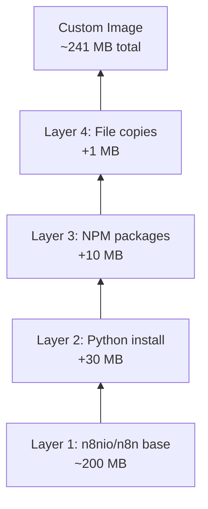

# Practice 3: Build Custom n8n Dockerfile

**Estimated Time:** 10 minutes  
**Difficulty:** Medium ⭐⭐  
**Prerequisites:** Practices 1 & 2 completed

---

## 🎯 Objective

Learn to create and build a custom Dockerfile to extend n8n with additional features, packages, and configurations.

---

## 📋 Instructions

### Step 1: Create Project Directory

```bash
mkdir ~/n8n-custom-docker
cd ~/n8n-custom-docker
```

---

### Step 2: Create a Basic Custom Dockerfile

Create a file named `Dockerfile`:

```bash
touch Dockerfile
```

**Edit `Dockerfile` with the following content:**

```dockerfile
# Use official n8n image as base
FROM n8nio/n8n:latest

# Switch to root user to install packages
USER root

# Install system dependencies
# (Example: Python for certain n8n nodes)
RUN apk add --no-cache \
    python3 \
    py3-pip

# Install additional Node.js packages
# (Example: moment-timezone for advanced date handling)
RUN npm install -g moment-timezone

# Create custom directory
RUN mkdir -p /home/node/.n8n/custom

# Copy custom configuration if needed
# COPY custom-config.json /home/node/.n8n/

# Set proper ownership
RUN chown -R node:node /home/node/.n8n

# Switch back to node user (security best practice)
USER node

# Environment variables (optional)
ENV N8N_CUSTOM_EXTENSIONS="/home/node/.n8n/custom"
ENV TZ="America/New_York"

# Expose n8n port (documentation)
EXPOSE 5678

# Default command is inherited from base image
# CMD ["n8n"]
```

---

### Step 3: Build the Custom Image

```bash
docker build -t my-custom-n8n:1.0 .
```

**Expected output:**
```
[+] Building 45.2s (12/12) FINISHED
 => [internal] load build definition from Dockerfile
 => => transferring dockerfile: 521B
 => [internal] load .dockerignore
 => [1/6] FROM n8nio/n8n:latest
 => [2/6] RUN apk add --no-cache python3 py3-pip
 => [3/6] RUN npm install -g moment-timezone
 => [4/6] RUN mkdir -p /home/node/.n8n/custom
 => [5/6] RUN chown -R node:node /home/node/.n8n
 => exporting to image
 => => naming to docker.io/library/my-custom-n8n:1.0
```

**Verify the image:**
```bash
docker images | grep my-custom-n8n
```

---

### Step 4: Run Your Custom Image

```bash
docker run -d \
  --name n8n-custom \
  -p 5678:5678 \
  -v n8n-custom-data:/home/node/.n8n \
  my-custom-n8n:1.0
```

**Check logs:**
```bash
docker logs n8n-custom
```

**Access n8n:**
Open `http://localhost:5678` in your browser.

---

### Step 5: Verify Custom Packages

Verify your custom packages are installed:

```bash
# Access container shell
docker exec -it n8n-custom sh

# Check Python installation
python3 --version

# Check npm global packages
npm list -g --depth=0 | grep moment

# Exit
exit
```

---

### Step 6: Create .dockerignore File

Create `.dockerignore` to exclude unnecessary files:

```bash
touch .dockerignore
```

**Edit `.dockerignore`:**

```
# Node
node_modules/
npm-debug.log
yarn-error.log

# Git
.git
.gitignore

# Documentation
*.md
README.md

# Environment
.env
.env.local

# IDE
.vscode/
.idea/
*.swp

# OS
.DS_Store
Thumbs.db
```

---

### Step 7: Advanced Dockerfile - Multi-Stage Build

Create `Dockerfile.advanced`:

```dockerfile
# Stage 1: Build custom tools
FROM node:18-alpine AS builder

WORKDIR /build

# Install build dependencies
RUN apk add --no-cache python3 g++ make

# Install custom npm packages
RUN npm install -g n8n-nodes-custom-package || echo "Package not found, continuing..."

# Stage 2: Runtime
FROM n8nio/n8n:latest

USER root

# Copy only necessary files from builder
# COPY --from=builder /usr/local/lib/node_modules /usr/local/lib/node_modules

# Install minimal runtime dependencies
RUN apk add --no-cache \
    python3 \
    curl \
    ca-certificates

# Create custom directories
RUN mkdir -p /home/node/.n8n/custom && \
    chown -R node:node /home/node/.n8n

USER node

# Environment variables
ENV N8N_CUSTOM_EXTENSIONS="/home/node/.n8n/custom"

EXPOSE 5678
```

**Build multi-stage:**
```bash
docker build -f Dockerfile.advanced -t my-n8n-advanced:1.0 .
```

---

### Step 8: Dockerfile with Custom Nodes

Create `Dockerfile.custom-nodes`:

```dockerfile
FROM n8nio/n8n:latest

USER root

# Install dependencies for custom nodes
RUN apk add --no-cache \
    python3 \
    py3-pip \
    g++ \
    make \
    git

# Example: Install community nodes
# Replace with actual custom node packages
RUN cd /usr/local/lib/node_modules/n8n && \
    npm install --save-dev \
    n8n-nodes-text-manipulation || true

# Set ownership
RUN chown -R node:node /usr/local/lib/node_modules/n8n

USER node

EXPOSE 5678
```

---

### Step 9: Build Arguments

Create `Dockerfile.args` with build-time variables:

```dockerfile
FROM n8nio/n8n:latest

# Build arguments
ARG NODE_ENV=production
ARG N8N_VERSION=latest
ARG TIMEZONE=UTC

USER root

RUN apk add --no-cache tzdata && \
    cp /usr/share/zoneinfo/${TIMEZONE} /etc/localtime && \
    echo "${TIMEZONE}" > /etc/timezone

USER node

# Set environment from build args
ENV NODE_ENV=${NODE_ENV}
ENV TZ=${TIMEZONE}

EXPOSE 5678
```

**Build with arguments:**
```bash
docker build \
  --build-arg TIMEZONE=America/New_York \
  --build-arg NODE_ENV=production \
  -f Dockerfile.args \
  -t my-n8n-tz:1.0 \
  .
```

---

### Step 10: Optimize Image Size

Create `Dockerfile.optimized`:

```dockerfile
FROM n8nio/n8n:latest

USER root

# Combine RUN commands to reduce layers
RUN apk add --no-cache python3 py3-pip && \
    npm install -g moment-timezone && \
    mkdir -p /home/node/.n8n/custom && \
    chown -R node:node /home/node/.n8n && \
    # Clean up
    npm cache clean --force && \
    rm -rf /tmp/* /var/cache/apk/*

USER node

EXPOSE 5678
```

**Compare sizes:**
```bash
docker images | grep my-n8n
```

---

## 💡 Key Observations

### Image Layers



### Build Cache

```bash
# First build (slow)
docker build -t my-n8n:1.0 .
# Time: 45 seconds

# Modify only last layer, rebuild (fast)
docker build -t my-n8n:1.1 .
# Time: 5 seconds (cached layers reused)
```

---

## 🔧 Best Practices

### 1. Always Switch Back to Non-Root User

```dockerfile
USER root
RUN apk add packages
USER node  # ✅ Security best practice
```

### 2. Combine Commands to Reduce Layers

```dockerfile
# ❌ Bad: Multiple layers
RUN apk update
RUN apk add python3
RUN apk add curl

# ✅ Good: Single layer
RUN apk add --no-cache python3 curl
```

### 3. Clean Up in Same Layer

```dockerfile
# ✅ Install and clean in same layer
RUN apk add --no-cache python3 && \
    rm -rf /var/cache/apk/*
```

### 4. Use Specific Tags

```dockerfile
# ❌ Unpredictable
FROM n8nio/n8n:latest

# ✅ Predictable, reproducible
FROM n8nio/n8n:1.19.0
```

### 5. Order Matters

```dockerfile
# ✅ Good order (rarely changing → frequently changing)
FROM n8nio/n8n:1.19.0
RUN apk add --no-cache python3  # Changes rarely
COPY config.json /app/           # Changes occasionally
COPY . /app/                     # Changes frequently
```

---

## 🔧 Troubleshooting

### Build Fails at Package Installation

```bash
# Check if package exists
docker run --rm -it alpine:latest sh
apk search python3
```

### Permission Denied Errors

```bash
# Ensure you're root when installing
USER root
RUN apk add packages
# Switch back after
USER node
```

### Image Too Large

```bash
# Check layer sizes
docker history my-custom-n8n:1.0

# Optimize by combining commands
# Clean up caches in same layer
```

---

## ✅ Completion Checklist

- [ ] Created custom Dockerfile extending n8n
- [ ] Built custom image with `docker build`
- [ ] Ran container from custom image
- [ ] Verified custom packages are installed
- [ ] Created `.dockerignore` file
- [ ] Experimented with multi-stage builds
- [ ] Used build arguments
- [ ] Optimized image size
- [ ] Understand layer caching
- [ ] Follow security best practices (non-root user)

---

## 📝 Quick Reference

```bash
# Build Commands
docker build -t my-n8n:1.0 .                    # Basic build
docker build -t my-n8n:1.0 -f Dockerfile.custom .  # Custom Dockerfile
docker build --no-cache -t my-n8n:1.0 .        # No cache
docker build --build-arg VAR=value -t my-n8n:1.0 .  # With arguments

# Image Commands
docker images                                   # List images
docker history my-n8n:1.0                      # View layers
docker inspect my-n8n:1.0                      # Detailed info
docker rmi my-n8n:1.0                          # Remove image

# Run Custom Image
docker run -d \
  --name n8n-custom \
  -p 5678:5678 \
  -v n8n-data:/home/node/.n8n \
  my-n8n:1.0

# Debug Build
docker build --progress=plain -t my-n8n:1.0 .  # Verbose output
```

---

## 🎯 Next Steps

Now you know how to:
- ✅ Run n8n with Docker
- ✅ Persist data with volumes
- ✅ Build custom Docker images

**Ready to move on to Docker Compose!**

**👉 [Go to Lesson 3: Docker Compose →](../../03-docker-compose/README.md)**

