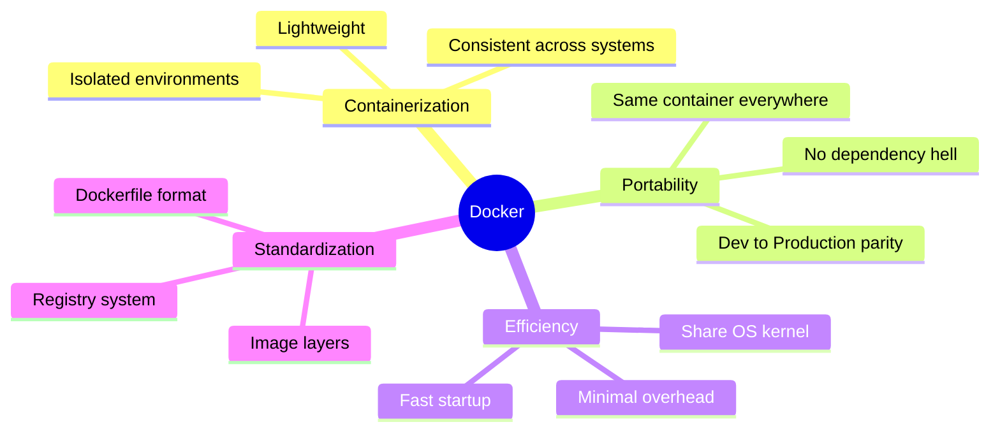
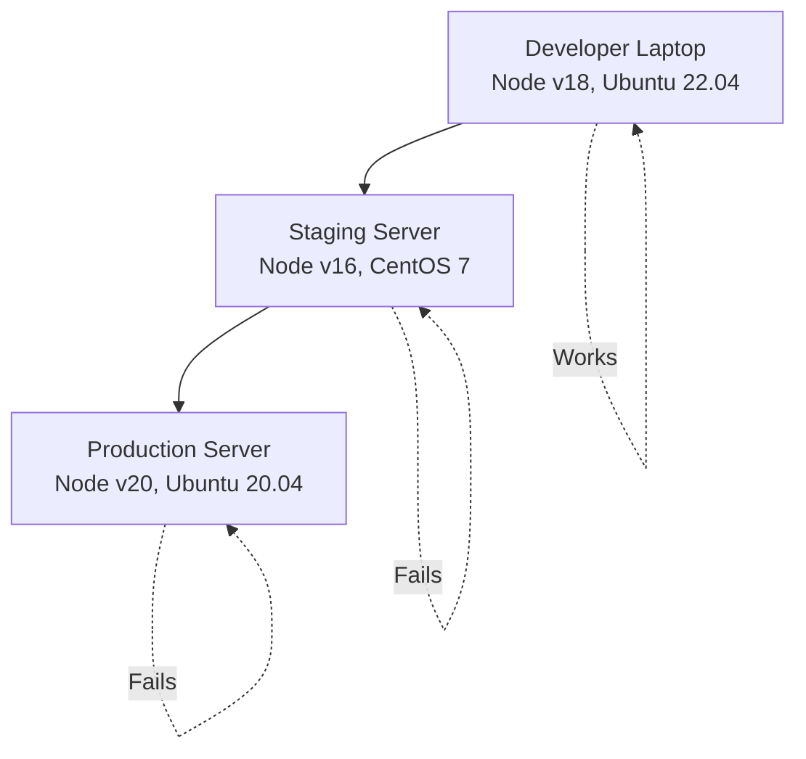
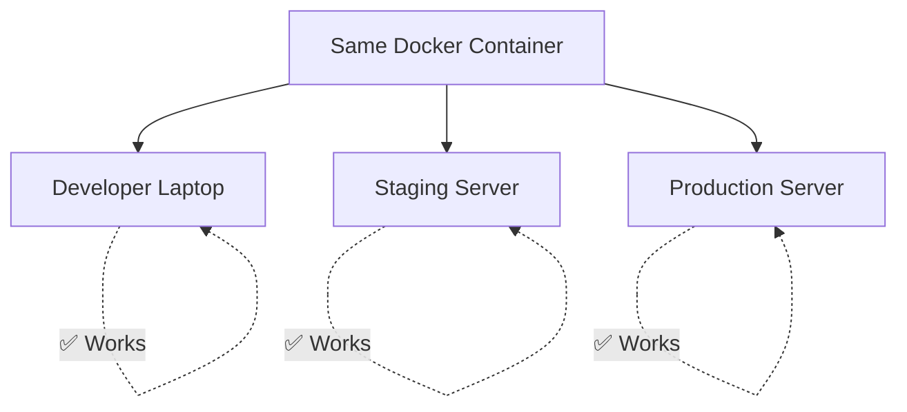
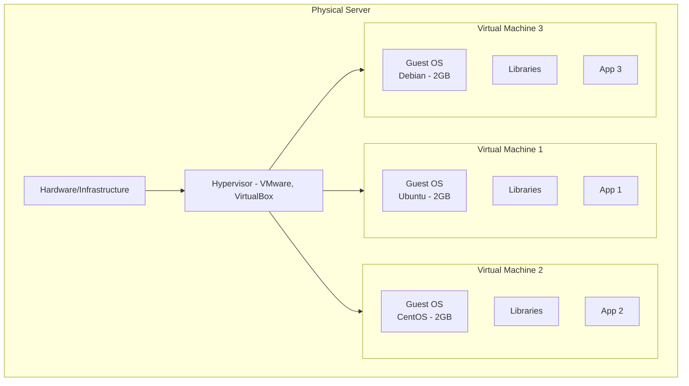
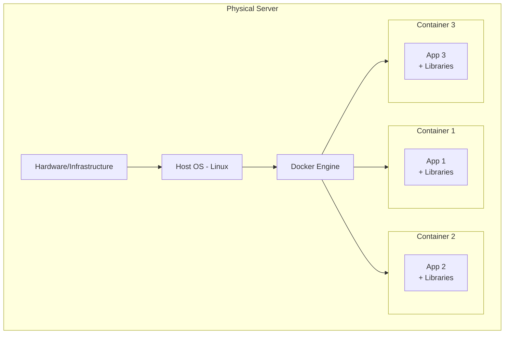
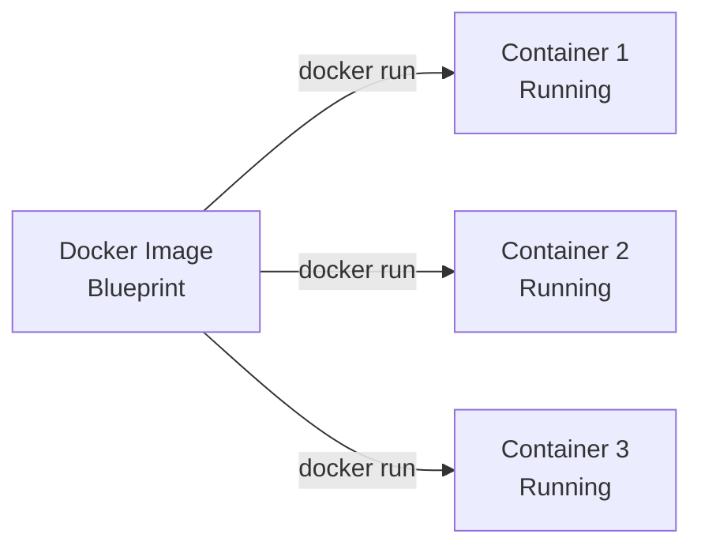
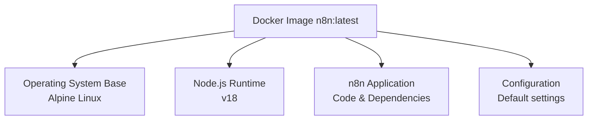
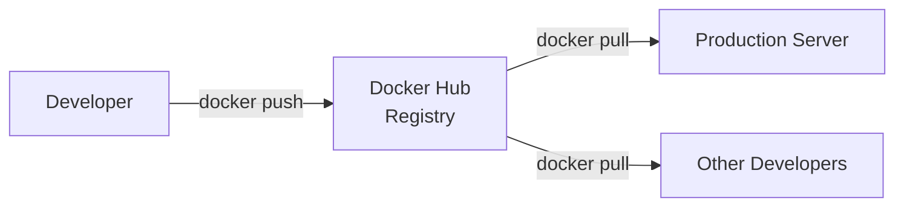
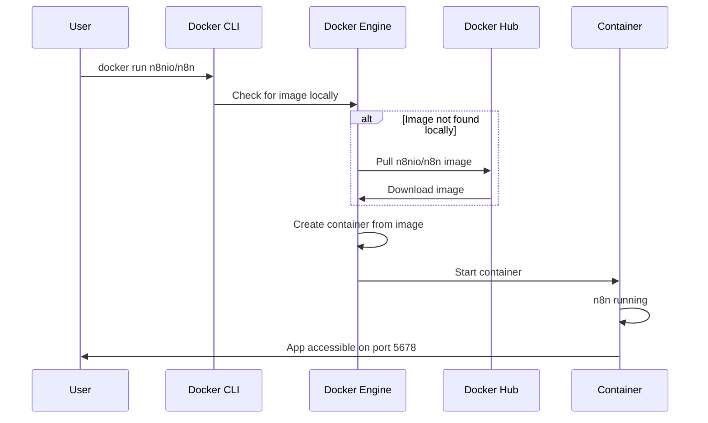
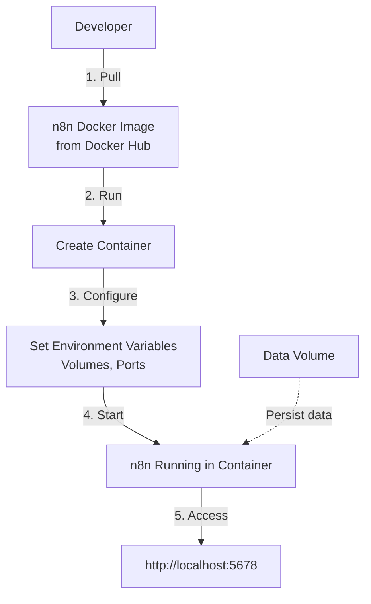

# What is Docker?

**Reading Time:** 7 minutes

---

## Simple Definition

> Docker is a tool that packages applications and all their dependencies into standardized units called **containers** that can run anywhere.

Think of it like a shipping container: just as shipping containers standardize how goods are transported, Docker containers standardize how software runs.

---

## Technical Definition

> Docker is a platform for developing, shipping, and running applications inside lightweight, portable, self-sufficient containers.

Let's break this down:



---

## The Problem Docker Solves

### Before Docker

```
Developer's Machine:
✅ App works perfectly

Production Server:
❌ "It doesn't work!"
❌ Different OS version
❌ Missing dependencies
❌ Wrong library versions
❌ Environment differences
```

### Classic "Works on My Machine" Problem



### With Docker

```
Developer's Machine:
✅ App runs in container

Production Server:
✅ Same container, works perfectly!
```



---

## Containers vs Virtual Machines

### Virtual Machines (Old Way)



**Characteristics:**
- Each VM includes a full OS (GBs of space)
- Heavy resource usage
- Slow startup (minutes)
- Strong isolation
- 3 apps = 3 full OS copies

### Docker Containers (Modern Way)



**Characteristics:**
- Containers share the host OS kernel
- Lightweight (MBs instead of GBs)
- Fast startup (seconds)
- Good isolation
- 3 apps = 1 OS, 3 isolated processes

### Comparison Table

| Feature | Virtual Machines | Docker Containers |
|---------|-----------------|-------------------|
| **Size** | GBs (1-10GB+) | MBs (50-500MB) |
| **Startup** | Minutes | Seconds |
| **Resource Usage** | Heavy | Light |
| **Isolation** | Complete | Process-level |
| **Portability** | Moderate | Excellent |
| **Use Case** | Full OS needed | App deployment |

---

## Core Docker Concepts

### 1. Container

> A running instance of an image. A container is to an image what a process is to a program.



**Analogy:** 
- Image = Recipe
- Container = Actual cake made from recipe

### 2. Image

> A read-only template with instructions for creating a container. Contains everything needed to run an application.



### 3. Dockerfile

> A text file with instructions on how to build a Docker image.

```dockerfile
# Example Dockerfile
FROM node:18-alpine
WORKDIR /app
COPY package.json .
RUN npm install
COPY . .
CMD ["npm", "start"]
```

### 4. Docker Hub (Registry)

> A cloud-based repository where Docker images are stored and shared.



---

## How Docker Works (Simplified)



**Step-by-step:**
1. You run `docker run n8nio/n8n`
2. Docker checks if image exists locally
3. If not, downloads from Docker Hub
4. Creates container from image
5. Starts the container
6. n8n runs inside the container

---

## Why Docker for n8n?

### Without Docker

```bash
# Complex manual setup
1. Install Node.js (specific version)
2. Install PostgreSQL
3. Install Redis
4. Configure environment variables
5. Install n8n
6. Configure n8n
7. Setup process manager
8. Configure reverse proxy
9. Setup SSL certificates
10. Hope it all works together
```

**Problems:**
- ❌ Different versions on different servers
- ❌ Manual dependency management
- ❌ Hard to reproduce
- ❌ Difficult to scale
- ❌ Complex troubleshooting

### With Docker

```bash
# Simple Docker setup
docker run -d \
  -p 5678:5678 \
  -v ~/.n8n:/home/node/.n8n \
  n8nio/n8n
```

**Benefits:**
- ✅ Consistent environment everywhere
- ✅ All dependencies included
- ✅ Easy to reproduce
- ✅ Simple to scale
- ✅ Isolated from host system

---

## Docker Workflow for n8n



---

## Real-World Analogy

Think of Docker like a food delivery service:

| Food Delivery | Docker |
|---------------|--------|
| Restaurant prepares meal | Developer builds image |
| Sealed container | Docker container |
| Delivery anywhere | Run on any server |
| Same meal, same quality | Same app, same behavior |
| No need to cook | No need to install dependencies |

---

## Key Takeaways

✅ Docker packages apps and dependencies into containers  
✅ Containers are lightweight, portable, and consistent  
✅ Unlike VMs, containers share the host OS kernel  
✅ Images are blueprints, containers are running instances  
✅ Solves "works on my machine" problem  
✅ Perfect for deploying n8n consistently  

---

## Check Your Understanding

1. What's the main difference between a container and a VM?
2. What problem does Docker solve?
3. What's the relationship between an image and a container?
4. Why is Docker better than manual installation for n8n?

---

**Next:** [Docker Architecture →](02-docker-architecture.md)

