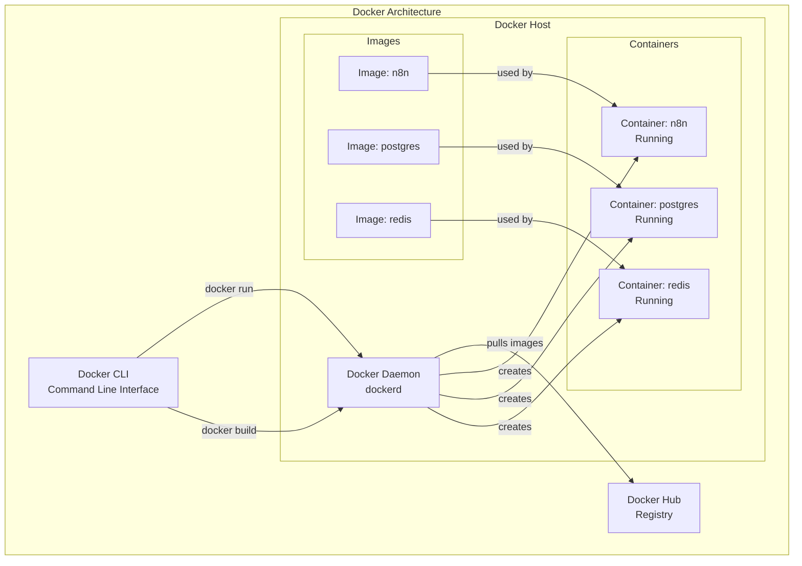
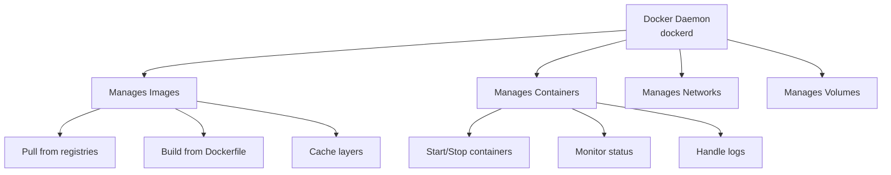
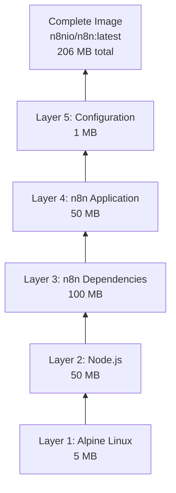
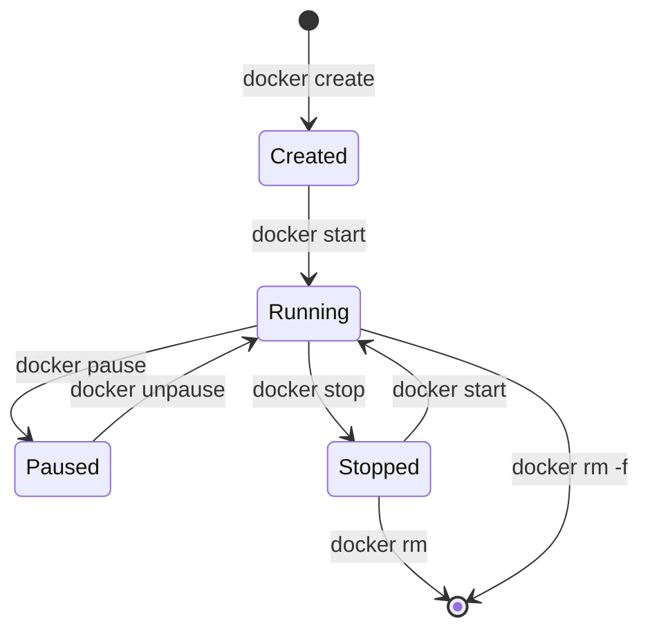
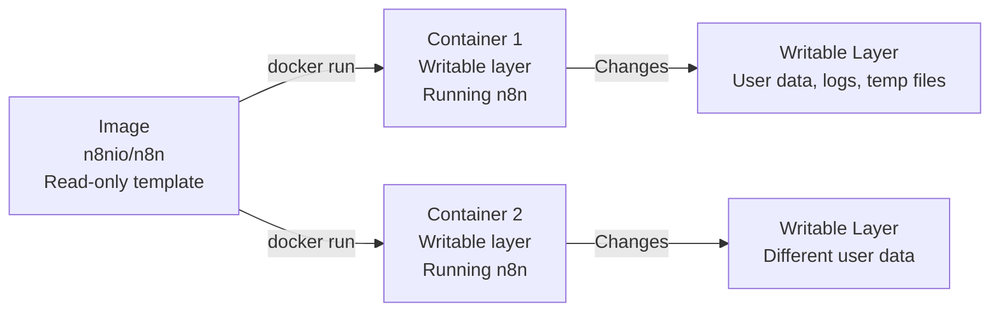
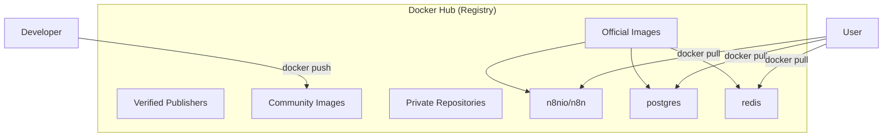
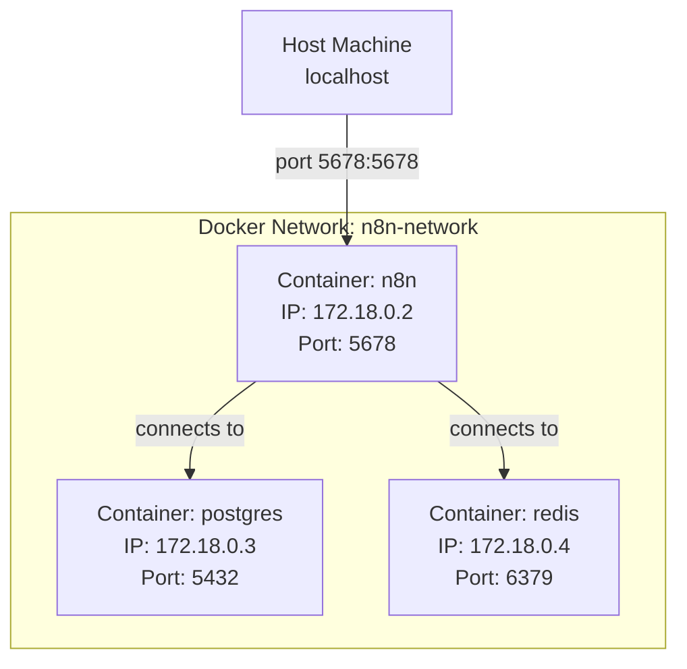
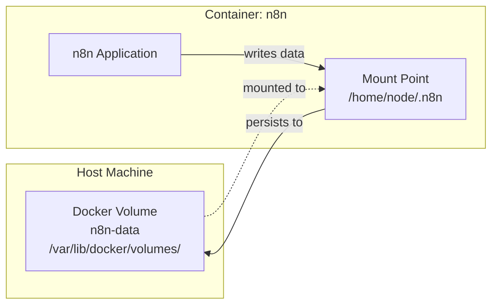
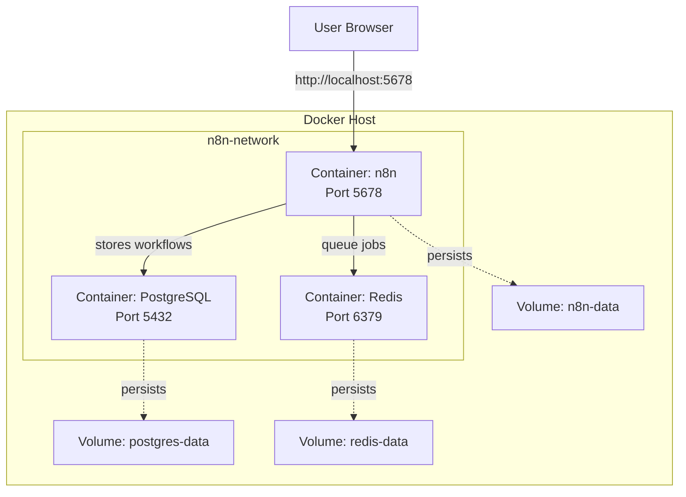

# Docker Architecture

**Reading Time:** 8 minutes

---

## Overview

Docker uses a client-server architecture. Understanding this architecture helps you work effectively with Docker for n8n deployments.



---

## Components Breakdown

### 1. Docker Client (CLI)

> The Docker client is how you interact with Docker. When you run commands like `docker run`, the client sends these to the Docker daemon.

```bash
# You type commands here
docker run n8nio/n8n
docker ps
docker logs my-container
docker build -t my-image .
```

**Key Points:**
- Command-line tool you interact with
- Sends instructions to Docker daemon
- Can connect to remote Docker daemons
- User-friendly interface to Docker Engine

---

### 2. Docker Daemon (dockerd)

> The Docker daemon is the background service that does the heavy lifting: building, running, and distributing containers.



**Responsibilities:**
- Listens for Docker API requests
- Manages Docker objects (images, containers, networks, volumes)
- Communicates with other daemons
- Handles the container lifecycle

---

### 3. Docker Images

> A Docker image is a read-only template with instructions for creating a container.

#### Image Layers

Images are built in layers. Each instruction in a Dockerfile creates a layer:



**Why Layers Matter:**
- Layers are cached and reusable
- Only changed layers need to be rebuilt/downloaded
- Saves bandwidth and storage
- Speeds up builds and deployments

#### Example: n8n Image Layers

```dockerfile
# Each instruction creates a layer

FROM node:18-alpine          # Layer 1: Base OS + Node.js
WORKDIR /usr/src/app        # Layer 2: Working directory
COPY package.json ./         # Layer 3: Package definition
RUN npm install             # Layer 4: Dependencies
COPY . .                    # Layer 5: Application code
CMD ["node", "index.js"]    # Layer 6: Startup command
```

#### Image Tags

```bash
# Image naming format
registry/repository:tag

# Examples
n8nio/n8n:latest           # Latest stable version
n8nio/n8n:1.19.0          # Specific version
n8nio/n8n:latest-alpine    # Latest with Alpine base
```

---

### 4. Docker Containers

> A container is a runnable instance of an image. You can create, start, stop, move, or delete a container.



#### Container States

| State | Description | Command |
|-------|-------------|---------|
| **Created** | Container exists but not started | `docker create` |
| **Running** | Container is executing | `docker start` / `docker run` |
| **Paused** | Container is frozen | `docker pause` |
| **Stopped** | Container has exited | `docker stop` |
| **Deleted** | Container removed | `docker rm` |

#### Container vs Image



**Key Differences:**
- **Image:** Immutable, shareable, versioned
- **Container:** Mutable, instance-specific, ephemeral

---

### 5. Docker Registry

> A Docker registry stores Docker images. Docker Hub is the default public registry.



#### Registry Types

**1. Docker Hub (Public)**
```bash
docker pull n8nio/n8n              # From Docker Hub
docker pull postgres:15          # Official PostgreSQL
```

**2. Private Registry**
```bash
docker pull mycompany.com/n8n:custom
```

**3. Self-hosted Registry**
```bash
docker pull registry.local:5000/n8n:internal
```

---

## Docker Networking

Containers can communicate with each other through Docker networks.



### Network Types

**1. Bridge (Default)**
- Private network on host
- Containers can communicate
- Access from host via port mapping

**2. Host**
- Container uses host's network directly
- No network isolation
- Better performance

**3. None**
- No networking
- Completely isolated

---

## Docker Volumes

Volumes persist data outside the container filesystem.



### Why Volumes?

**Without Volumes:**
```bash
docker run n8nio/n8n
# Create workflow, stop container
docker stop <container>
# Start new container
docker run n8nio/n8n
# ❌ Workflow data is GONE!
```

**With Volumes:**
```bash
docker run -v n8n-data:/home/node/.n8n n8nio/n8n
# Create workflow, stop container
docker stop <container>
# Start new container with same volume
docker run -v n8n-data:/home/node/.n8n n8nio/n8n
# ✅ Workflow data is PRESERVED!
```

### Volume Types

**1. Named Volumes**
```bash
docker run -v n8n-data:/home/node/.n8n n8nio/n8n
```

**2. Bind Mounts**
```bash
docker run -v /home/user/n8n-data:/home/node/.n8n n8nio/n8n
```

**3. tmpfs (temporary)**
```bash
docker run --tmpfs /tmp n8nio/n8n
```

---

## Complete n8n Docker Architecture



---

## Docker Lifecycle Commands

### Image Operations

```bash
# Pull image from registry
docker pull n8nio/n8n:latest

# List images
docker images

# Remove image
docker rmi n8nio/n8n:latest

# Build image from Dockerfile
docker build -t my-n8n:latest .
```

### Container Operations

```bash
# Run container (create + start)
docker run -d --name n8n n8nio/n8n

# List running containers
docker ps

# List all containers (including stopped)
docker ps -a

# Stop container
docker stop n8n

# Start stopped container
docker start n8n

# Remove container
docker rm n8n

# View logs
docker logs n8n

# Execute command in running container
docker exec -it n8n sh
```

### Volume Operations

```bash
# Create volume
docker volume create n8n-data

# List volumes
docker volume ls

# Inspect volume
docker volume inspect n8n-data

# Remove volume
docker volume rm n8n-data
```

---

## Key Takeaways

✅ Docker uses client-server architecture  
✅ Images are templates, containers are running instances  
✅ Images are built in layers for efficiency  
✅ Docker daemon manages all Docker objects  
✅ Volumes persist data outside containers  
✅ Networks allow container communication  
✅ Registries store and distribute images  

---

## Check Your Understanding

1. What's the role of the Docker daemon?
2. Why are Docker images built in layers?
3. What happens to container data when you stop it?
4. How do containers communicate with each other?
5. What's the difference between a named volume and a bind mount?

---

**Next:** [Docker for n8n →](03-docker-for-n8n.md)

