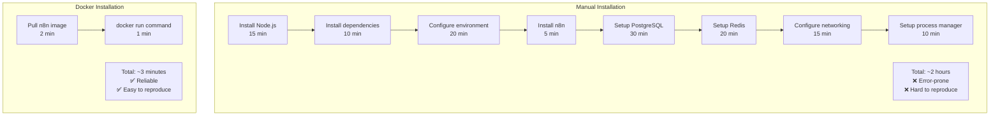
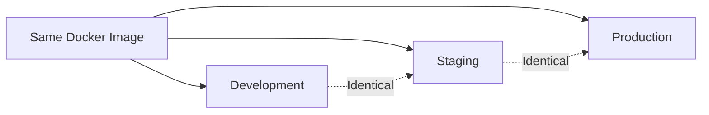
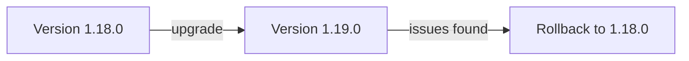
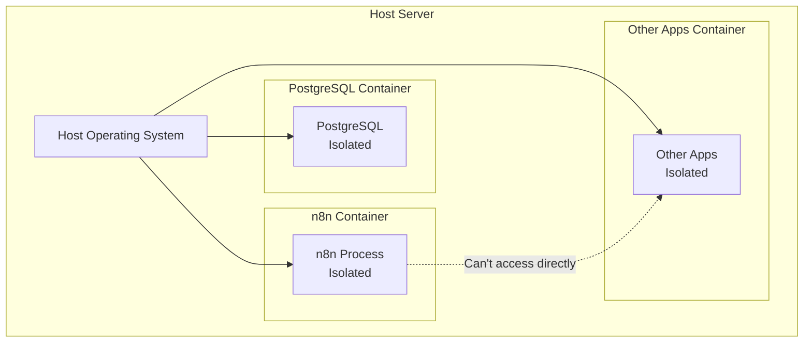
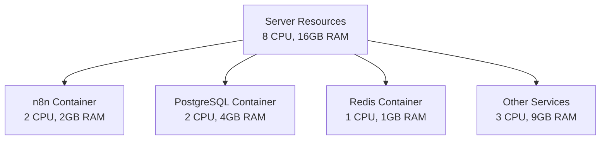
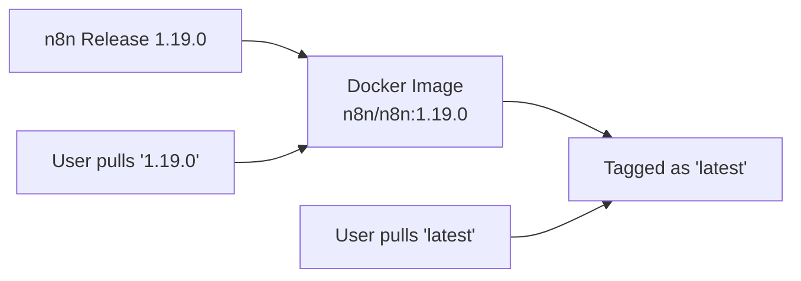
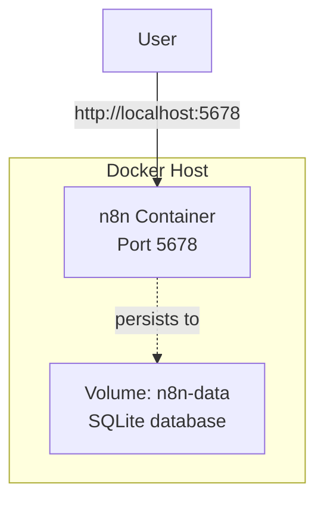
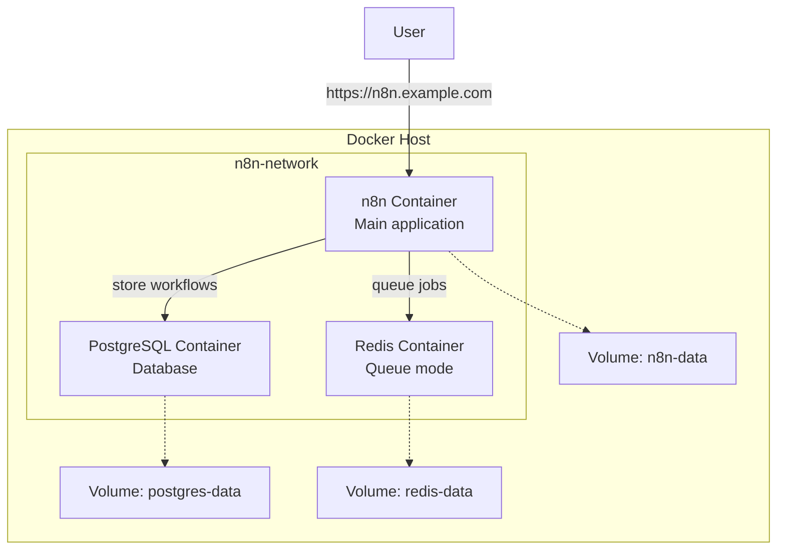
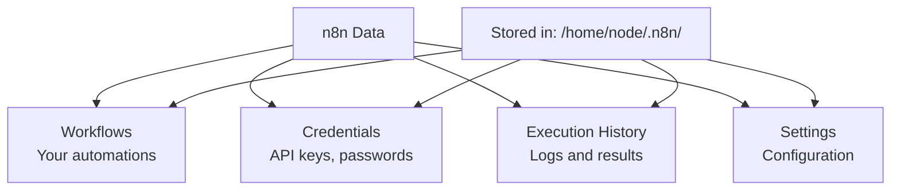

# Docker for n8n

**Reading Time:** 5 minutes

---

## Why Use Docker for n8n?

Running n8n with Docker provides significant advantages over traditional installation methods.

### Comparison: Docker vs Manual Installation



---

## Benefits of Docker for n8n

### 1. **Consistency Across Environments**



**Without Docker:**
```
Dev: Ubuntu 22.04, Node 18.x  ❌ Different
Staging: CentOS 7, Node 16.x  ❌ Different  
Prod: Debian 11, Node 20.x    ❌ Different
```

**With Docker:**
```
Dev: n8n/n8n:1.19.0      ✅ Identical
Staging: n8n/n8n:1.19.0  ✅ Identical
Prod: n8n/n8n:1.19.0     ✅ Identical
```

---

### 2. **Simplified Dependency Management**

All dependencies are bundled in the Docker image:

```dockerfile
# The n8n Docker image includes:
- Base OS (Alpine Linux)
- Node.js runtime (correct version)
- n8n application
- All npm dependencies
- Required system libraries
- Proper configurations
```

**You don't need to install:**
- ❌ Node.js
- ❌ npm packages
- ❌ System libraries
- ❌ Build tools

---

### 3. **Easy Updates and Rollbacks**

```bash
# Current version
docker run n8n/n8n:1.18.0

# Upgrade to new version
docker stop n8n
docker run n8n/n8n:1.19.0

# Rollback if issues occur
docker stop n8n
docker run n8n/n8n:1.18.0  # Back to previous version
```



---

### 4. **Isolation and Security**



**Benefits:**
- n8n runs in isolated environment
- Limited access to host system
- Compromised container doesn't affect host
- Each service in its own sandbox

---

### 5. **Resource Management**

Control how much resources n8n can use:

```bash
# Limit CPU and memory
docker run \
  --cpus="2.0" \
  --memory="2g" \
  n8n/n8n
```



---

## Official n8n Docker Images

### Available Images on Docker Hub

```bash
# Main repository
n8n/n8n

# Common tags
n8n/n8n:latest              # Latest stable version
n8n/n8n:1.19.0             # Specific version
n8n/n8n:latest-alpine      # Alpine Linux base
n8n/n8n:latest-debian      # Debian base
```

### Image Variants

**1. Standard (Debian-based)**
```bash
docker pull n8n/n8n:latest
# Size: ~500MB
# Use case: General purpose
```

**2. Alpine (Lightweight)**
```bash
docker pull n8n/n8n:latest-alpine
# Size: ~200MB
# Use case: Resource-constrained environments
```

### Version Strategy



**Best Practice:**
```bash
# ❌ Don't use 'latest' in production (unpredictable)
docker run n8n/n8n:latest

# ✅ Use specific version (predictable)
docker run n8n/n8n:1.19.0
```

---

## n8n Docker Architecture

### Simple Setup (Single Container)



```bash
docker run -d \
  --name n8n \
  -p 5678:5678 \
  -v n8n-data:/home/node/.n8n \
  n8n/n8n
```

**Use Case:** Development, testing, small personal projects

---

### Production Setup (Multiple Containers)



**Components:**
- **n8n Container:** Main application
- **PostgreSQL:** Production database (replaces SQLite)
- **Redis:** Queue mode for high-performance
- **Volumes:** Persistent data storage

**Use Case:** Production deployments, high availability

---

## Environment Variables for n8n Docker

Common environment variables you'll use:

```bash
docker run -d \
  --name n8n \
  -p 5678:5678 \
  -e N8N_BASIC_AUTH_ACTIVE=true \
  -e N8N_BASIC_AUTH_USER=admin \
  -e N8N_BASIC_AUTH_PASSWORD=secure_password \
  -e N8N_HOST=n8n.example.com \
  -e N8N_PROTOCOL=https \
  -e N8N_PORT=5678 \
  -e WEBHOOK_URL=https://n8n.example.com \
  -e DB_TYPE=postgresdb \
  -e DB_POSTGRESDB_HOST=postgres \
  -e DB_POSTGRESDB_PORT=5432 \
  -e DB_POSTGRESDB_DATABASE=n8n \
  -e DB_POSTGRESDB_USER=n8n \
  -e DB_POSTGRESDB_PASSWORD=n8n_password \
  -v n8n-data:/home/node/.n8n \
  n8n/n8n
```

### Key Environment Variables

| Variable | Purpose | Example |
|----------|---------|---------|
| `N8N_BASIC_AUTH_ACTIVE` | Enable authentication | `true` |
| `N8N_HOST` | Domain name | `n8n.example.com` |
| `DB_TYPE` | Database type | `postgresdb` |
| `WEBHOOK_URL` | Base URL for webhooks | `https://n8n.example.com` |
| `EXECUTIONS_MODE` | Execution mode | `queue` |
| `QUEUE_BULL_REDIS_HOST` | Redis host | `redis` |

---

## Data Persistence in Docker

### What Data Needs to Persist?



### Without Volume (Data Loss)

```bash
docker run -d --name n8n n8n/n8n
# Create workflows
docker stop n8n
docker rm n8n
docker run -d --name n8n n8n/n8n
# ❌ All workflows GONE!
```

### With Volume (Data Persists)

```bash
docker run -d --name n8n -v n8n-data:/home/node/.n8n n8n/n8n
# Create workflows
docker stop n8n
docker rm n8n
docker run -d --name n8n -v n8n-data:/home/node/.n8n n8n/n8n
# ✅ Workflows PRESERVED!
```

---

## Trade-offs: Docker vs Manual

### Advantages of Docker

✅ Fast deployment (minutes vs hours)  
✅ Consistent across environments  
✅ Easy updates and rollbacks  
✅ Better isolation and security  
✅ Simplified dependency management  
✅ Resource control  
✅ Easy to scale  

### Disadvantages of Docker

❌ Slight performance overhead (minimal)  
❌ Learning curve if new to Docker  
❌ Additional layer of complexity  
❌ Need to understand container concepts  
❌ Debugging can be more complex  

### When NOT to Use Docker

- Very simple, temporary testing
- Embedded systems with limited resources
- Legacy systems that can't run Docker
- When you need absolute maximum performance

---

## Key Takeaways

✅ Docker simplifies n8n deployment dramatically  
✅ Official images available on Docker Hub  
✅ Provides consistency across all environments  
✅ Easy to update, rollback, and scale  
✅ Always use volumes for data persistence  
✅ Production needs PostgreSQL and Redis containers  
✅ Use specific version tags in production  

---

## Check Your Understanding

1. What are 3 main benefits of running n8n with Docker?
2. What's the difference between `n8n/n8n:latest` and `n8n/n8n:1.19.0`?
3. Why do we need volumes for n8n?
4. What additional containers does a production n8n setup need?

---

**Next:** [Understanding Dockerfiles →](04-understanding-dockerfiles.md)

