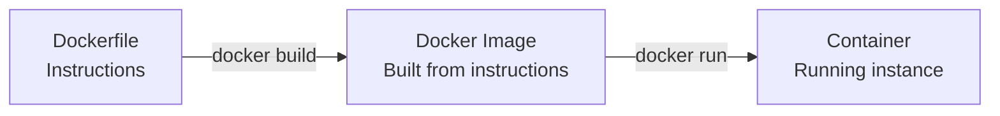
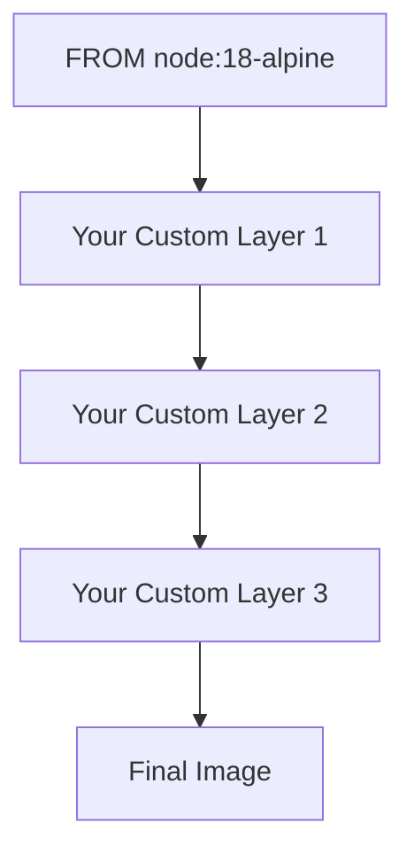
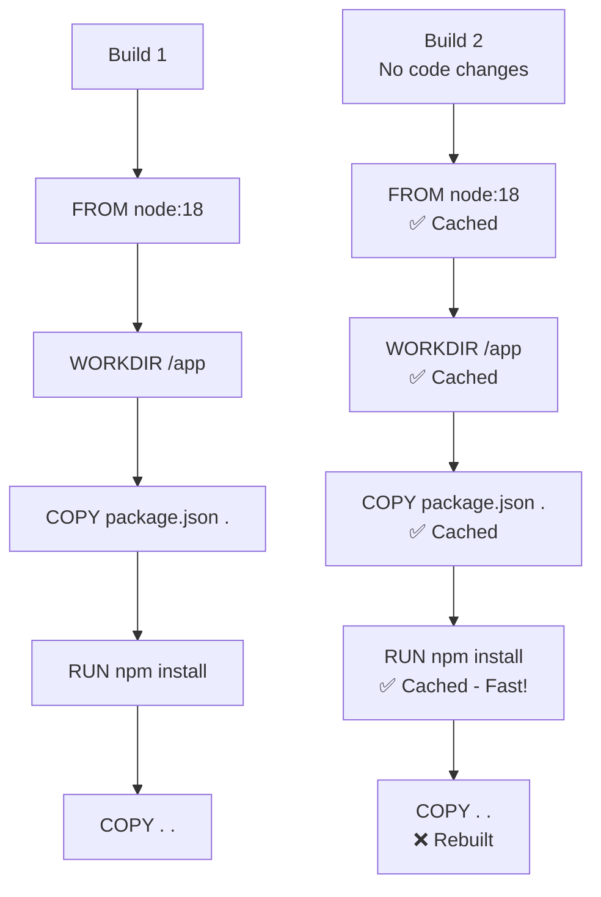
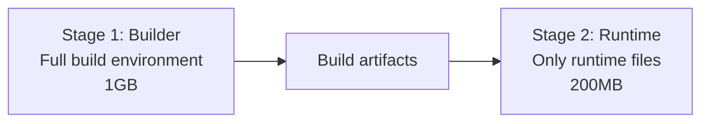

# Understanding Dockerfiles

**Reading Time:** 5 minutes

---

## What is a Dockerfile?

> A Dockerfile is a text file containing instructions for building a Docker image. It's like a recipe that tells Docker how to package your application.



---

## Basic Dockerfile Structure

```dockerfile
# 1. Base image
FROM node:18-alpine

# 2. Metadata
LABEL maintainer="you@example.com"

# 3. Working directory
WORKDIR /usr/src/app

# 4. Copy files
COPY package*.json ./

# 5. Install dependencies
RUN npm install

# 6. Copy application code
COPY . .

# 7. Expose port
EXPOSE 5678

# 8. Default command
CMD ["npm", "start"]
```

---

## Essential Dockerfile Instructions

### 1. FROM - Base Image

```dockerfile
FROM node:18-alpine
```

> Sets the base image for your build. Every Dockerfile must start with FROM.

**Common base images for n8n:**
```dockerfile
FROM node:18-alpine      # Lightweight, recommended
FROM node:18-slim        # Debian-based, minimal
FROM node:18            # Full Debian with more tools
FROM ubuntu:22.04       # Full Ubuntu (larger)
```



---

### 2. WORKDIR - Working Directory

```dockerfile
WORKDIR /usr/src/app
```

> Sets the working directory for subsequent instructions. Creates the directory if it doesn't exist.

**Without WORKDIR:**
```dockerfile
RUN cd /usr/src/app
COPY . /usr/src/app    # ❌ Error-prone
```

**With WORKDIR:**
```dockerfile
WORKDIR /usr/src/app
COPY . .               # ✅ Clean and clear
```

---

### 3. COPY - Copy Files

```dockerfile
COPY source destination
```

> Copies files from your host machine into the Docker image.

**Examples:**
```dockerfile
# Copy specific file
COPY package.json .

# Copy multiple files
COPY package.json package-lock.json ./

# Copy entire directory
COPY src/ ./src/

# Copy everything
COPY . .
```

**Best Practice - Copy Dependencies First:**
```dockerfile
# ✅ Good: Copy package.json first
COPY package*.json ./
RUN npm install
COPY . .

# ❌ Bad: Copy everything at once
COPY . .
RUN npm install
```

Why? Docker caches layers. If you copy package.json first and it hasn't changed, Docker reuses the cached `npm install` layer.

---

### 4. RUN - Execute Commands

```dockerfile
RUN command
```

> Executes commands during the build process. Each RUN creates a new layer.

**Examples:**
```dockerfile
# Install dependencies
RUN npm install

# Install system packages
RUN apk add --no-cache python3 g++ make

# Multiple commands (single layer)
RUN npm install && \
    npm run build && \
    npm cache clean --force
```

**Optimize Layers:**
```dockerfile
# ❌ Bad: Multiple layers
RUN apk update
RUN apk add python3
RUN apk add g++
RUN apk add make

# ✅ Good: Single layer
RUN apk update && \
    apk add --no-cache python3 g++ make && \
    rm -rf /var/cache/apk/*
```

---

### 5. ENV - Environment Variables

```dockerfile
ENV KEY=value
```

> Sets environment variables in the image and containers.

**Examples:**
```dockerfile
ENV NODE_ENV=production
ENV N8N_PORT=5678
ENV N8N_PROTOCOL=http
ENV N8N_HOST=localhost

# Multiple variables
ENV NODE_ENV=production \
    N8N_PORT=5678 \
    N8N_PROTOCOL=http
```

These can be overridden at runtime:
```bash
docker run -e N8N_HOST=example.com my-n8n
```

---

### 6. EXPOSE - Document Ports

```dockerfile
EXPOSE 5678
```

> Documents which ports the container listens on. **This is for documentation only** - it doesn't actually publish the port.

```dockerfile
# n8n default port
EXPOSE 5678

# Multiple ports
EXPOSE 5678 5679
```

To actually publish the port:
```bash
docker run -p 5678:5678 my-n8n
```

---

### 7. CMD - Default Command

```dockerfile
CMD ["executable", "param1", "param2"]
```

> Specifies the default command to run when starting a container. Only the last CMD in a Dockerfile is used.

**Forms:**
```dockerfile
# Exec form (preferred)
CMD ["node", "index.js"]

# Shell form
CMD node index.js

# With npm
CMD ["npm", "start"]
```

---

### 8. ENTRYPOINT - Container Executable

```dockerfile
ENTRYPOINT ["executable"]
```

> Defines the main executable. Unlike CMD, ENTRYPOINT is not overridden by arguments passed to `docker run`.

**Difference between CMD and ENTRYPOINT:**

```dockerfile
# With CMD
CMD ["npm", "start"]
# docker run my-image           → runs "npm start"
# docker run my-image sh        → runs "sh" (CMD overridden)

# With ENTRYPOINT
ENTRYPOINT ["npm"]
CMD ["start"]
# docker run my-image           → runs "npm start"
# docker run my-image test      → runs "npm test" (CMD replaced, ENTRYPOINT stays)
```

---

## Layer Caching and Optimization

### How Layer Caching Works



### Optimization Best Practices

**1. Order matters - place changing layers last:**
```dockerfile
# ✅ Good order
FROM node:18-alpine           # Rarely changes
WORKDIR /app                  # Never changes
COPY package*.json ./         # Changes occasionally
RUN npm install              # Only rebuilds when package.json changes
COPY . .                     # Changes frequently
```

**2. Combine commands to reduce layers:**
```dockerfile
# ❌ Many layers
RUN apk update
RUN apk add python3
RUN apk add g++

# ✅ Single layer
RUN apk update && apk add --no-cache python3 g++
```

**3. Use .dockerignore:**
```bash
# .dockerignore file
node_modules/
npm-debug.log
.git
.env
*.md
```

---

## Real-World Example: Custom n8n Dockerfile

```dockerfile
# Use official n8n image as base
FROM n8nio/n8n:latest

# Switch to root to install custom packages
USER root

# Install custom dependencies
RUN apk add --no-cache \
    python3 \
    py3-pip \
    g++ \
    make

# Install additional npm packages (custom nodes)
RUN npm install -g n8n-nodes-custom-package

# Create directory for custom files
RUN mkdir -p /home/node/.n8n/custom

# Copy custom configuration
COPY custom-config.json /home/node/.n8n/

# Set proper ownership
RUN chown -R node:node /home/node/.n8n

# Switch back to node user (security best practice)
USER node

# Set environment variables
ENV N8N_CUSTOM_EXTENSIONS="/home/node/.n8n/custom"

# The default CMD from base image is inherited
# CMD ["n8n"]
```

---

## Multi-Stage Builds (Advanced)

Multi-stage builds create smaller final images by separating build and runtime environments.

```dockerfile
# Stage 1: Build
FROM node:18-alpine AS builder

WORKDIR /app
COPY package*.json ./
RUN npm install
COPY . .
RUN npm run build

# Stage 2: Runtime
FROM node:18-alpine

WORKDIR /app
# Copy only necessary files from builder
COPY --from=builder /app/dist ./dist
COPY --from=builder /app/node_modules ./node_modules
COPY package*.json ./

EXPOSE 5678
CMD ["node", "dist/index.js"]
```



**Benefits:**
- Smaller final image
- Build tools not included in runtime
- More secure (fewer packages)

---

## Common Dockerfile Patterns for n8n

### Pattern 1: Basic n8n Extension

```dockerfile
FROM n8nio/n8n:latest
USER root
RUN npm install -g @n8nio/n8n-nodes-langchain
USER node
```

### Pattern 2: n8n with System Dependencies

```dockerfile
FROM n8nio/n8n:latest
USER root
RUN apk add --no-cache \
    chromium \
    nss \
    freetype \
    harfbuzz \
    ttf-freefont
USER node
```

### Pattern 3: n8n with Custom Configuration

```dockerfile
FROM n8nio/n8n:latest
COPY --chown=node:node custom-nodes/ /home/node/.n8n/custom/
ENV N8N_CUSTOM_EXTENSIONS="/home/node/.n8n/custom"
```

---

## Building Images from Dockerfile

```bash
# Basic build
docker build -t my-n8n:latest .

# Build with custom Dockerfile name
docker build -f Dockerfile.custom -t my-n8n:custom .

# Build with build arguments
docker build --build-arg NODE_ENV=production -t my-n8n .

# No cache (force rebuild)
docker build --no-cache -t my-n8n .
```

---

## Key Takeaways

✅ Dockerfile is a recipe for building images  
✅ Order of instructions matters for caching  
✅ Each instruction creates a layer  
✅ COPY dependencies before source code  
✅ Combine RUN commands to reduce layers  
✅ Use .dockerignore to exclude files  
✅ Multi-stage builds create smaller images  
✅ Always return to non-root user for security  

---

## Check Your Understanding

1. What's the difference between COPY and RUN?
2. Why should you copy package.json before copying all source code?
3. What does the EXPOSE instruction actually do?
4. How do CMD and ENTRYPOINT differ?
5. Why use multi-stage builds?

---

**Next:** [Practice: Run n8n with Docker →](../practice/01-run-n8n-docker.md)

