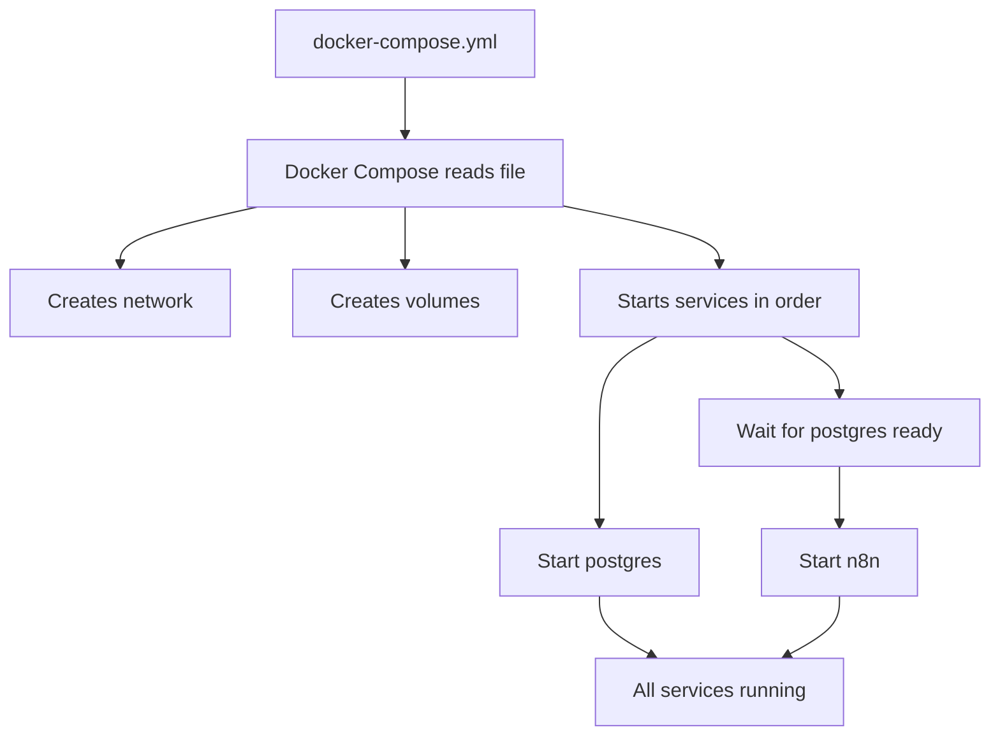
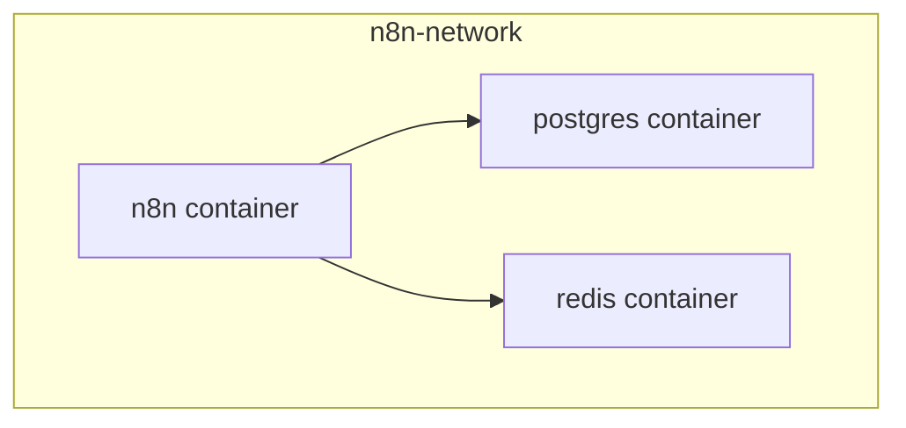
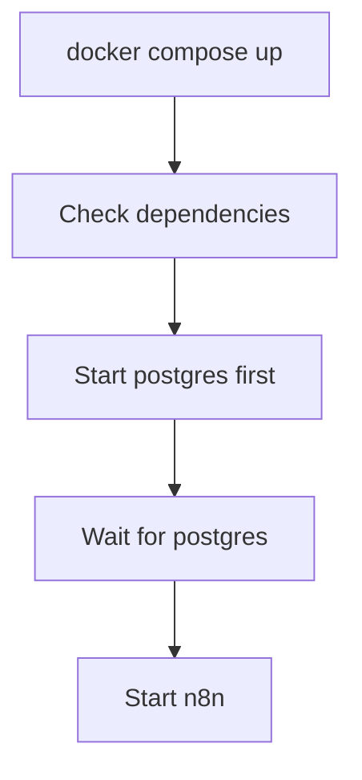
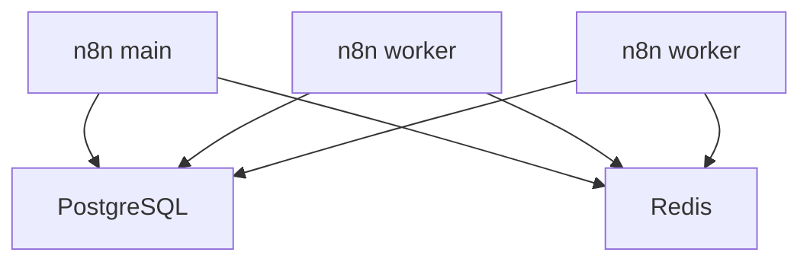

# What is Docker Compose?

**Reading Time:** 6 minutes

---

## Simple Definition

> Docker Compose is a tool for defining and running multi-container Docker applications using a single YAML file.

Instead of running multiple `docker run` commands, you describe your entire application stack in one file and start everything with one command: `docker compose up`.

---

## The Problem Without Compose

### Running n8n with PostgreSQL - The Hard Way

```bash
# Step 1: Create network
docker network create n8n-network

# Step 2: Start PostgreSQL
docker run -d \
  --name postgres \
  --network n8n-network \
  -e POSTGRES_USER=n8n \
  -e POSTGRES_PASSWORD=n8n_password \
  -e POSTGRES_DB=n8n \
  -v postgres-data:/var/lib/postgresql/data \
  postgres:15-alpine

# Step 3: Wait for PostgreSQL to be ready
sleep 10

# Step 4: Start n8n
docker run -d \
  --name n8n \
  --network n8n-network \
  -p 5678:5678 \
  -e DB_TYPE=postgresdb \
  -e DB_POSTGRESDB_HOST=postgres \
  -e DB_POSTGRESDB_PORT=5432 \
  -e DB_POSTGRESDB_DATABASE=n8n \
  -e DB_POSTGRESDB_USER=n8n \
  -e DB_POSTGRESDB_PASSWORD=n8n_password \
  -e N8N_ENCRYPTION_KEY=your-secret-key \
  -v n8n-data:/home/node/.n8n \
  n8nio/n8n
```

**Problems:**
- ❌ Repetitive and error-prone
- ❌ Hard to remember all flags and options
- ❌ Difficult to share with team
- ❌ No version control for infrastructure
- ❌ Manual dependency management
- ❌ Complex to scale or modify

---

## The Solution: Docker Compose

### Same Setup - The Easy Way

Create `docker-compose.yml`:

```yaml
version: '3.8'

services:
  postgres:
    image: postgres:15-alpine
    environment:
      POSTGRES_USER: n8n
      POSTGRES_PASSWORD: n8n_password
      POSTGRES_DB: n8n
    volumes:
      - postgres-data:/var/lib/postgresql/data
    networks:
      - n8n-network

  n8n:
    image: n8nio/n8n
    ports:
      - "5678:5678"
    environment:
      DB_TYPE: postgresdb
      DB_POSTGRESDB_HOST: postgres
      DB_POSTGRESDB_PORT: 5432
      DB_POSTGRESDB_DATABASE: n8n
      DB_POSTGRESDB_USER: n8n
      DB_POSTGRESDB_PASSWORD: n8n_password
      N8N_ENCRYPTION_KEY: your-secret-key
    volumes:
      - n8n-data:/home/node/.n8n
    networks:
      - n8n-network
    depends_on:
      - postgres

volumes:
  postgres-data:
  n8n-data:

networks:
  n8n-network:
```

Run everything:

```bash
docker compose up -d
```

**Benefits:**
- ✅ Single command to start everything
- ✅ Easy to read and understand
- ✅ Version controlled (Git-friendly)
- ✅ Shareable with team
- ✅ Automatic dependency management
- ✅ Easy to modify and scale

---

## How Docker Compose Works



### Workflow Comparison

**Without Compose:**


**With Compose:**


---

## Key Concepts

### 1. Services

**Definition:** A service is a container configuration. Each service in Compose becomes a running container.

```yaml
services:
  n8n:          # Service name
    image: n8nio/n8n
    ports:
      - "5678:5678"
  
  postgres:     # Another service
    image: postgres:15-alpine
```

### 2. Networks

**Definition:** Networks allow containers to communicate with each other.



Compose automatically creates a network and connects all services to it.

### 3. Volumes

**Definition:** Volumes persist data between container restarts.

```yaml
volumes:
  n8n-data:        # Volume name
  postgres-data:
```

### 4. Dependencies

**Definition:** Control startup order of services.

```yaml
services:
  n8n:
    depends_on:
      - postgres   # Start postgres before n8n
```



---

## YAML Basics

Docker Compose uses YAML (YAML Ain't Markup Language) format.

### Key Rules

```yaml
# Comments start with #

# Key-value pairs
key: value
name: n8n

# Nested structures (use 2 spaces for indentation)
parent:
  child: value
  another_child: value2

# Lists
services:
  - n8n
  - postgres
  - redis

# OR (more common in Compose)
services:
  n8n:
    # config
  postgres:
    # config

# Multi-line strings
environment:
  KEY: |
    This is a
    multi-line
    value

# Quotes optional for strings
name: n8n        # OK
name: "n8n"      # Also OK
name: 'n8n'      # Also OK
```

**Important:**
- ⚠️ **Indentation matters!** Use 2 spaces (not tabs)
- ⚠️ **Case sensitive**
- ⚠️ **Colons must be followed by a space**

---

## Common Docker Compose Commands

```bash
# Start all services
docker compose up

# Start in detached mode (background)
docker compose up -d

# Stop all services
docker compose down

# View running services
docker compose ps

# View logs
docker compose logs

# Follow logs in real-time
docker compose logs -f

# Restart a service
docker compose restart n8n

# Execute command in service
docker compose exec n8n sh

# Build custom images
docker compose build

# Pull latest images
docker compose pull
```

---

## Why Docker Compose is Perfect for n8n

### 1. **Multi-Container Architecture**

n8n production setup requires multiple services:



All defined in one file, started with one command.

### 2. **Environment Configuration**

```yaml
environment:
  N8N_BASIC_AUTH_ACTIVE: "true"
  WEBHOOK_URL: "https://n8n.example.com"
  DB_TYPE: postgresdb
  # ... all configs in one place
```

### 3. **Easy Development to Production**

```yaml
# docker-compose.dev.yml
environment:
  N8N_LOG_LEVEL: debug

# docker-compose.prod.yml  
environment:
  N8N_LOG_LEVEL: info
```

```bash
# Development
docker compose -f docker-compose.dev.yml up

# Production
docker compose -f docker-compose.prod.yml up
```

### 4. **Reproducible Deployments**

Team member can clone your repo and run:

```bash
git clone your-repo
cd your-repo
docker compose up -d
# ✅ Exact same environment
```

---

## Docker Compose vs Alternatives

| Feature | docker run | Docker Compose | Kubernetes |
|---------|-----------|----------------|------------|
| **Learning curve** | Easy | Medium | Hard |
| **Multi-container** | Manual | Built-in | Built-in |
| **Configuration** | Command line | YAML file | Multiple YAML files |
| **Best for** | Single container | 2-10 containers | 10+ containers, clusters |
| **n8n setup time** | 15 min | 2 min | 2 hours |
| **Production ready** | ❌ | ✅ (small-medium) | ✅ (large scale) |

**For most n8n deployments, Docker Compose is the sweet spot.**

---

## Real-World Comparison

### Scenario: Adding Redis to n8n

**Without Compose:**
```bash
# You need to remember and run 3 separate commands
# Update network settings
# Update n8n configuration
# Restart everything manually
# ~15 minutes of work
```

**With Compose:**
```yaml
# Add 4 lines to docker-compose.yml
services:
  redis:
    image: redis:7-alpine
    networks:
      - n8n-network
```

```bash
docker compose up -d
# ~30 seconds of work
```

---

## Key Takeaways

✅ Docker Compose simplifies multi-container applications  
✅ One YAML file replaces multiple docker commands  
✅ Perfect for n8n production setups  
✅ Infrastructure as code - version controlled  
✅ Easy to share and reproduce  
✅ Manages networks, volumes, and dependencies automatically  
✅ Essential tool for n8n engineers  

---

## Check Your Understanding

1. What problem does Docker Compose solve?
2. What are the 4 main components of a docker-compose.yml file?
3. How do you start all services defined in docker-compose.yml?
4. Why is Compose better than multiple `docker run` commands for n8n?
5. What format does Docker Compose use for configuration files?

---

**Next:** [Anatomy of docker-compose.yml →](02-compose-anatomy.md)

