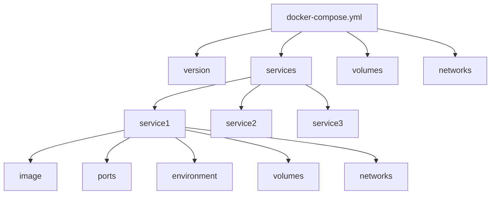
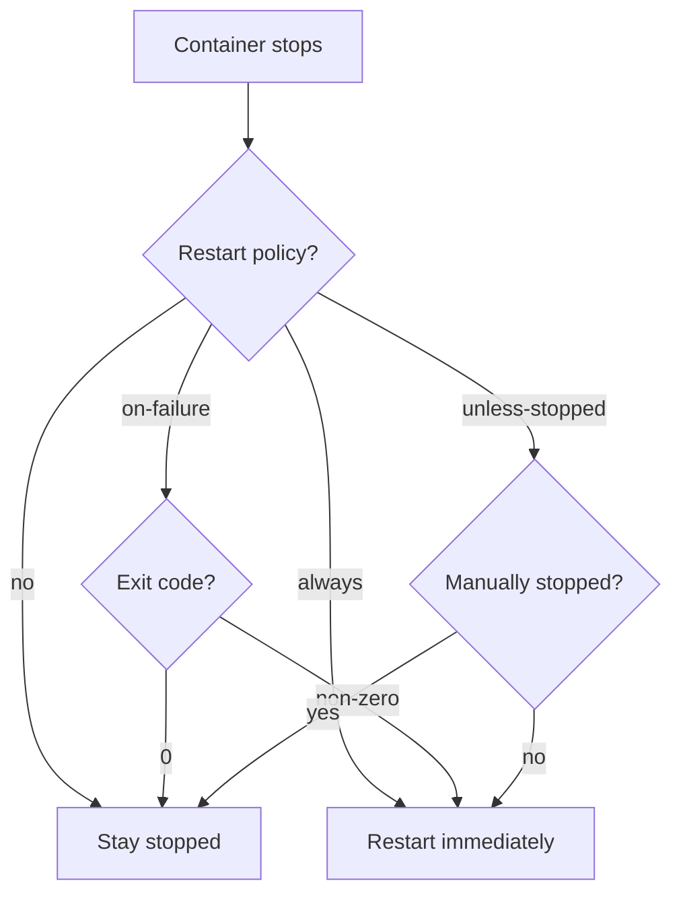
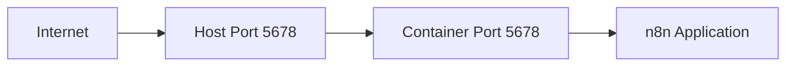
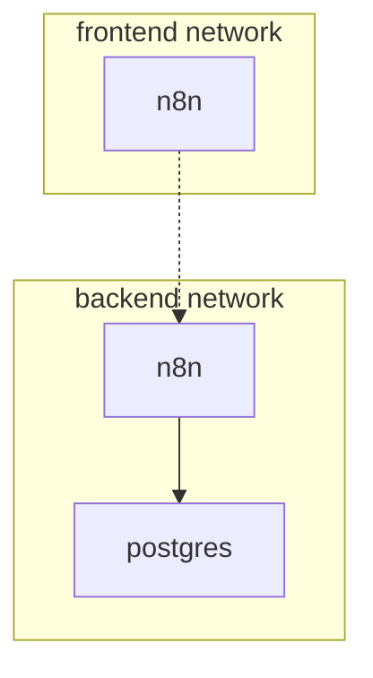
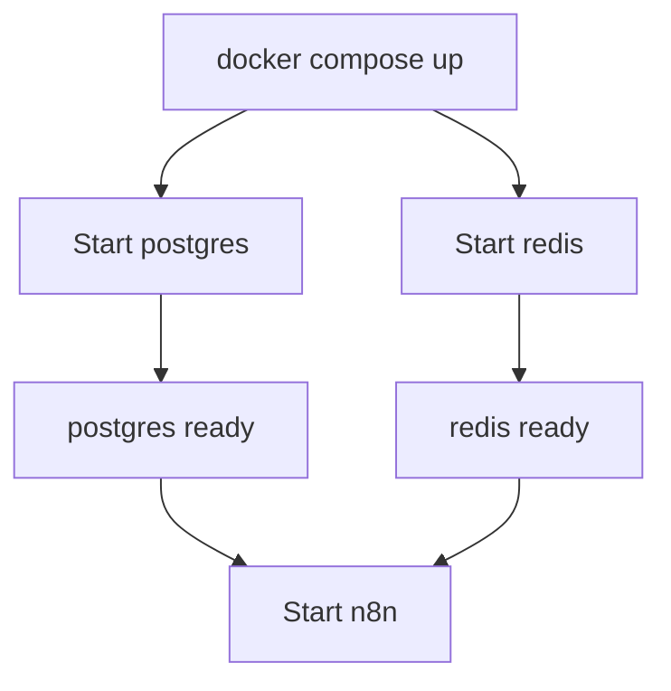
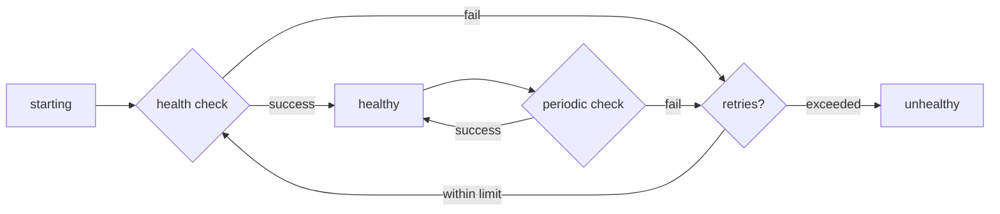

# Anatomy of docker-compose.yml

**Reading Time:** 8 minutes

---

## File Structure Overview

A `docker-compose.yml` file has a clear hierarchical structure:

```yaml
version: '3.8'              # Compose file format version

services:                   # Define containers
  service1:
    # service configuration
  service2:
    # service configuration

volumes:                    # Define persistent storage
  volume1:
  volume2:

networks:                   # Define networks
  network1:
  network2:
```



---

## Version Specification

```yaml
version: '3.8'
```

**Available versions:**
- `3.8` - Most common, recommended for n8n
- `3.9` - Latest in v3 series
- `2.x` - Legacy (avoid)

**Note:** Version 3.8+ supports all features needed for n8n.

---

## Services Section

The `services` section defines containers to run.

### Basic Service Definition

```yaml
services:
  n8n:
    image: n8nio/n8n           # Docker image to use
    container_name: n8n        # Optional: custom container name
    restart: always            # Restart policy
```

### Complete Service Configuration

```yaml
services:
  n8n:
    image: n8nio/n8n:1.19.0
    container_name: n8n-main
    hostname: n8n
    restart: unless-stopped
    ports:
      - "5678:5678"
    environment:
      - DB_TYPE=postgresdb
      - N8N_HOST=${N8N_HOST}
    volumes:
      - n8n-data:/home/node/.n8n
      - ./custom-nodes:/home/node/.n8n/custom
    networks:
      - n8n-network
    depends_on:
      - postgres
    healthcheck:
      test: ["CMD", "wget", "--spider", "http://localhost:5678"]
      interval: 30s
      timeout: 10s
      retries: 3
```

Let's break down each option:

---

## Image

Specify which Docker image to use:

```yaml
# Using specific version (recommended)
image: n8nio/n8n:1.19.0

# Using latest (not recommended for production)
image: n8nio/n8n:latest

# From Docker Hub (implicit)
image: postgres:15-alpine

# From private registry
image: registry.example.com/my-n8n:1.0.0
```

**Best practice:** Always use specific version tags in production.

---

## Container Name

```yaml
container_name: n8n-main
```

- Optional but recommended
- Makes containers easier to identify
- Must be unique across your Docker host
- If omitted, Compose auto-generates names

**Auto-generated pattern:** `{project}_{service}_{number}`

```bash
# Without container_name:
n8n_n8n_1, n8n_postgres_1

# With container_name:
n8n-main, n8n-postgres
```

---

## Restart Policies

```yaml
restart: always
```

**Options:**

| Policy | Behavior |
|--------|----------|
| `no` | Never restart (default) |
| `always` | Always restart on stop |
| `on-failure` | Restart only on error |
| `unless-stopped` | Restart unless manually stopped |

**For n8n production:** Use `unless-stopped` or `always`



---

## Ports

Map ports from container to host:

```yaml
ports:
  - "5678:5678"        # host:container
  - "8080:5678"        # Different host port
  - "127.0.0.1:5678:5678"  # Bind to localhost only
```

**Format:** `[HOST_IP:]HOST_PORT:CONTAINER_PORT`



**Multiple ports:**

```yaml
ports:
  - "5678:5678"    # n8n UI
  - "5679:5679"    # n8n webhook
```

---

## Environment Variables

### Inline Format

```yaml
environment:
  DB_TYPE: postgresdb
  DB_POSTGRESDB_HOST: postgres
  N8N_ENCRYPTION_KEY: your-secret-key
```

### List Format

```yaml
environment:
  - DB_TYPE=postgresdb
  - DB_POSTGRESDB_HOST=postgres
  - N8N_ENCRYPTION_KEY=your-secret-key
```

Both formats are equivalent. Use what's more readable for you.

### Environment File

```yaml
env_file:
  - .env              # Load from file
  - .env.production
```

**.env file example:**

```bash
# .env
DB_TYPE=postgresdb
DB_POSTGRESDB_HOST=postgres
DB_POSTGRESDB_USER=n8n
DB_POSTGRESDB_PASSWORD=secure_password
N8N_ENCRYPTION_KEY=your-very-long-secret-key
N8N_HOST=n8n.example.com
WEBHOOK_URL=https://n8n.example.com
```

**Usage:**

```yaml
services:
  n8n:
    image: n8nio/n8n
    env_file:
      - .env
```

### Variable Substitution

Reference environment variables from your shell:

```yaml
environment:
  N8N_HOST: ${N8N_HOST}                    # Required
  N8N_PORT: ${N8N_PORT:-5678}             # Default value
  DB_PASSWORD: ${DB_PASSWORD:?error}       # Error if not set
```

```bash
# Set before running docker compose
export N8N_HOST=n8n.example.com
docker compose up -d
```

---

## Volumes

Persist data between container restarts.

### Named Volumes

```yaml
services:
  n8n:
    volumes:
      - n8n-data:/home/node/.n8n          # named volume

volumes:
  n8n-data:                                 # declare volume
```

### Bind Mounts

```yaml
services:
  n8n:
    volumes:
      - ./data:/home/node/.n8n              # host path : container path
      - ./custom-nodes:/home/node/custom    # relative path
      - /opt/n8n/workflows:/workflows       # absolute path
```

### Read-Only Volumes

```yaml
volumes:
  - ./config:/config:ro                     # :ro = read-only
```

### Volume Syntax

```
[SOURCE:]TARGET[:MODE]

SOURCE: Host path or volume name
TARGET: Container path (required)
MODE: ro (read-only) or rw (read-write, default)
```

**Examples:**

```yaml
volumes:
  - n8n-data:/home/node/.n8n              # Named volume
  - ./data:/data                           # Bind mount
  - ./config:/config:ro                    # Read-only bind mount
  - n8n-logs:/var/log:rw                  # Named volume, explicitly read-write
```

---

## Networks

Control how containers communicate.

### Automatic Network

By default, Compose creates a network and connects all services:

```yaml
services:
  n8n:
    # automatically connected to default network
  postgres:
    # automatically connected to default network
```

### Custom Networks

```yaml
services:
  n8n:
    networks:
      - frontend
      - backend
  
  postgres:
    networks:
      - backend          # Not accessible from frontend

networks:
  frontend:
  backend:
```



### Network Aliases

```yaml
services:
  postgres:
    networks:
      backend:
        aliases:
          - db
          - database
```

Now n8n can connect to postgres using: `postgres`, `db`, or `database`

---

## Dependencies

Control startup order:

```yaml
services:
  n8n:
    depends_on:
      - postgres
      - redis
  
  postgres:
    # starts first
  
  redis:
    # starts first
```



### With Health Checks

```yaml
services:
  postgres:
    healthcheck:
      test: ["CMD-SHELL", "pg_isready -U n8n"]
      interval: 10s
      timeout: 5s
      retries: 5
  
  n8n:
    depends_on:
      postgres:
        condition: service_healthy    # Wait for health check
```

**Conditions:**
- `service_started` - Default, just wait for container to start
- `service_healthy` - Wait for health check to pass
- `service_completed_successfully` - Wait for container to exit with 0

---

## Health Checks

Monitor container health:

```yaml
healthcheck:
  test: ["CMD", "wget", "--spider", "http://localhost:5678"]
  interval: 30s          # Check every 30 seconds
  timeout: 10s           # Timeout after 10 seconds
  retries: 3             # Mark unhealthy after 3 failures
  start_period: 40s      # Grace period before first check
```

**Test formats:**

```yaml
# Shell command
test: ["CMD-SHELL", "wget --spider http://localhost:5678 || exit 1"]

# Exec command (no shell)
test: ["CMD", "wget", "--spider", "http://localhost:5678"]

# Disable inherited health check
test: ["NONE"]
```

**Health states:**



---

## Resource Limits

Control CPU and memory usage:

```yaml
services:
  n8n:
    deploy:
      resources:
        limits:
          cpus: '2.0'          # Max 2 CPUs
          memory: 2G           # Max 2GB RAM
        reservations:
          cpus: '0.5'          # Minimum 0.5 CPU
          memory: 512M         # Minimum 512MB
```

**Note:** `deploy` section works with Docker Swarm. For regular Compose, use:

```yaml
services:
  n8n:
    mem_limit: 2g
    cpus: 2.0
```

---

## Logging

Configure container logging:

```yaml
services:
  n8n:
    logging:
      driver: "json-file"
      options:
        max-size: "10m"       # Rotate after 10MB
        max-file: "3"         # Keep 3 files
```

**Logging drivers:**
- `json-file` - Default
- `syslog` - Syslog protocol
- `journald` - Systemd journal
- `none` - Disable logging

---

## Complete n8n Example

Putting it all together:

```yaml
version: '3.8'

services:
  postgres:
    image: postgres:15-alpine
    container_name: n8n-postgres
    restart: unless-stopped
    environment:
      POSTGRES_USER: n8n
      POSTGRES_PASSWORD: ${DB_PASSWORD}
      POSTGRES_DB: n8n
    volumes:
      - postgres-data:/var/lib/postgresql/data
    networks:
      - n8n-internal
    healthcheck:
      test: ["CMD-SHELL", "pg_isready -U n8n"]
      interval: 10s
      timeout: 5s
      retries: 5

  redis:
    image: redis:7-alpine
    container_name: n8n-redis
    restart: unless-stopped
    volumes:
      - redis-data:/data
    networks:
      - n8n-internal
    healthcheck:
      test: ["CMD", "redis-cli", "ping"]
      interval: 10s
      timeout: 5s
      retries: 5

  n8n:
    image: n8nio/n8n:latest
    container_name: n8n-main
    restart: unless-stopped
    ports:
      - "5678:5678"
    environment:
      - DB_TYPE=postgresdb
      - DB_POSTGRESDB_HOST=postgres
      - DB_POSTGRESDB_PORT=5432
      - DB_POSTGRESDB_DATABASE=n8n
      - DB_POSTGRESDB_USER=n8n
      - DB_POSTGRESDB_PASSWORD=${DB_PASSWORD}
      - N8N_ENCRYPTION_KEY=${N8N_ENCRYPTION_KEY}
      - N8N_HOST=${N8N_HOST}
      - WEBHOOK_URL=${WEBHOOK_URL}
      - EXECUTIONS_MODE=queue
      - QUEUE_BULL_REDIS_HOST=redis
      - QUEUE_BULL_REDIS_PORT=6379
    volumes:
      - n8n-data:/home/node/.n8n
    networks:
      - n8n-internal
    depends_on:
      postgres:
        condition: service_healthy
      redis:
        condition: service_healthy
    healthcheck:
      test: ["CMD", "wget", "--spider", "http://localhost:5678"]
      interval: 30s
      timeout: 10s
      retries: 3
      start_period: 60s

volumes:
  postgres-data:
    driver: local
  redis-data:
    driver: local
  n8n-data:
    driver: local

networks:
  n8n-internal:
    driver: bridge
```

---

## Best Practices

### 1. Use Specific Versions

```yaml
# ❌ Avoid
image: n8nio/n8n:latest

# ✅ Better
image: n8nio/n8n:1.19.0
```

### 2. Externalize Secrets

```yaml
# ❌ Never commit secrets
environment:
  DB_PASSWORD: mypassword123

# ✅ Use env files (gitignored)
env_file:
  - .env
```

### 3. Add Health Checks

```yaml
# ✅ Always include health checks
healthcheck:
  test: ["CMD", "wget", "--spider", "http://localhost:5678"]
  interval: 30s
```

### 4. Use Named Volumes

```yaml
# ✅ Named volumes are managed by Docker
volumes:
  - n8n-data:/home/node/.n8n

volumes:
  n8n-data:
```

### 5. Set Restart Policies

```yaml
# ✅ Ensure services auto-restart
restart: unless-stopped
```

---

## Key Takeaways

✅ docker-compose.yml has 4 main sections: version, services, volumes, networks  
✅ Services define containers with all their configuration  
✅ Volumes persist data between restarts  
✅ Networks control container communication  
✅ Environment variables externalize configuration  
✅ Health checks ensure service readiness  
✅ Dependencies control startup order  

---

## Check Your Understanding

1. What are the 4 main top-level keys in a docker-compose.yml file?
2. What's the difference between a named volume and a bind mount?
3. How do you make a service wait for another service to be healthy?
4. What restart policy should you use for production n8n?
5. How can you avoid hardcoding secrets in docker-compose.yml?

---

**Next:** [Networks and Container Communication →](03-compose-networking.md)

