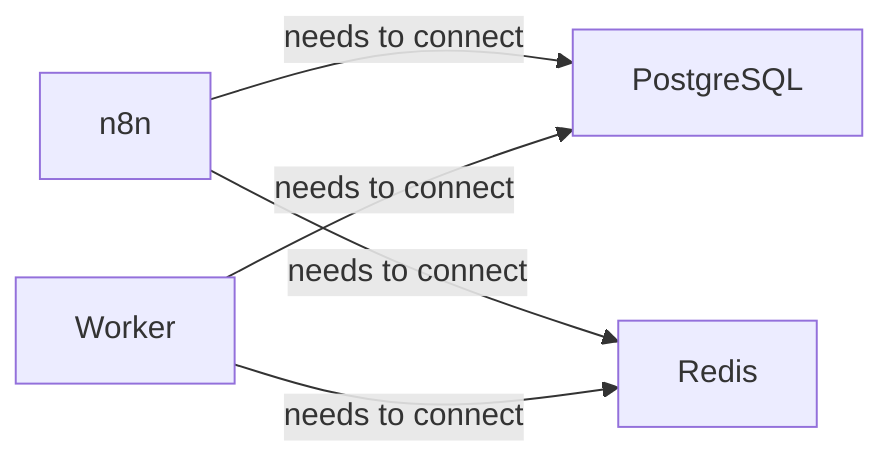
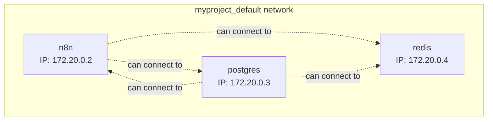
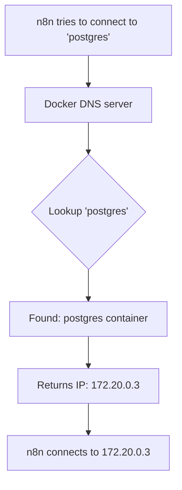
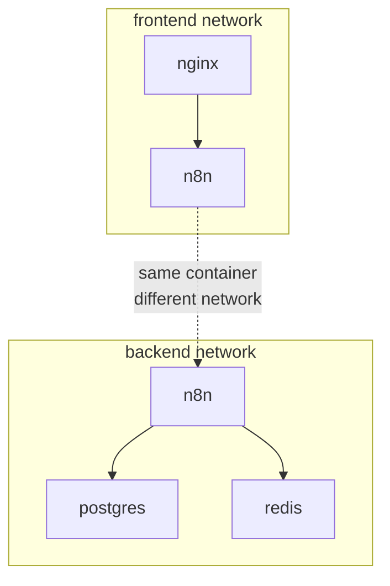
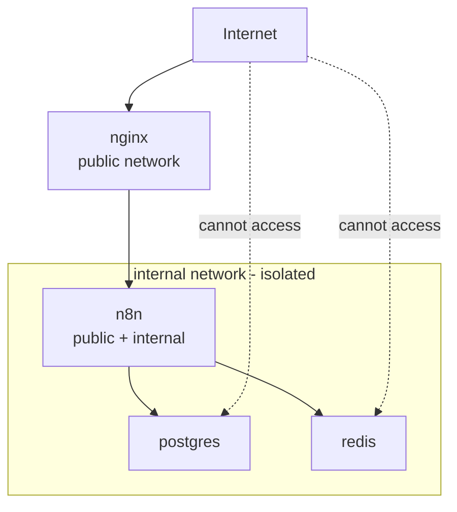
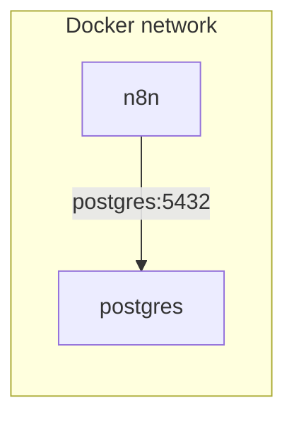
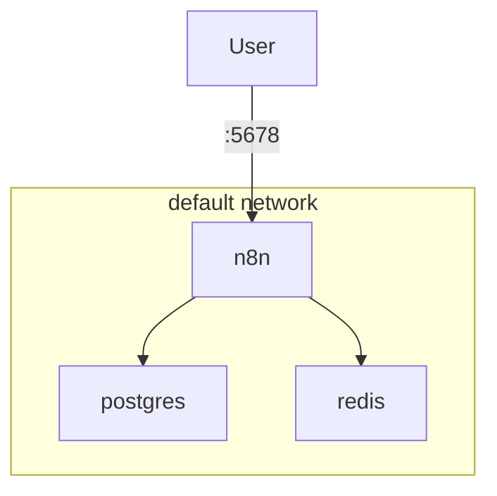
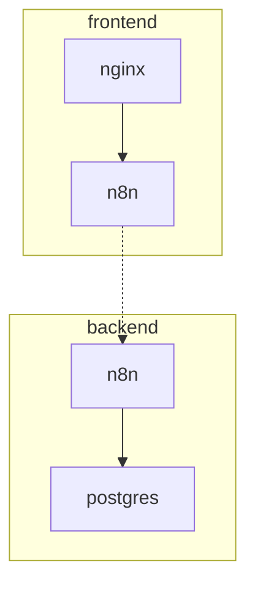
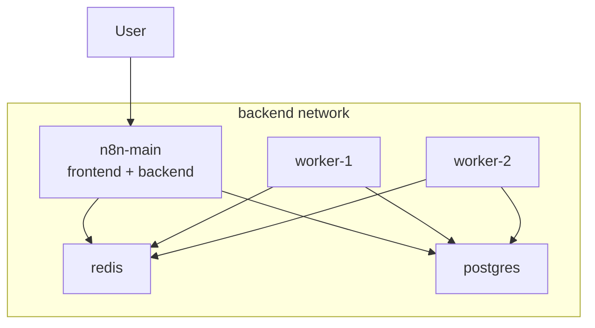

# Networks and Container Communication

**Reading Time:** 6 minutes

---

## The Networking Challenge

When running multiple containers, they need to communicate with each other:



**Questions:**
- How does n8n find PostgreSQL?
- What IP address should n8n use?
- How to isolate services for security?

Docker Compose solves all of this automatically.

---

## Default Network Behavior

When you run `docker compose up`, Compose automatically:

1. Creates a network named `{project}_default`
2. Connects all services to that network
3. Sets up DNS so services can find each other by name

```yaml
version: '3.8'

services:
  n8n:
    image: n8nio/n8n
  
  postgres:
    image: postgres:15-alpine
  
  redis:
    image: redis:7-alpine
```



**Result:** All services can communicate with each other using service names.

---

## DNS Resolution in Compose

Docker Compose provides automatic DNS resolution:

```yaml
services:
  n8n:
    environment:
      DB_POSTGRESDB_HOST: postgres    # ← Just use service name!
      QUEUE_BULL_REDIS_HOST: redis    # ← Magic!
  
  postgres:
    # n8n can reach this as "postgres"
  
  redis:
    # n8n can reach this as "redis"
```

**How it works:**



**You never need to know the IP addresses!**

---

## Service Name Resolution

Each service is reachable by its service name:

```yaml
services:
  n8n:
    # Reachable as: n8n
  
  postgres:
    # Reachable as: postgres
  
  redis:
    # Reachable as: redis
```

**From inside n8n container:**

```bash
# These all work
ping postgres
curl http://redis:6379
psql -h postgres -U n8n
```

---

## Custom Networks

You can create custom networks for better organization and security:

```yaml
version: '3.8'

services:
  n8n:
    networks:
      - frontend
      - backend
  
  postgres:
    networks:
      - backend        # Only on backend network
  
  nginx:
    networks:
      - frontend       # Only on frontend network

networks:
  frontend:
  backend:
```



**Benefits:**
- Nginx can reach n8n but NOT postgres
- n8n can reach both networks
- Better security through isolation

---

## Network Isolation Example

Secure n8n architecture with network isolation:

```yaml
version: '3.8'

services:
  # Public-facing reverse proxy
  nginx:
    image: nginx:alpine
    ports:
      - "80:80"
      - "443:443"
    networks:
      - public
  
  # n8n application
  n8n:
    image: n8nio/n8n
    networks:
      - public          # Accessible from nginx
      - internal        # Can access database
  
  # Database (not exposed to public network)
  postgres:
    image: postgres:15-alpine
    networks:
      - internal        # Only n8n can access
  
  # Redis (not exposed to public network)
  redis:
    image: redis:7-alpine
    networks:
      - internal        # Only n8n can access

networks:
  public:
    driver: bridge
  internal:
    driver: bridge
    internal: true      # No external access
```



---

## Network Drivers

Docker Compose supports different network drivers:

### Bridge (Default)

```yaml
networks:
  my-network:
    driver: bridge
```

- Default driver
- Creates isolated network on single host
- Best for most use cases

### Host

```yaml
services:
  n8n:
    network_mode: host
```

- Container uses host's network directly
- No port mapping needed
- Less isolation

### None

```yaml
services:
  isolated-service:
    network_mode: none
```

- No networking
- Completely isolated
- Rare use case

---

## Network Aliases

Give services additional DNS names:

```yaml
services:
  postgres:
    networks:
      backend:
        aliases:
          - db
          - database
          - postgres-server
```

**Now n8n can connect using any of:**
- `postgres` (service name)
- `db`
- `database`
- `postgres-server`

```yaml
services:
  n8n:
    environment:
      # All of these work
      DB_POSTGRESDB_HOST: postgres
      # DB_POSTGRESDB_HOST: db
      # DB_POSTGRESDB_HOST: database
```

---

## Port Mapping vs Network Communication

**Two ways containers communicate:**

### 1. Internal Communication (within Docker network)

```yaml
services:
  n8n:
    environment:
      DB_POSTGRESDB_HOST: postgres
      DB_POSTGRESDB_PORT: 5432       # Container port
    networks:
      - internal
  
  postgres:
    # No ports exposed to host
    networks:
      - internal
```

**n8n connects directly to postgres:5432 inside Docker network**



### 2. External Access (from host or internet)

```yaml
services:
  n8n:
    ports:
      - "5678:5678"    # Host:Container
```

**Users access via localhost:5678**


**Key difference:**
- **No `ports`** = Only accessible within Docker network
- **With `ports`** = Accessible from outside Docker

---

## Common Networking Patterns

### Pattern 1: Simple Stack (All Connected)

```yaml
services:
  n8n:
    ports:
      - "5678:5678"
  postgres:
  redis:

# Default network - all can communicate
```



### Pattern 2: Frontend + Backend Separation

```yaml
services:
  n8n:
    networks:
      - frontend
      - backend
  
  postgres:
    networks:
      - backend
  
  nginx:
    networks:
      - frontend

networks:
  frontend:
  backend:
```



### Pattern 3: Multiple Workers (Shared Backend)

```yaml
services:
  n8n-main:
    networks:
      - frontend
      - backend
  
  n8n-worker-1:
    networks:
      - backend
  
  n8n-worker-2:
    networks:
      - backend
  
  postgres:
    networks:
      - backend
  
  redis:
    networks:
      - backend

networks:
  frontend:
  backend:
```



---

## Connecting to External Networks

Sometimes you need to connect to existing networks:

```yaml
services:
  n8n:
    networks:
      - default
      - existing-network

networks:
  default:
  existing-network:
    external: true           # Don't create, already exists
    name: my_existing_network
```

---

## Network Configuration Options

```yaml
networks:
  my-network:
    driver: bridge
    driver_opts:
      com.docker.network.bridge.name: br-n8n
    ipam:
      driver: default
      config:
        - subnet: 172.28.0.0/16
          gateway: 172.28.0.1
    internal: true           # No external access
    attachable: true         # Allow manual container attachment
    labels:
      app: n8n
      environment: production
```

**Most of the time, you only need:**

```yaml
networks:
  my-network:
    driver: bridge
```

---

## Debugging Network Issues

### Check network exists

```bash
docker network ls
```

### Inspect network details

```bash
docker network inspect n8n_default
```

### Test connectivity from container

```bash
# Enter n8n container
docker compose exec n8n sh

# Test PostgreSQL connection
ping postgres
nc -zv postgres 5432

# Check DNS resolution
nslookup postgres
```

### View all containers on network

```bash
docker network inspect n8n_default --format '{{range .Containers}}{{.Name}} {{end}}'
```

---

## Real-World n8n Example

Complete networking setup for production n8n:

```yaml
version: '3.8'

services:
  nginx:
    image: nginx:alpine
    ports:
      - "80:80"
      - "443:443"
    networks:
      - proxy-network
  
  n8n-main:
    image: n8nio/n8n
    networks:
      - proxy-network      # nginx can reach
      - app-network        # can reach DB/Redis
    environment:
      DB_POSTGRESDB_HOST: postgres
      QUEUE_BULL_REDIS_HOST: redis
  
  n8n-worker:
    image: n8nio/n8n
    command: worker
    networks:
      - app-network        # can reach DB/Redis only
    environment:
      DB_POSTGRESDB_HOST: postgres
      QUEUE_BULL_REDIS_HOST: redis
  
  postgres:
    image: postgres:15-alpine
    networks:
      - app-network        # isolated from internet
  
  redis:
    image: redis:7-alpine
    networks:
      - app-network        # isolated from internet

networks:
  proxy-network:
    driver: bridge
  app-network:
    driver: bridge
    internal: false        # Allow outbound internet for n8n
```

**Security benefits:**
- Postgres and Redis not exposed to proxy network
- Workers don't need proxy access
- Clear network separation

---

## Key Takeaways

✅ Docker Compose creates networks automatically  
✅ Services find each other using service names (DNS)  
✅ No need to know IP addresses  
✅ Custom networks provide security isolation  
✅ Internal communication doesn't need port mapping  
✅ Only expose ports for external access  
✅ Use multiple networks for layered security  

---

## Check Your Understanding

1. How do containers find each other in Docker Compose?
2. What's the difference between internal network communication and exposed ports?
3. Why would you use multiple networks in a Compose file?
4. How would n8n connect to a postgres service in the same Compose file?
5. What command shows you all containers on a Docker network?

---

**Next:** [Docker Compose for n8n →](04-compose-for-n8n.md)

