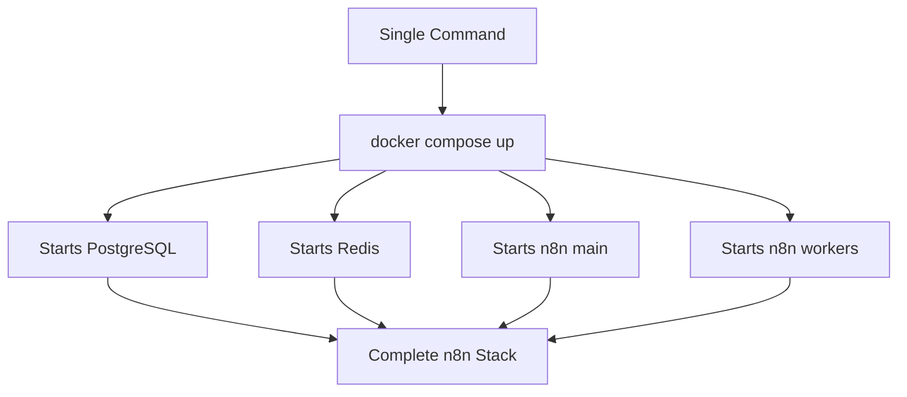
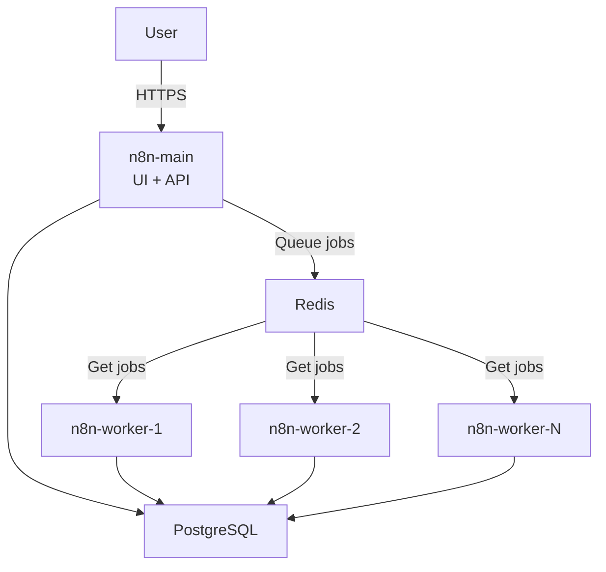

# Docker Compose for n8n

**Reading Time:** 5 minutes

---

## Why Docker Compose is Perfect for n8n

n8n's architecture benefits immensely from Docker Compose:



**Without Compose:** 15+ commands, error-prone  
**With Compose:** 1 command, repeatable

---

## n8n Deployment Scenarios

### Scenario 1: Development / Testing

**Requirements:**
- Quick setup
- SQLite database
- Single container
- No persistence needed

```yaml
version: '3.8'

services:
  n8n:
    image: n8nio/n8n
    ports:
      - "5678:5678"
    environment:
      - N8N_LOG_LEVEL=debug
```

```bash
docker compose up
```

**Use case:** Learning, quick tests, debugging

---

### Scenario 2: Small Production

**Requirements:**
- PostgreSQL for reliability
- Data persistence
- Basic security
- Single n8n instance

```yaml
version: '3.8'

services:
  postgres:
    image: postgres:15-alpine
    restart: unless-stopped
    environment:
      POSTGRES_USER: n8n
      POSTGRES_PASSWORD: ${DB_PASSWORD}
      POSTGRES_DB: n8n
    volumes:
      - postgres-data:/var/lib/postgresql/data
    healthcheck:
      test: ["CMD-SHELL", "pg_isready -U n8n"]
      interval: 10s

  n8n:
    image: n8nio/n8n
    restart: unless-stopped
    ports:
      - "5678:5678"
    environment:
      - DB_TYPE=postgresdb
      - DB_POSTGRESDB_HOST=postgres
      - DB_POSTGRESDB_DATABASE=n8n
      - DB_POSTGRESDB_USER=n8n
      - DB_POSTGRESDB_PASSWORD=${DB_PASSWORD}
      - N8N_ENCRYPTION_KEY=${N8N_ENCRYPTION_KEY}
      - N8N_HOST=${N8N_HOST}
      - WEBHOOK_URL=https://${N8N_HOST}
    volumes:
      - n8n-data:/home/node/.n8n
    depends_on:
      postgres:
        condition: service_healthy

volumes:
  postgres-data:
  n8n-data:
```

**.env file:**

```bash
DB_PASSWORD=secure_random_password_here
N8N_ENCRYPTION_KEY=very_long_random_key_here
N8N_HOST=n8n.yourdomain.com
```

**Use case:** Personal projects, small business, up to 100 workflows

---

### Scenario 3: High-Performance Production (Queue Mode)

**Requirements:**
- PostgreSQL database
- Redis for queue
- Multiple workers
- Horizontal scaling
- High availability

```yaml
version: '3.8'

services:
  postgres:
    image: postgres:15-alpine
    restart: unless-stopped
    environment:
      POSTGRES_USER: n8n
      POSTGRES_PASSWORD: ${DB_PASSWORD}
      POSTGRES_DB: n8n
      POSTGRES_NON_ROOT_USER: n8n_user
      POSTGRES_NON_ROOT_PASSWORD: ${DB_PASSWORD}
    volumes:
      - postgres-data:/var/lib/postgresql/data
    healthcheck:
      test: ["CMD-SHELL", "pg_isready -U n8n"]
      interval: 10s
      timeout: 5s
      retries: 5

  redis:
    image: redis:7-alpine
    restart: unless-stopped
    volumes:
      - redis-data:/data
    healthcheck:
      test: ["CMD", "redis-cli", "ping"]
      interval: 10s
      timeout: 5s
      retries: 5

  n8n-main:
    image: n8nio/n8n
    restart: unless-stopped
    ports:
      - "5678:5678"
    environment:
      - DB_TYPE=postgresdb
      - DB_POSTGRESDB_HOST=postgres
      - DB_POSTGRESDB_PORT=5432
      - DB_POSTGRESDB_DATABASE=n8n
      - DB_POSTGRESDB_USER=n8n
      - DB_POSTGRESDB_PASSWORD=${DB_PASSWORD}
      - N8N_ENCRYPTION_KEY=${N8N_ENCRYPTION_KEY}
      - N8N_HOST=${N8N_HOST}
      - N8N_PROTOCOL=https
      - WEBHOOK_URL=https://${N8N_HOST}
      - EXECUTIONS_MODE=queue
      - QUEUE_BULL_REDIS_HOST=redis
      - QUEUE_BULL_REDIS_PORT=6379
      - N8N_LOG_LEVEL=info
    volumes:
      - n8n-data:/home/node/.n8n
    depends_on:
      postgres:
        condition: service_healthy
      redis:
        condition: service_healthy

  n8n-worker:
    image: n8nio/n8n
    restart: unless-stopped
    command: worker
    environment:
      - DB_TYPE=postgresdb
      - DB_POSTGRESDB_HOST=postgres
      - DB_POSTGRESDB_PORT=5432
      - DB_POSTGRESDB_DATABASE=n8n
      - DB_POSTGRESDB_USER=n8n
      - DB_POSTGRESDB_PASSWORD=${DB_PASSWORD}
      - N8N_ENCRYPTION_KEY=${N8N_ENCRYPTION_KEY}
      - EXECUTIONS_MODE=queue
      - QUEUE_BULL_REDIS_HOST=redis
      - QUEUE_BULL_REDIS_PORT=6379
    depends_on:
      postgres:
        condition: service_healthy
      redis:
        condition: service_healthy

volumes:
  postgres-data:
  redis-data:
  n8n-data:
```



**Scaling workers:**

```bash
# Scale to 3 workers
docker compose up -d --scale n8n-worker=3

# Scale to 5 workers
docker compose up -d --scale n8n-worker=5
```

**Use case:** Enterprise, high traffic, 1000+ workflows

---

## Essential n8n Environment Variables

### Database Configuration

```yaml
environment:
  # Database type
  DB_TYPE: postgresdb                    # or 'sqlite' for dev
  
  # PostgreSQL settings
  DB_POSTGRESDB_HOST: postgres
  DB_POSTGRESDB_PORT: 5432
  DB_POSTGRESDB_DATABASE: n8n
  DB_POSTGRESDB_USER: n8n
  DB_POSTGRESDB_PASSWORD: ${DB_PASSWORD}
```

### Security Settings

```yaml
environment:
  # Encryption (REQUIRED for production)
  N8N_ENCRYPTION_KEY: ${N8N_ENCRYPTION_KEY}
  
  # Basic authentication
  N8N_BASIC_AUTH_ACTIVE: "true"
  N8N_BASIC_AUTH_USER: admin
  N8N_BASIC_AUTH_PASSWORD: ${ADMIN_PASSWORD}
```

### Host Configuration

```yaml
environment:
  # Public URL
  N8N_HOST: ${N8N_HOST}
  N8N_PROTOCOL: https
  N8N_PORT: 5678
  
  # Webhook URL
  WEBHOOK_URL: https://${N8N_HOST}
```

### Queue Mode Settings

```yaml
environment:
  # Enable queue mode
  EXECUTIONS_MODE: queue
  
  # Redis configuration
  QUEUE_BULL_REDIS_HOST: redis
  QUEUE_BULL_REDIS_PORT: 6379
  QUEUE_BULL_REDIS_PASSWORD: ${REDIS_PASSWORD}  # if using auth
  QUEUE_BULL_REDIS_DB: 0
```

### Logging and Debug

```yaml
environment:
  # Log level
  N8N_LOG_LEVEL: info        # debug, info, warn, error
  
  # Log output
  N8N_LOG_OUTPUT: console    # console, file
```

---

## Production Best Practices

### 1. Use Environment Files

**docker-compose.yml:**

```yaml
services:
  n8n:
    env_file:
      - .env
```

**.env (gitignored):**

```bash
# Database
DB_PASSWORD=your-secure-password

# n8n
N8N_ENCRYPTION_KEY=your-very-long-random-encryption-key
N8N_HOST=n8n.yourdomain.com

# Admin
ADMIN_PASSWORD=secure-admin-password
```

**.gitignore:**

```
.env
.env.local
.env.*.local
```

### 2. Use Specific Version Tags

```yaml
# ❌ Don't use latest in production
image: n8nio/n8n:latest

# ✅ Pin to specific version
image: n8nio/n8n:1.19.0
```

### 3. Health Checks for All Services

```yaml
services:
  postgres:
    healthcheck:
      test: ["CMD-SHELL", "pg_isready -U n8n"]
      interval: 10s
      timeout: 5s
      retries: 5
  
  redis:
    healthcheck:
      test: ["CMD", "redis-cli", "ping"]
      interval: 10s
      timeout: 5s
      retries: 5
  
  n8n:
    healthcheck:
      test: ["CMD", "wget", "--spider", "-q", "http://localhost:5678/healthz"]
      interval: 30s
      timeout: 10s
      retries: 3
      start_period: 60s
```

### 4. Resource Limits

```yaml
services:
  n8n:
    deploy:
      resources:
        limits:
          cpus: '2'
          memory: 2G
        reservations:
          cpus: '0.5'
          memory: 512M
```

### 5. Restart Policies

```yaml
services:
  n8n:
    restart: unless-stopped    # Recommended for production
  
  postgres:
    restart: unless-stopped
  
  redis:
    restart: unless-stopped
```

### 6. Named Volumes

```yaml
volumes:
  postgres-data:
    driver: local
    driver_opts:
      type: none
      o: bind
      device: /opt/n8n/postgres-data
  
  n8n-data:
    driver: local
```

---

## Multiple Environment Setup

### Development Configuration

**docker-compose.dev.yml:**

```yaml
version: '3.8'

services:
  n8n:
    image: n8nio/n8n:latest
    ports:
      - "5678:5678"
    environment:
      - N8N_LOG_LEVEL=debug
      - DB_TYPE=sqlite
    volumes:
      - ./data:/home/node/.n8n
      - ./custom-nodes:/home/node/.n8n/custom
```

### Production Configuration

**docker-compose.prod.yml:**

```yaml
version: '3.8'

services:
  n8n:
    image: n8nio/n8n:1.19.0
    restart: unless-stopped
    environment:
      - N8N_LOG_LEVEL=info
      - DB_TYPE=postgresdb
    env_file:
      - .env.production
```

**Usage:**

```bash
# Development
docker compose -f docker-compose.dev.yml up

# Production
docker compose -f docker-compose.prod.yml up -d
```

---

## Common Compose Commands for n8n

```bash
# Start all services
docker compose up -d

# View logs
docker compose logs -f n8n

# Restart n8n only
docker compose restart n8n

# Scale workers
docker compose up -d --scale n8n-worker=3

# Update images and restart
docker compose pull
docker compose up -d

# Stop all services
docker compose down

# Stop and remove volumes (⚠️ DELETES DATA)
docker compose down -v

# Execute command in n8n
docker compose exec n8n n8n export:workflow --all

# View resource usage
docker compose stats

# Verify configuration
docker compose config
```

---

## Troubleshooting n8n with Compose

### Check service status

```bash
docker compose ps
```

### View logs for specific service

```bash
docker compose logs n8n
docker compose logs postgres
docker compose logs redis
```

### Test database connection

```bash
docker compose exec n8n sh
# Inside container:
nc -zv postgres 5432
```

### Restart unhealthy service

```bash
docker compose restart postgres
```

### Rebuild and restart

```bash
docker compose up -d --force-recreate n8n
```

---

## Migration: docker run to docker compose

**Before (docker run):**

```bash
docker run -d \
  --name n8n \
  -p 5678:5678 \
  -e DB_TYPE=postgresdb \
  -e DB_POSTGRESDB_HOST=postgres \
  -v n8n-data:/home/node/.n8n \
  n8nio/n8n
```

**After (docker-compose.yml):**

```yaml
version: '3.8'

services:
  n8n:
    image: n8nio/n8n
    container_name: n8n
    ports:
      - "5678:5678"
    environment:
      - DB_TYPE=postgresdb
      - DB_POSTGRESDB_HOST=postgres
    volumes:
      - n8n-data:/home/node/.n8n

volumes:
  n8n-data:
```

**Benefits of migration:**
- ✅ Documented infrastructure
- ✅ Version controlled
- ✅ Easy to share and reproduce
- ✅ Simple to add more services

---

## Complete Production Example

See **[examples/03-queue-mode-complete/](../examples/03-queue-mode-complete/)** for a complete, production-ready setup including:

- PostgreSQL with persistence
- Redis for queue mode
- n8n main instance
- Multiple workers
- Health checks
- Resource limits
- Security best practices
- Backup scripts

---

## Key Takeaways

✅ Docker Compose is essential for n8n production deployments  
✅ Start simple, scale when needed  
✅ Use environment files for secrets  
✅ Pin specific versions in production  
✅ Include health checks for all services  
✅ Queue mode requires PostgreSQL + Redis  
✅ Easy to scale workers horizontally  
✅ One command deploys entire stack  

---

## Check Your Understanding

1. What are the three n8n deployment scenarios covered?
2. What services are required for queue mode?
3. Why should you use `.env` files for configuration?
4. How do you scale n8n workers in Compose?
5. What's the difference between development and production configurations?

---

**Next:** [Practice: Your First docker-compose.yml →](../practice/01-first-compose.md)

